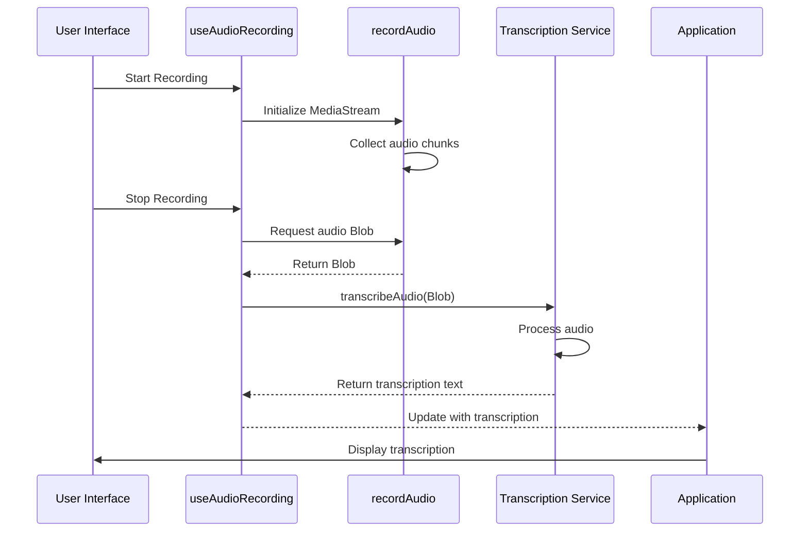
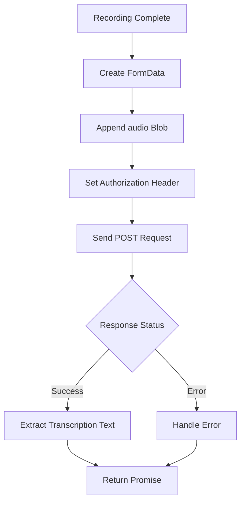
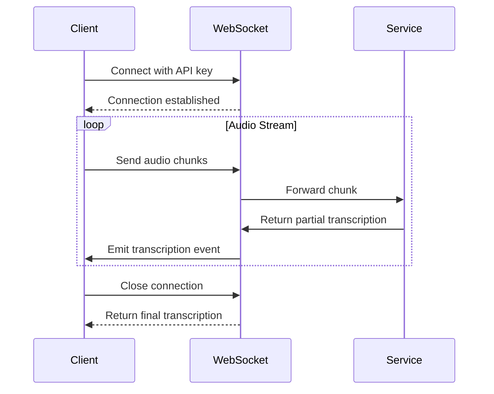
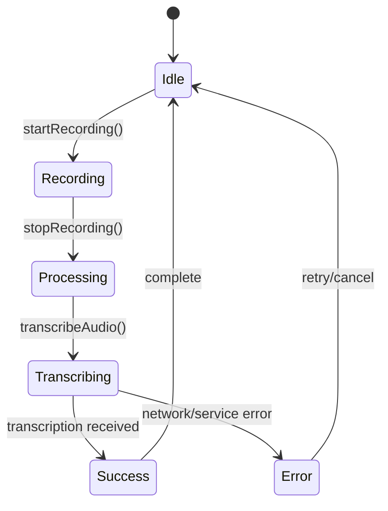
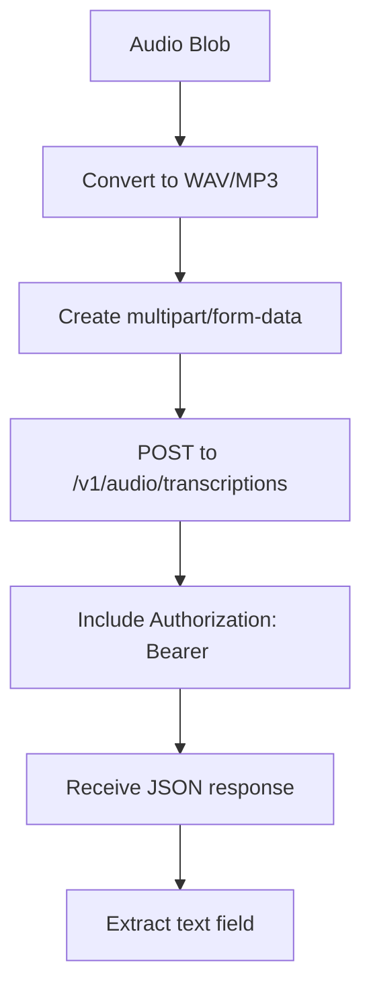
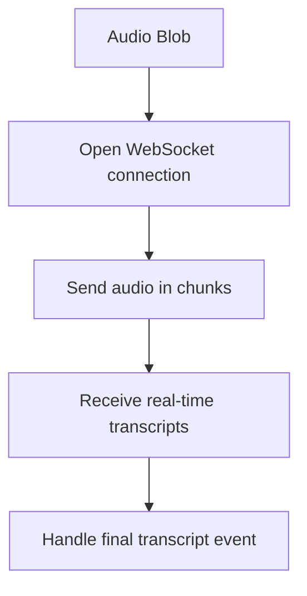
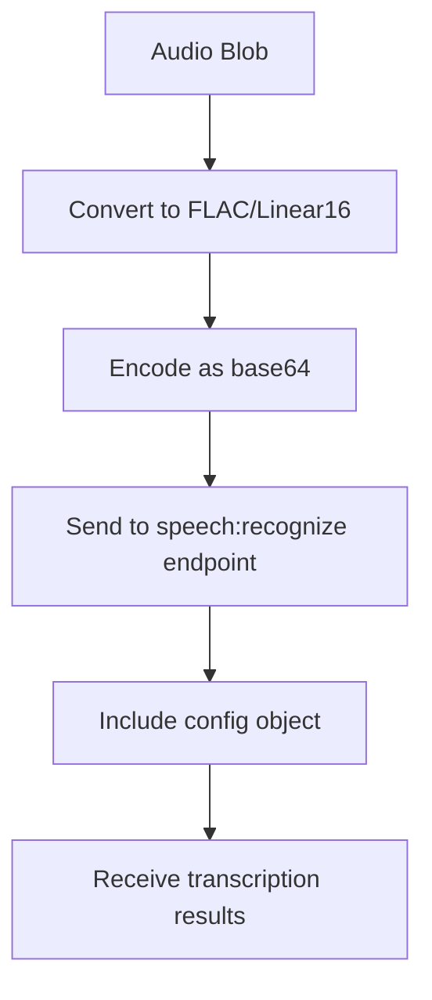
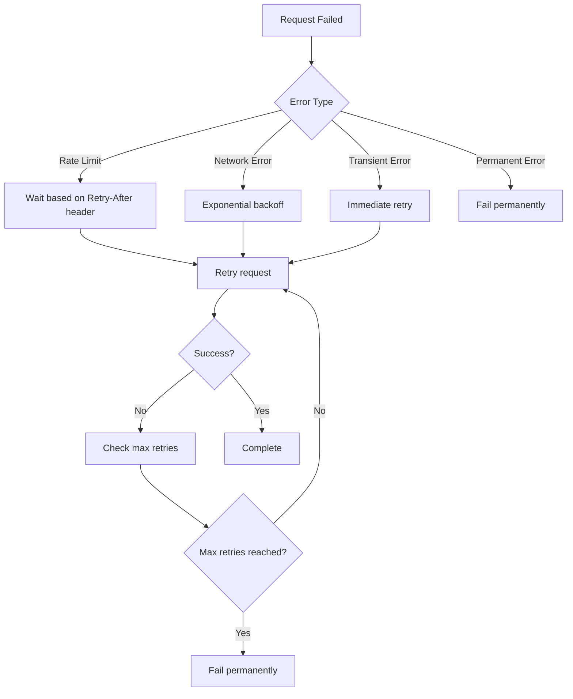

# API Integration Patterns

<cite>
**Referenced Files in This Document**   
- [use-audio-recording.ts](file://src/hooks/use-audio-recording.ts)
- [audio-utils.ts](file://src/lib/audio-utils.ts)
</cite>

## Table of Contents
1. [Introduction](#introduction)
2. [Core Integration Interface](#core-integration-interface)
3. [Data Flow Overview](#data-flow-overview)
4. [Service Communication Methods](#service-communication-methods)
5. [Error Handling and Loading States](#error-handling-and-loading-states)
6. [Security Considerations](#security-considerations)
7. [Client Implementation Guidelines](#client-implementation-guidelines)
8. [Performance Optimization](#performance-optimization)
9. [Conclusion](#conclusion)

## Introduction
This document outlines the external service integration patterns for the transcription functionality in code-speeder, focusing on the `transcribeAudio` callback within the `useAudioRecording` hook. The system is designed to capture audio input from users and send it to third-party speech-to-text services such as Whisper, Deepgram, or Google Speech-to-Text. This documentation details the expected interface, data flow, error handling, security practices, and performance optimization strategies for seamless integration with external transcription APIs.

## Core Integration Interface

The primary integration point for external transcription services is the `transcribeAudio` callback function exposed by the `useAudioRecording` hook. This function accepts an audio Blob recorded from the user's microphone and returns a Promise that resolves with the transcription text.

The interface follows a clean, asynchronous pattern that abstracts the underlying recording mechanism while providing a standardized way to integrate with various transcription backends. The audio is captured using the Web Audio API and MediaRecorder, encoded in WebM format with Opus codec for optimal compression and quality.

**Section sources**
- [use-audio-recording.ts](file://src/hooks/use-audio-recording.ts)
- [audio-utils.ts](file://src/lib/audio-utils.ts#L1-L50)

## Data Flow Overview

The data flow from recording initiation to transcription result follows a structured sequence of operations:

**Diagram sources**
- [audio-utils.ts](file://src/lib/audio-utils.ts#L7-L50)
- [use-audio-recording.ts](file://src/hooks/use-audio-recording.ts)

**Section sources**
- [audio-utils.ts](file://src/lib/audio-utils.ts#L7-L50)

## Service Communication Methods

The integration supports both HTTP (fetch) and WebSocket-based communication patterns for sending audio data to transcription services.

### HTTP/fetch Implementation
For services like Whisper API or Google Speech-to-Text, the fetch API is used to send the audio Blob in a POST request:

### WebSocket Implementation
For real-time streaming transcription with services like Deepgram, WebSocket connections provide continuous transcription:

**Diagram sources**
- [use-audio-recording.ts](file://src/hooks/use-audio-recording.ts)

## Error Handling and Loading States

The system implements comprehensive error handling and provides clear loading state feedback during the transcription process.

### Error Types and Handling
- **Recording Errors**: Media access denied, device unavailable
- **Network Errors**: Connection timeouts, CORS failures
- **Service Errors**: API rate limits, authentication failures
- **Processing Errors**: Invalid audio format, service-side processing errors

The hook exposes error states through its return value, allowing the UI to display appropriate messages and recovery options.

### Loading States
The integration manages several loading states:
- Recording in progress
- Audio processing
- Network transmission
- Server-side transcription
- Result processing

These states are exposed through boolean flags that can be used to control UI elements like spinners, progress bars, and status messages.

**Diagram sources**
- [use-audio-recording.ts](file://src/hooks/use-audio-recording.ts)

**Section sources**
- [use-audio-recording.ts](file://src/hooks/use-audio-recording.ts)

## Security Considerations

### API Key Management
API keys for external transcription services should be managed securely:
- Never expose API keys in client-side code
- Use environment variables on the server side
- Implement token-based authentication where possible
- Rotate keys regularly
- Use scoped keys with minimal required permissions

For client-server architectures, the frontend should send audio data to a backend endpoint, which then communicates with the transcription service using stored credentials.

### CORS Configuration
When making direct client-to-service requests, ensure proper CORS configuration:
- Register your domain with the transcription service provider
- Use HTTPS for all requests
- Implement proper preflight request handling
- Consider using a proxy server to avoid CORS issues entirely

### Data Privacy
- Inform users when audio is being recorded and transcribed
- Provide clear privacy policy about audio data handling
- Implement data retention policies
- Consider on-device processing options when available

**Section sources**
- [use-audio-recording.ts](file://src/hooks/use-audio-recording.ts)

## Client Implementation Guidelines

### Integration with Popular Services

#### Whisper API

#### Deepgram

#### Google Speech-to-Text

### Implementation Best Practices
- Always validate the transcription result before use
- Implement timeout mechanisms for long-running requests
- Provide user feedback during long transcription processes
- Support both streaming and batch processing modes
- Handle partial results for real-time applications

**Section sources**
- [use-audio-recording.ts](file://src/hooks/use-audio-recording.ts)

## Performance Optimization

### Large Audio Uploads
- Implement chunked uploading for large files
- Use resumable uploads when supported by the service
- Compress audio data before transmission
- Consider server-side processing for very large files

### Streaming Transcription
- Send audio data in small chunks (200-500ms)
- Implement buffering to handle network latency
- Use WebSocket for lowest latency
- Handle out-of-order packets gracefully

### Rate Limiting and Retry Logic
Implement intelligent retry strategies:

### Offline Fallback Strategies
- Cache recent transcription results
- Implement local speech recognition as fallback
- Queue requests for later transmission
- Provide estimated transcription time

**Diagram sources**
- [use-audio-recording.ts](file://src/hooks/use-audio-recording.ts)

**Section sources**
- [use-audio-recording.ts](file://src/hooks/use-audio-recording.ts)

## Conclusion
The transcription service integration in code-speeder provides a flexible and robust framework for connecting with external speech-to-text services. By following the patterns outlined in this documentation, developers can successfully integrate with various transcription providers while maintaining security, performance, and reliability. The modular design of the `useAudioRecording` hook and its `transcribeAudio` callback enables easy adaptation to different service APIs and communication protocols, making it a versatile solution for voice-enabled applications.