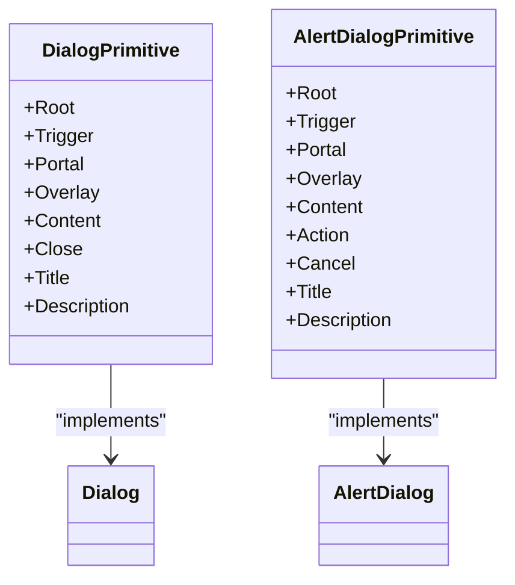
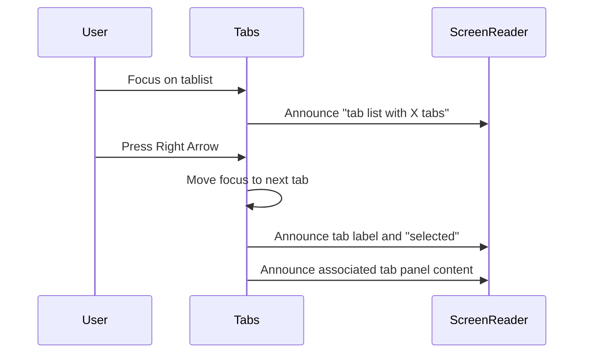
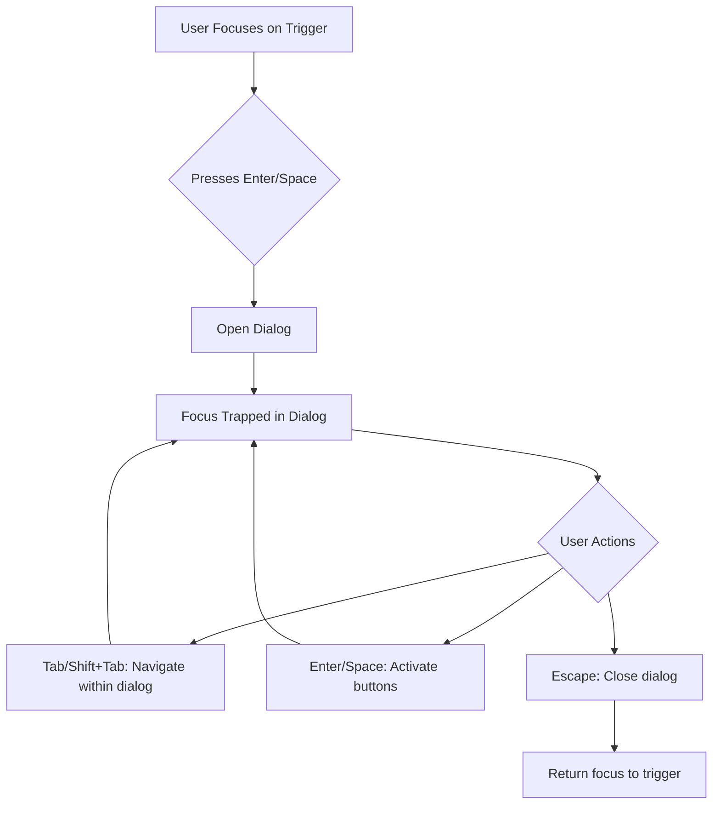
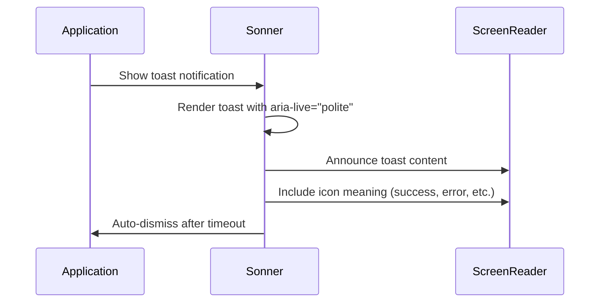
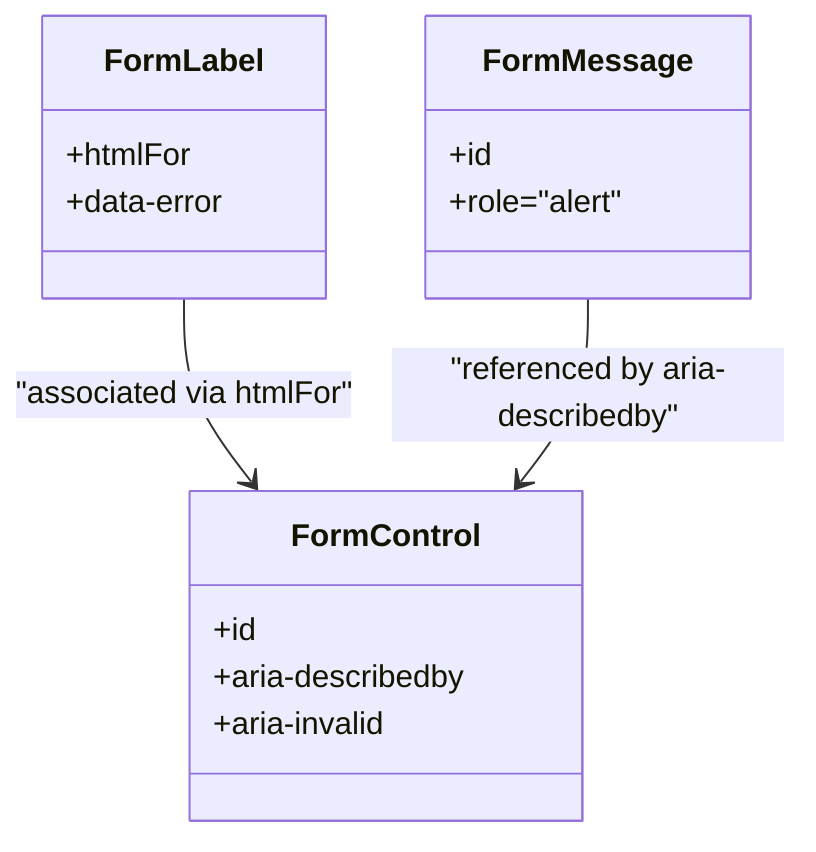

# Accessibility Features

<cite>
**Referenced Files in This Document**   
- [dialog.tsx](file://src/components/ui/dialog.tsx)
- [alert-dialog.tsx](file://src/components/ui/alert-dialog.tsx)
- [dropdown-menu.tsx](file://src/components/ui/dropdown-menu.tsx)
- [tabs.tsx](file://src/components/ui/tabs.tsx)
- [label.tsx](file://src/components/ui/label.tsx)
- [form.tsx](file://src/components/ui/form.tsx)
- [sonner.tsx](file://src/components/ui/sonner.tsx)
- [input.tsx](file://src/components/ui/input.tsx)
- [button.tsx](file://src/components/ui/button.tsx)
- [globals.css](file://src/app/globals.css)
- [biome.json](file://biome.json)
</cite>

## Table of Contents
1. [Introduction](#introduction)
2. [Core Accessibility Principles](#core-accessibility-principles)
3. [Radix UI Primitives and ARIA Implementation](#radix-ui-primitives-and-aria-implementation)
4. [Semantic HTML and Screen Reader Support](#semantic-html-and-screen-reader-support)
5. [Focus Management and Keyboard Navigation](#focus-management-and-keyboard-navigation)
6. [Color Contrast and Visual Design](#color-contrast-and-visual-design)
7. [Live Regions and Dynamic Content](#live-regions-and-dynamic-content)
8. [Reduced Motion Preferences](#reduced-motion-preferences)
9. [Form Accessibility](#form-accessibility)
10. [Testing and Validation](#testing-and-validation)
11. [Best Practices for Component Extension](#best-practices-for-component-extension)

## Introduction
The code-speeder application implements comprehensive accessibility features through the integration of Radix UI primitives, Tailwind CSS, and modern web standards. This documentation details how the application ensures accessibility for all users, including those who rely on assistive technologies such as screen readers, keyboard navigation, and alternative input methods. The implementation follows WCAG 2.1 guidelines and ARIA best practices to create an inclusive user experience.

## Core Accessibility Principles
The code-speeder application follows established accessibility principles by leveraging Radix UI's unstyled, accessible components that provide built-in ARIA attributes, keyboard navigation, and focus management. These components serve as the foundation for accessible UI elements while allowing complete customization through Tailwind CSS. The application prioritizes semantic HTML, proper focus management, and compatibility with assistive technologies to ensure all users can effectively interact with the interface regardless of their abilities or preferred input methods.

**Section sources**
- [dialog.tsx](file://src/components/ui/dialog.tsx#L1-L144)
- [dropdown-menu.tsx](file://src/components/ui/dropdown-menu.tsx#L1-L258)
- [tabs.tsx](file://src/components/ui/tabs.tsx#L1-L67)

## Radix UI Primitives and ARIA Implementation
The application utilizes Radix UI primitives to provide built-in accessibility features across interactive components. These primitives automatically handle ARIA attributes, keyboard navigation, and focus management according to WAI-ARIA authoring practices.

### Dialog and AlertDialog Components
The Dialog and AlertDialog components implement modal accessibility patterns with proper focus trapping, ARIA roles, and keyboard navigation. When a dialog opens, focus is automatically moved to the dialog content and trapped within it until dismissal. The components use appropriate ARIA roles (dialog/alertdialog) and properties (aria-modal) to communicate their purpose to assistive technologies.

**Diagram sources**
- [dialog.tsx](file://src/components/ui/dialog.tsx#L9-L143)
- [alert-dialog.tsx](file://src/components/ui/alert-dialog.tsx#L9-L157)

### DropdownMenu Component
The DropdownMenu component provides accessible dropdown functionality with proper keyboard navigation, including arrow key support, Enter/Space for selection, and Escape for dismissal. It implements ARIA roles for menus, menuitems, and submenus, ensuring screen readers can properly announce the menu structure and available actions.

**Section sources**
- [dropdown-menu.tsx](file://src/components/ui/dropdown-menu.tsx#L9-L257)

### Tabs Component
The Tabs component implements the ARIA tab pattern with proper keyboard navigation (arrow keys to move between tabs, Enter/Space to activate). It manages ARIA attributes such as role="tablist", role="tab", role="tabpanel", aria-selected, and aria-controls to create a cohesive tab interface that screen readers can navigate effectively.

**Diagram sources**
- [tabs.tsx](file://src/components/ui/tabs.tsx#L8-L66)

## Semantic HTML and Screen Reader Support
The application emphasizes semantic HTML structure to ensure content is properly interpreted by assistive technologies. Components use appropriate HTML elements and ARIA attributes to convey meaning and relationships.

### Role Attributes
Interactive components implement proper ARIA roles:
- Dialogs use role="dialog" or role="alertdialog"
- Alerts use role="alert"
- Navigation menus use role="menubar"
- Tab interfaces use role="tablist", "tab", and "tabpanel"

### Screen Reader Text
The application includes visually hidden text for screen readers using the "sr-only" class. For example, the close button in dialogs includes a visually hidden "Close" label to provide context for screen reader users.

**Section sources**
- [dialog.tsx](file://src/components/ui/dialog.tsx#L75)
- [alert.tsx](file://src/components/ui/alert.tsx#L30)

## Focus Management and Keyboard Navigation
The application implements comprehensive focus management to support keyboard-only navigation and ensure a logical tab order.

### Focus Trapping
Modal components like Dialog and AlertDialog implement focus trapping, preventing keyboard navigation from leaving the modal until it is dismissed. This ensures users do not accidentally navigate to content outside the modal, which could be confusing or lead to unexpected behavior.

### Keyboard Navigation Patterns
Components follow standard keyboard interaction patterns:
- Tab/Shift+Tab: Move focus forward/backward through interactive elements
- Enter/Space: Activate buttons, links, and other interactive elements
- Arrow keys: Navigate between options in menus, tabs, and other grouped controls
- Escape: Dismiss modals, menus, and other temporary interfaces

**Diagram sources**
- [dialog.tsx](file://src/components/ui/dialog.tsx#L49-L80)
- [dropdown-menu.tsx](file://src/components/ui/dropdown-menu.tsx#L34-L51)

## Color Contrast and Visual Design
The application ensures sufficient color contrast through Tailwind CSS utility classes and CSS custom properties, meeting WCAG 2.1 AA requirements for text and interactive elements.

### Contrast Ratios
Text and background colors are selected to maintain appropriate contrast ratios:
- Normal text: Minimum 4.5:1 contrast ratio
- Large text: Minimum 3:1 contrast ratio
- Interactive elements: Sufficient contrast in all states (default, hover, focus, disabled)

### Dark Mode Support
The application supports both light and dark color schemes with appropriate contrast adjustments. CSS variables defined in globals.css ensure consistent color application across themes while maintaining accessibility standards.

**Section sources**
- [globals.css](file://src/app/globals.css#L49-L116)
- [button.tsx](file://src/components/ui/button.tsx#L7-L37)

## Live Regions and Dynamic Content
The application handles dynamic content updates through proper ARIA live regions to ensure screen readers announce important changes.

### Sonner Toast Notifications
The Sonner toast component implements live regions to announce notifications to screen reader users. When a toast appears, its content is programmatically announced without requiring user interaction, ensuring important information is conveyed promptly.

**Diagram sources**
- [sonner.tsx](file://src/components/ui/sonner.tsx#L13-L40)

## Reduced Motion Preferences
The application respects user preferences for reduced motion through the prefers-reduced-motion media query. Animations and transitions are minimized or disabled for users who have indicated a preference for reduced motion in their operating system settings.

### CSS Transitions
Motion effects are implemented with consideration for reduced motion preferences:
- Animations are kept subtle and short
- Motion can be disabled via CSS when prefers-reduced-motion is enabled
- Essential functionality is not dependent on animations

**Section sources**
- [globals.css](file://src/app/globals.css#L118-L126)
- [dialog.tsx](file://src/components/ui/dialog.tsx#L41-L42)

## Form Accessibility
The application implements accessible form patterns to ensure all users can complete form interactions successfully.

### Label Component
The Label component provides proper form input association using the htmlFor attribute, creating a programmatic and visual connection between labels and their corresponding inputs. This ensures screen readers can properly announce the purpose of form fields.

### Form Component
The Form component integrates with react-hook-form to provide accessible form validation and error messaging. Error messages are properly associated with their fields using aria-describedby, and invalid fields are marked with aria-invalid="true".

**Diagram sources**
- [label.tsx](file://src/components/ui/label.tsx#L8-L24)
- [form.tsx](file://src/components/ui/form.tsx#L90-L156)

## Testing and Validation
The application employs multiple methods to ensure accessibility compliance and identify potential issues.

### Automated Testing
The Biome linter configuration includes accessibility rules to catch common issues during development. The linter checks for proper ARIA usage, semantic HTML, and other accessibility best practices, providing immediate feedback to developers.

### Manual Testing
Accessibility is validated through manual testing with screen readers (such as NVDA, VoiceOver) and keyboard-only navigation to ensure real-world usability. This complements automated testing by identifying issues that automated tools might miss.

**Section sources**
- [biome.json](file://biome.json#L17-L29)
- [button.tsx](file://src/components/ui/button.tsx#L8)
- [input.tsx](file://src/components/ui/input.tsx#L13)

## Best Practices for Component Extension
When extending existing components or creating new ones, developers should follow these accessibility guidelines to maintain consistency and usability.

### Maintaining ARIA Attributes
When wrapping or extending Radix UI components, ensure all ARIA attributes and keyboard interactions are preserved. Avoid overriding accessibility features unless absolutely necessary, and when modifications are required, ensure equivalent or improved accessibility is maintained.

### Focus Management
When creating custom interactive components, implement proper focus management:
- Ensure all interactive elements are keyboard accessible
- Maintain a logical tab order
- Implement focus trapping for modal interfaces
- Provide visible focus indicators

### Semantic Structure
Use semantic HTML elements whenever possible rather than generic divs and spans. When custom elements are necessary, apply appropriate ARIA roles and properties to convey their purpose to assistive technologies.

**Section sources**
- [dialog.tsx](file://src/components/ui/dialog.tsx#L50-L66)
- [dropdown-menu.tsx](file://src/components/ui/dropdown-menu.tsx#L34-L49)
- [form.tsx](file://src/components/ui/form.tsx#L107-L122)