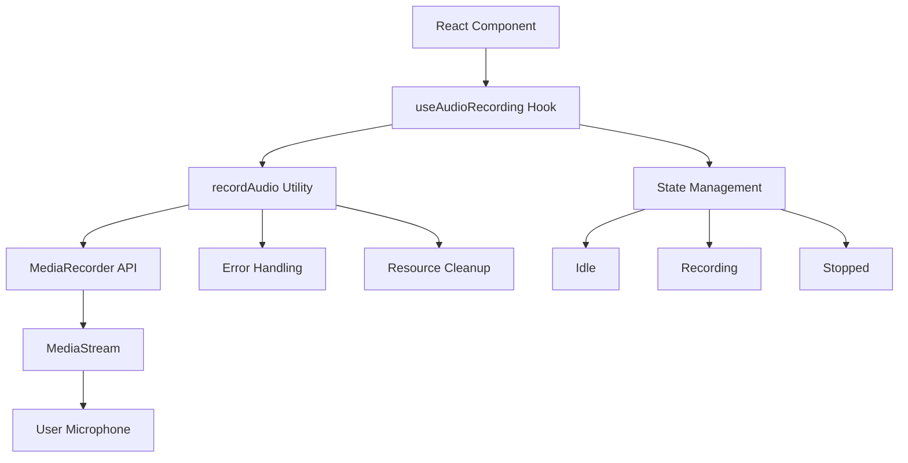
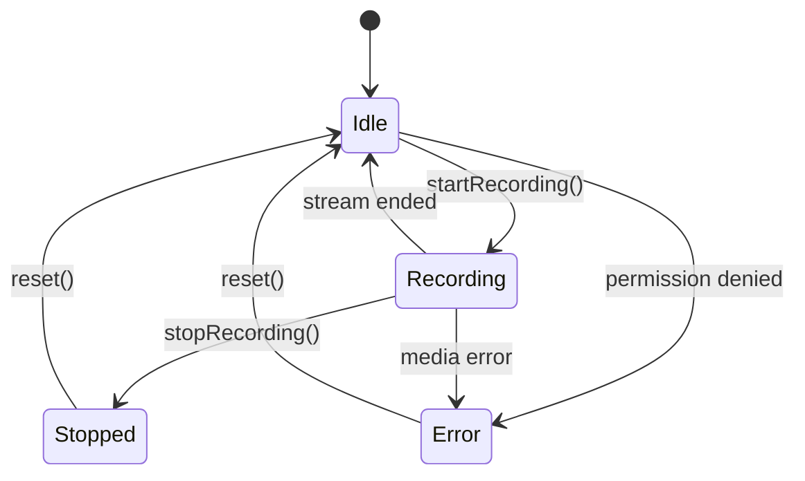
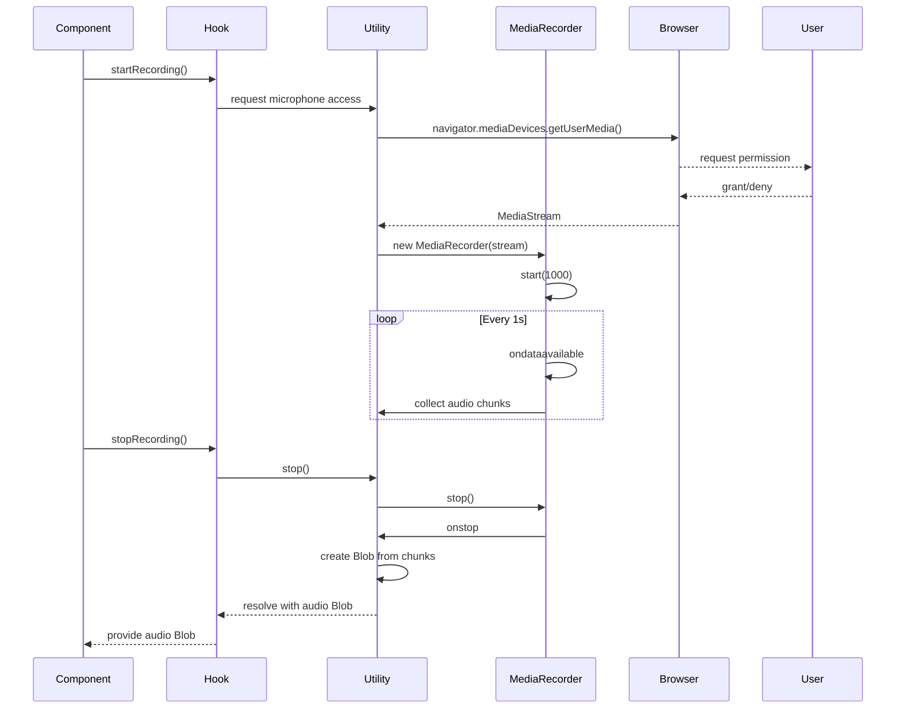
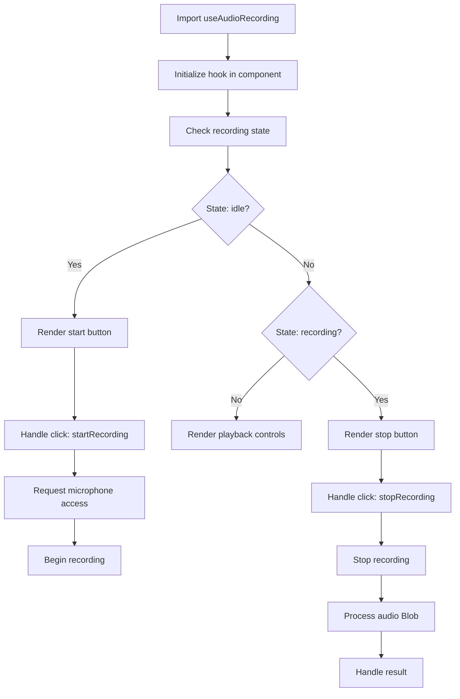
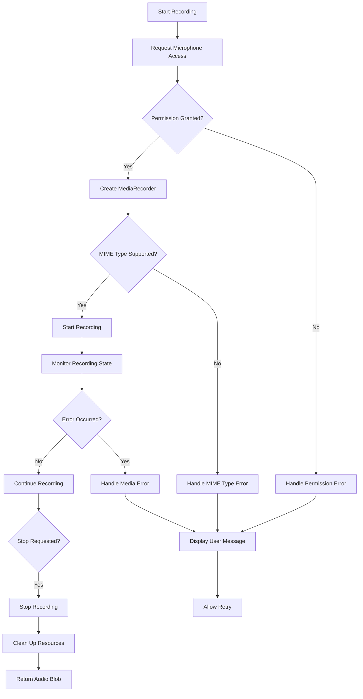

# Audio Recording

<cite>
**Referenced Files in This Document**   
- [use-audio-recording.ts](file://src/hooks/use-audio-recording.ts)
- [audio-utils.ts](file://src/lib/audio-utils.ts)
</cite>

## Table of Contents
1. [Introduction](#introduction)
2. [Core Components](#core-components)
3. [Architecture Overview](#architecture-overview)
4. [Detailed Component Analysis](#detailed-component-analysis)
5. [Usage Examples](#usage-examples)
6. [Error Handling and Edge Cases](#error-handling-and-edge-cases)
7. [Best Practices](#best-practices)
8. [Conclusion](#conclusion)

## Introduction
The Audio Recording sub-system enables browser-based audio capture through a custom React hook and utility functions that interface with the Web Audio APIs. This system provides a reliable, state-managed solution for recording audio via the user's microphone, handling lifecycle states, permissions, and cross-browser compatibility concerns. Built on the MediaStream and MediaRecorder Web APIs, it abstracts complex asynchronous operations into a simple interface for application-level use.

## Core Components
The audio recording functionality is composed of two primary components: the `useAudioRecording` custom hook for React component integration and the `recordAudio` utility function that manages low-level recording operations. These components work together to provide a seamless recording experience with proper resource management and error handling.

**Section sources**
- [use-audio-recording.ts](file://src/hooks/use-audio-recording.ts)
- [audio-utils.ts](file://src/lib/audio-utils.ts)

## Architecture Overview
The audio recording system follows a layered architecture where the React hook manages UI state and user interactions, while the utility function handles the underlying media recording process. This separation of concerns ensures that recording logic remains independent of the component lifecycle, enabling reuse and testability.

**Diagram sources**
- [use-audio-recording.ts](file://src/hooks/use-audio-recording.ts)
- [audio-utils.ts](file://src/lib/audio-utils.ts)

## Detailed Component Analysis

### useAudioRecording Hook Analysis
The `useAudioRecording` custom hook provides a React-friendly interface for managing audio recording functionality. It encapsulates the recording state (idle, recording, stopped), handles permission requests, and manages the MediaStream lifecycle to prevent memory leaks. The hook returns methods to start and stop recording, along with the current state and recorded audio blob.

**Diagram sources**
- [use-audio-recording.ts](file://src/hooks/use-audio-recording.ts)

**Section sources**
- [use-audio-recording.ts](file://src/hooks/use-audio-recording.ts)

### recordAudio Utility Function Analysis
The `recordAudio` function is a self-invoking function that returns an object with a recording function, a stop method, and a reference to the current recorder instance. It uses the MediaRecorder API with the audio/webm;codecs=opus MIME type, which provides high-quality audio compression with broad browser support.

**Diagram sources**
- [audio-utils.ts](file://src/lib/audio-utils.ts#L7-L50)

**Section sources**
- [audio-utils.ts](file://src/lib/audio-utils.ts#L7-L50)

## Usage Examples
To use the audio recording functionality, import the `useAudioRecording` hook in a React component and call the startRecording and stopRecording methods in response to user actions. The hook manages all aspects of the recording lifecycle, including permission handling and stream cleanup.

**Diagram sources**
- [use-audio-recording.ts](file://src/hooks/use-audio-recording.ts)
- [audio-utils.ts](file://src/lib/audio-utils.ts)

## Error Handling and Edge Cases
The audio recording system includes comprehensive error handling for common issues such as permission denials, unsupported MIME types, and inactive recorder states. When a user denies microphone permissions, the system gracefully handles the rejection and allows for retry attempts. The stop method safely terminates recordings by checking the recorder state before attempting to stop, preventing errors from calling stop() on an inactive recorder.

**Diagram sources**
- [audio-utils.ts](file://src/lib/audio-utils.ts#L34-L38)
- [use-audio-recording.ts](file://src/hooks/use-audio-recording.ts)

## Best Practices
For reliable audio recording across different browsers and devices, follow these best practices:
1. Always request microphone permissions in response to a user gesture (click, tap)
2. Use the audio/webm;codecs=opus MIME type for optimal compatibility and quality
3. Implement proper stream cleanup to prevent memory leaks and device lock issues
4. Handle permission denials gracefully with clear user instructions
5. Provide visual feedback during recording to indicate active state
6. Test on multiple devices and browsers to ensure consistent behavior
7. Implement timeout mechanisms for recordings that exceed expected duration
8. Monitor recorder state before performing operations to avoid invalid state errors

## Conclusion
The Audio Recording sub-system provides a robust solution for browser-based audio capture, abstracting the complexities of the MediaStream and MediaRecorder APIs into a simple, state-managed interface. By properly handling permissions, errors, and resource cleanup, it enables reliable audio recording functionality that works across different browsers and devices. The separation of concerns between the React hook and utility function promotes reusability and maintainability, making it easy to integrate audio recording capabilities into various parts of an application.