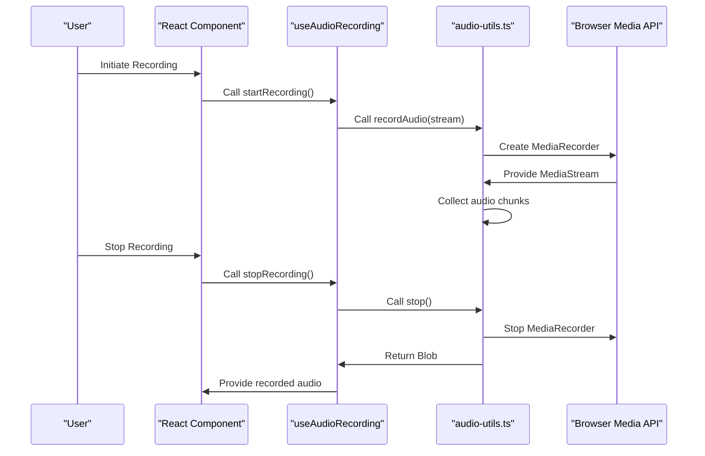
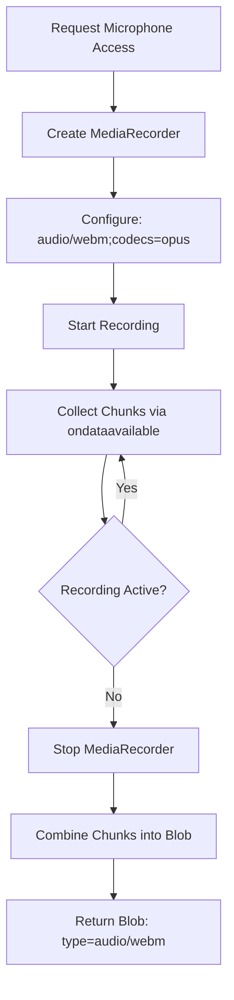

# Audio System

<cite>
**Referenced Files in This Document**   
- [audio-utils.ts](file://src/lib/audio-utils.ts)
</cite>

## Table of Contents
1. [Introduction](#introduction)
2. [Core Components](#core-components)
3. [Audio Recording Architecture](#audio-recording-architecture)
4. [Data Flow and State Management](#data-flow-and-state-management)
5. [Blob Processing and MIME Type Handling](#blob-processing-and-mime-type-handling)
6. [Error Handling and Browser Compatibility](#error-handling-and-browser-compatibility)
7. [Performance Considerations](#performance-considerations)

## Introduction
The Audio System in this application is designed to capture, process, and manage audio input from user microphones using modern Web APIs. It leverages the MediaStream and MediaRecorder interfaces to enable browser-based audio recording functionality. Although the custom hook `useAudioRecording` and the audio visualizer component are not present in the current codebase, the core audio recording logic is implemented through utility functions in `audio-utils.ts`. This document provides a comprehensive analysis of the existing audio infrastructure, focusing on the `recordAudio` function, its integration points, and recommended patterns for building a complete audio system.

## Core Components

The primary component of the audio system is the `recordAudio` function defined in `audio-utils.ts`, which serves as a stateful wrapper around the MediaRecorder API. This function implements a singleton pattern with internal state management, allowing for recording initiation and termination across different parts of the application. The implementation includes error handling, MIME type configuration, and Blob output generation.

**Section sources**
- [audio-utils.ts](file://src/lib/audio-utils.ts#L1-L50)

## Audio Recording Architecture

The audio recording architecture is built on the Web Media APIs, specifically utilizing MediaStream for capturing audio input and MediaRecorder for encoding and processing the stream into downloadable audio files. The `recordAudio` function encapsulates this functionality with a promise-based interface that resolves with a Blob when recording stops.

**Diagram sources**
- [audio-utils.ts](file://src/lib/audio-utils.ts#L7-L50)

## Data Flow and State Management

The data flow begins with acquiring microphone access through `navigator.mediaDevices.getUserMedia()`, which returns a MediaStream object. This stream is passed to the `recordAudio` function, which creates a MediaRecorder instance configured with the WebM/Opus codec for efficient audio compression. During recording, audio data is collected in chunks through the `ondataavailable` event, which fires periodically (every 1000ms as configured). When recording stops, the collected chunks are combined into a single Blob with the appropriate MIME type.

The system manages recording state implicitly through the MediaRecorder's internal state machine (inactive, recording, paused) and the presence of the `currentRecorder` reference in the `recordAudio` function. This enables centralized control of the recording process, preventing multiple simultaneous recordings.

**Section sources**
- [audio-utils.ts](file://src/lib/audio-utils.ts#L14-L25)

## Blob Processing and MIME Type Handling

The audio system implements specific MIME type handling to ensure compatibility and optimal file size. The MediaRecorder is configured with the MIME type "audio/webm;codecs=opus", which specifies:

- Container format: WebM
- Audio codec: Opus (known for high-quality compression, especially for speech)

When the recording stops, the collected audio chunks are combined into a final Blob using the same MIME type. This approach ensures that the output file is compatible with most modern browsers and media players while maintaining small file sizes suitable for web transmission.

**Diagram sources**
- [audio-utils.ts](file://src/lib/audio-utils.ts#L10-L12)
- [audio-utils.ts](file://src/lib/audio-utils.ts#L23-L24)

## Error Handling and Browser Compatibility

The audio system includes comprehensive error handling at multiple levels. The `recordAudio` function wraps the MediaRecorder creation in a try-catch block to handle initialization errors, while also setting the `onerror` callback to capture runtime errors during recording. Errors are normalized into standard JavaScript Error objects with descriptive messages.

Common issues addressed by this pattern include:
- Microphone access denial by the user
- Microphone already in use by another application
- Browser compatibility issues with MediaRecorder API
- Invalid constraints when requesting media access

The implementation gracefully handles these scenarios by rejecting the returned Promise with a descriptive error message, allowing calling code to implement appropriate user feedback.

**Section sources**
- [audio-utils.ts](file://src/lib/audio-utils.ts#L27-L29)
- [audio-utils.ts](file://src/lib/audio-utils.ts#L34-L38)

## Performance Considerations

The current implementation includes several performance optimizations:

1. **Chunk-based recording**: By setting the timeslice to 1000ms, the system balances memory usage with responsiveness, preventing excessive memory consumption during long recordings.

2. **Efficient codec selection**: The Opus codec provides excellent compression ratios while maintaining high audio quality, particularly for speech content.

3. **Centralized recorder management**: The singleton pattern prevents multiple MediaRecorder instances from consuming system resources simultaneously.

For applications handling large audio blobs, additional optimizations could include:
- Streaming uploads during recording rather than waiting for completion
- Implementing chunked processing to avoid memory spikes
- Providing progress feedback to users during long recordings
- Adding automatic cleanup of the `currentRecorder` reference to prevent memory leaks

The system should also implement proper cleanup of media streams by calling `getTracks().forEach(track => track.stop())` when recording ends to prevent microphone access from remaining active.

**Section sources**
- [audio-utils.ts](file://src/lib/audio-utils.ts#L31)
- [audio-utils.ts](file://src/lib/audio-utils.ts#L41-L47)