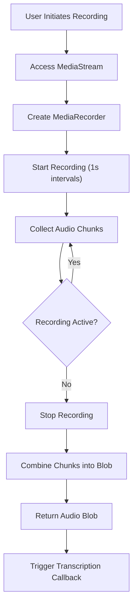
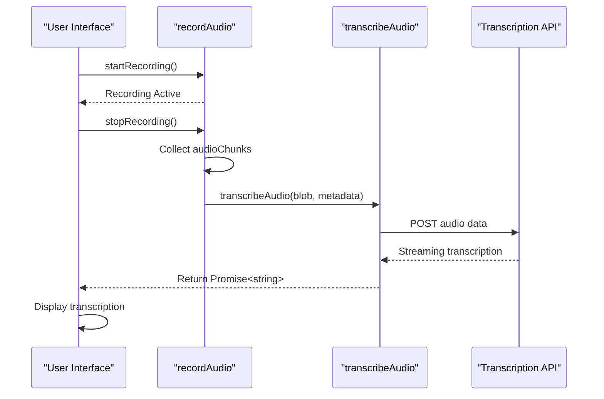

# Transcription Integration

<cite>
**Referenced Files in This Document**   
- [audio-utils.ts](file://src/lib/audio-utils.ts)
</cite>

## Table of Contents
1. [Introduction](#introduction)
2. [Audio Recording Lifecycle](#audio-recording-lifecycle)
3. [Transcription Integration Pattern](#transcription-integration-pattern)
4. [Transcription Callback Interface](#transcription-callback-interface)
5. [Integration with External Services](#integration-with-external-services)
6. [Error Handling and User Feedback](#error-handling-and-user-feedback)
7. [Data Privacy and On-Device Processing](#data-privacy-and-on-device-processing)
8. [Type Safety and TypeScript Patterns](#type-safety-and-typescript-patterns)
9. [Conclusion](#conclusion)

## Introduction
This document details the Transcription Integration pattern within the application, focusing on how recorded audio is processed and transmitted to external transcription services. The system leverages modern web APIs to capture audio, convert it into Blob format, and pass it through a callback mechanism for transcription. Although the current codebase does not include explicit transcription service integrations, the architecture supports extensible transcription via callback functions that can interface with various speech-to-text providers.

## Audio Recording Lifecycle

The audio recording process begins when a user initiates recording through the UI, which triggers the `recordAudio` function from `audio-utils.ts`. This utility uses the Web Audio API's `MediaRecorder` to capture audio streams from the user's microphone. The recording is segmented into chunks at 1-second intervals (via `start(1000)`), which are collected in memory until the recording stops.

Upon stopping, the accumulated audio chunks are combined into a single `Blob` of type `audio/webm` and returned as a resolved promise. This Blob becomes the primary input for any subsequent transcription processing.



**Diagram sources**
- [audio-utils.ts](file://src/lib/audio-utils.ts#L7-L50)

**Section sources**
- [audio-utils.ts](file://src/lib/audio-utils.ts#L7-L50)

## Transcription Integration Pattern

The transcription integration occurs immediately after the recording lifecycle completes and the audio Blob is generated. At this point, the application should invoke a transcription callback function—such as `transcribeAudio`—passing the Blob and associated metadata for processing.

Although the current implementation does not define a formal `transcribeAudio` function, the pattern would involve:

1. Accepting the recorded Blob from `recordAudio()`
2. Preparing metadata (e.g., language, sample rate, context)
3. Invoking an asynchronous transcription service
4. Handling the returned transcription text in the UI

This callback-based approach enables loose coupling between the recording module and transcription services, allowing developers to plug in different providers without modifying core recording logic.



**Diagram sources**
- [audio-utils.ts](file://src/lib/audio-utils.ts#L7-L50)

**Section sources**
- [audio-utils.ts](file://src/lib/audio-utils.ts#L7-L50)

## Transcription Callback Interface

To ensure consistency and type safety, the transcription callback should adhere to a standardized interface. Based on the existing architecture and TypeScript usage, the expected signature would be:

```typescript
type TranscriptionMetadata = {
  language?: string;
  sampleRate?: number;
  context?: string;
  deviceId?: string;
};

type TranscribeAudioCallback = (
  audioBlob: Blob,
  metadata?: TranscriptionMetadata
) => Promise<string>;
```

This interface defines:
- **Input Parameters**: 
  - `audioBlob`: The recorded audio data in Blob format (typically WebM/Opus)
  - `metadata`: Optional contextual information to improve transcription accuracy
- **Return Type**: `Promise<string>` representing the transcribed text

The use of `Promise<string>` aligns with asynchronous processing requirements and enables seamless integration with `async/await` patterns in the UI layer.

**Section sources**
- [audio-utils.ts](file://src/lib/audio-utils.ts#L7-L50)

## Integration with External Services

While the current codebase does not implement direct integrations with transcription services, the architecture supports integration with multiple providers. Below are examples of how such integrations could be implemented:

### Web Speech API (Browser-Native)
```typescript
const webSpeechTranscribe: TranscribeAudioCallback = async (blob) => {
  const arrayBuffer = await blob.arrayBuffer();
  const audioContext = new AudioContext();
  const audioBuffer = await audioContext.decodeAudioData(arrayBuffer);
  
  const recognition = new (window.SpeechRecognition || window.webkitSpeechRecognition)();
  recognition.lang = 'en-US';
  
  return new Promise((resolve, reject) => {
    recognition.onresult = (event) => resolve(event.results[0][0].transcript);
    recognition.onerror = (event) => reject(new Error(event.error));
    recognition.start();
  });
};
```

### OpenAI Whisper (Cloud API)
```typescript
const whisperTranscribe: TranscribeAudioCallback = async (blob, metadata = {}) => {
  const formData = new FormData();
  formData.append('file', blob, 'recording.webm');
  formData.append('model', 'whisper-1');
  if (metadata.language) formData.append('language', metadata.language);
  
  const response = await fetch('https://api.openai.com/v1/audio/transcriptions', {
    method: 'POST',
    headers: {
      'Authorization': `Bearer ${import.meta.env.VITE_OPENAI_KEY}`
    },
    body: formData
  });
  
  if (!response.ok) throw new Error('Transcription failed');
  const result = await response.json();
  return result.text;
};
```

### Google Cloud Speech-to-Text
```typescript
const googleTranscribe: TranscribeAudioCallback = async (blob) => {
  const audioBytes = await blob.arrayBuffer();
  const request = {
    config: {
      encoding: 'WEBM_OPUS',
      sampleRateHertz: 16000,
      languageCode: 'en-US',
    },
    audio: {
      content: btoa(String.fromCharCode(...new Uint8Array(audioBytes)))
    }
  };

  const response = await fetch('https://speech.googleapis.com/v1/speech:recognize', {
    method: 'POST',
    headers: {
      'Content-Type': 'application/json',
      'Authorization': `Bearer ${await getGoogleAuthToken()}`
    },
    body: JSON.stringify(request)
  });

  const result = await response.json();
  return result.results[0].alternatives[0].transcript;
};
```

These implementations demonstrate how the same callback interface can be used across different service providers, enabling flexibility and easy swapping of transcription backends.

**Section sources**
- [audio-utils.ts](file://src/lib/audio-utils.ts#L7-L50)

## Error Handling and User Feedback

Effective transcription integration requires robust error handling and clear user feedback. Potential failure points include:

- Network connectivity issues
- Service rate limits or authentication failures
- Audio format incompatibility
- Timeout during processing

Recommended error handling strategy:
```typescript
try {
  const transcription = await transcribeAudio(audioBlob, { language: 'en-US' });
  updateUI(transcription);
} catch (error) {
  if (error instanceof NetworkError) {
    showNotification('Network connection failed. Please check your internet connection.');
  } else if (error.message.includes('quota')) {
    showNotification('Transcription quota exceeded. Please try again later.');
  } else {
    showNotification('Transcription failed. Please try again.');
  }
  logErrorToService(error);
}
```

Loading states should be communicated through:
- Visual indicators (spinners, progress bars)
- Status messages ("Processing audio...")
- Estimated time to completion (if available)

The UI should remain responsive during transcription, allowing users to cancel long-running operations if needed.

**Section sources**
- [audio-utils.ts](file://src/lib/audio-utils.ts#L7-L50)

## Data Privacy and On-Device Processing

When transmitting audio to external APIs, data privacy becomes a critical concern. Consider the following implications:

### Privacy Risks
- Audio may contain sensitive personal information
- Cloud providers may store or analyze recordings
- Compliance with GDPR, HIPAA, or other regulations

### Mitigation Strategies
1. **On-Device Processing**: Use browser-native APIs like Web Speech API to keep audio processing local
2. **Data Minimization**: Strip identifying metadata before transmission
3. **Encryption**: Ensure end-to-end encryption for audio in transit
4. **Retention Policies**: Implement automatic deletion of audio after transcription
5. **User Consent**: Explicitly request permission before sending audio to external services

For maximum privacy, on-device transcription using the Web Speech API is recommended, though it may offer lower accuracy compared to cloud-based solutions like Whisper.

**Section sources**
- [audio-utils.ts](file://src/lib/audio-utils.ts#L7-L50)

## Type Safety and TypeScript Patterns

The application uses TypeScript throughout, enabling strong typing for the transcription integration. Recommended patterns include:

### Interface Definitions
```typescript
interface TranscriptionResult {
  text: string;
  confidence: number;
  timestamp: Date;
  language: string;
}

interface TranscriptionService {
  transcribe: TranscribeAudioCallback;
  isAvailable: () => boolean;
  getLanguageSupport: () => string[];
}
```

### Async/Await Usage in UI
```typescript
const handleTranscription = async (audioBlob: Blob) => {
  setIsTranscribing(true);
  setError(null);
  
  try {
    const text = await transcribeAudio(audioBlob, { language: 'en-US' });
    setTranscription(text);
  } catch (err) {
    setError(err instanceof Error ? err.message : 'Transcription failed');
  } finally {
    setIsTranscribing(false);
  }
};
```

### Type Guards for Service Availability
```typescript
const supportsWebSpeech = (): boolean => {
  return 'SpeechRecognition' in window || 'webkitSpeechRecognition' in window;
};

const getTranscriptionService = (): TranscriptionService => {
  if (supportsWebSpeech()) {
    return webSpeechService;
  } else if (import.meta.env.VITE_OPENAI_KEY) {
    return whisperService;
  }
  throw new Error('No available transcription service');
};
```

These patterns ensure type safety, improve developer experience, and reduce runtime errors.

**Section sources**
- [audio-utils.ts](file://src/lib/audio-utils.ts#L7-L50)

## Conclusion
The transcription integration pattern in this application is built around a clean separation between audio recording and transcription processing. The `recordAudio` function provides a reliable mechanism for capturing audio and returning it as a Blob, which can then be passed to a transcription callback. While the current implementation lacks explicit transcription service integrations, the architecture supports extensible transcription through a well-defined callback interface.

Key recommendations:
- Implement a standardized `transcribeAudio` callback interface
- Support multiple transcription providers with fallback mechanisms
- Prioritize user privacy through on-device processing options
- Provide clear feedback during transcription operations
- Leverage TypeScript for type safety and better developer experience

By following these patterns, the application can deliver accurate, responsive, and privacy-conscious transcription capabilities.