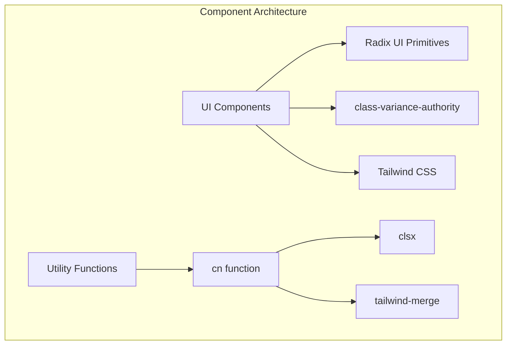
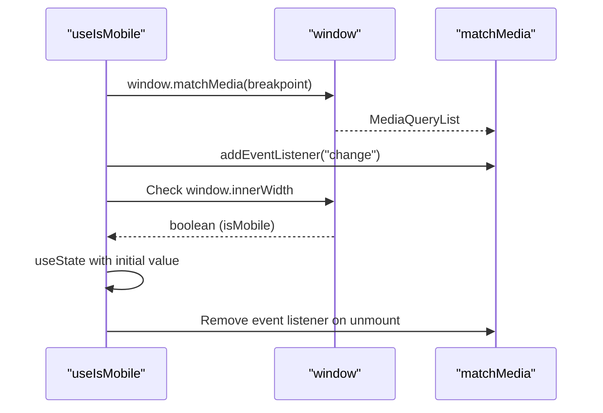

# Contributing Guidelines

<cite>
**Referenced Files in This Document**   
- [README.md](file://README.md)
- [package.json](file://package.json)
- [biome.json](file://biome.json)
- [components.json](file://components.json)
- [tsconfig.json](file://tsconfig.json)
- [button.tsx](file://src/components/ui/button.tsx)
- [use-mobile.ts](file://src/hooks/use-mobile.ts)
- [audio-utils.ts](file://src/lib/audio-utils.ts)
- [utils.ts](file://src/lib/utils.ts)
- [layout.tsx](file://src/app/layout.tsx)
- [page.tsx](file://src/app/page.tsx)
</cite>

## Table of Contents
1. [Introduction](#introduction)
2. [Development Environment Setup](#development-environment-setup)
3. [Code Formatting with Biome](#code-formatting-with-biome)
4. [Component Architecture](#component-architecture)
5. [Adding New UI Components](#adding-new-ui-components)
6. [Creating Custom Hooks](#creating-custom-hooks)
7. [TypeScript and React Best Practices](#typescript-and-react-best-practices)
8. [Tailwind CSS Usage](#tailwind-css-usage)
9. [Pull Request Process](#pull-request-process)
10. [Code Review Expectations](#code-review-expectations)
11. [Maintainability Practices](#maintainability-practices)
12. [Examples of Good Contributions](#examples-of-good-contributions)

## Introduction
This document provides comprehensive guidelines for contributing to the code-speeder project. It covers setup, coding standards, component architecture, and contribution processes to ensure consistency and maintainability across the codebase.

**Section sources**
- [README.md](file://README.md#L1-L37)

## Development Environment Setup
To set up the development environment for code-speeder, follow these steps:

1. Ensure Node.js (v18+) and pnpm are installed on your system
2. Clone the repository and navigate to the project directory
3. Install dependencies using `pnpm install`
4. Start the development server with `pnpm dev`
5. Access the application at http://localhost:3000

The project is built with Next.js 16.1.1 and React 19.2.3, using TypeScript for type safety. The development server supports hot reloading, allowing you to see changes immediately as you edit files.

**Section sources**
- [README.md](file://README.md#L3-L17)
- [package.json](file://package.json#L6-L8)

## Code Formatting with Biome
The code-speeder project uses Biome for code formatting and linting. Biome is configured to enforce consistent code style across the codebase.

To format code, run:
```bash
pnpm format
```

To check for linting issues, run:
```bash
pnpm lint
```

The Biome configuration enforces:
- 2-space indentation
- Automatic import organization
- React and Next.js best practices
- Suspicious code pattern detection (with specific rules disabled as needed)

All code submissions must pass Biome checks before being merged.

**Section sources**
- [package.json](file://package.json#L9-L10)
- [biome.json](file://biome.json#L1-L38)

## Component Architecture
The code-speeder project follows a component-based architecture with a clear directory structure. UI components are organized in the `src/components/ui` directory, following the shadcn/ui pattern.

Key architectural features:
- Reusable UI components built with Radix UI primitives
- Component variants managed with class-variance-authority (cva)
- Utility functions for className merging (cn)
- Type-safe component props using TypeScript
- Responsive design principles

Components are designed to be composable and accessible, with proper ARIA attributes and keyboard navigation support.



**Diagram sources**
- [button.tsx](file://src/components/ui/button.tsx#L1-L63)
- [utils.ts](file://src/lib/utils.ts#L1-L7)

**Section sources**
- [button.tsx](file://src/components/ui/button.tsx#L1-L63)
- [utils.ts](file://src/lib/utils.ts#L1-L7)

## Adding New UI Components
To add new UI components following the shadcn/ui patterns:

1. Use the `components.json` configuration as a reference for aliases and project settings
2. Create new component files in `src/components/ui/`
3. Follow existing component patterns for structure and typing
4. Use the `cva` function to define component variants
5. Leverage the `cn` utility for className merging
6. Ensure proper TypeScript typing for all props
7. Include appropriate documentation comments

The `components.json` file defines important project aliases:
- `@/components` → `src/components`
- `@/lib/utils` → `src/lib/utils`
- `@/hooks` → `src/hooks`
- `@/ui` → `src/components/ui`

These aliases should be used when importing components and utilities.

**Section sources**
- [components.json](file://components.json#L1-L23)
- [button.tsx](file://src/components/ui/button.tsx#L1-L63)

## Creating Custom Hooks
Custom hooks should be created in the `src/hooks` directory and follow these guidelines:

1. Use descriptive names starting with "use" prefix
2. Provide proper TypeScript typing for all parameters and return values
3. Include JSDoc comments explaining the hook's purpose and usage
4. Handle edge cases and cleanup properly
5. Minimize dependencies in useEffect dependencies array
6. Avoid unnecessary re-renders

For example, the `useIsMobile` hook demonstrates proper pattern usage with window event listeners and cleanup:



**Diagram sources**
- [use-mobile.ts](file://src/hooks/use-mobile.ts#L1-L20)

**Section sources**
- [use-mobile.ts](file://src/hooks/use-mobile.ts#L1-L20)
- [audio-utils.ts](file://src/lib/audio-utils.ts#L1-L51)

## TypeScript and React Best Practices
The code-speeder project adheres to the following TypeScript and React best practices:

### TypeScript Guidelines
- Strict mode is enabled in tsconfig.json
- All component props are properly typed
- Use interface or type for complex object structures
- Leverage TypeScript's utility types when appropriate
- Avoid using 'any' type

### React Best Practices
- Use functional components with hooks
- Leverage React 19 features where applicable
- Implement proper error boundaries when needed
- Use React.memo for performance optimization when appropriate
- Follow the rules of hooks
- Use the React compiler plugin for optimization

The tsconfig.json configuration enforces strict type checking and modern JavaScript features while ensuring compatibility with Next.js.

**Section sources**
- [tsconfig.json](file://tsconfig.json#L1-L35)
- [use-mobile.ts](file://src/hooks/use-mobile.ts#L1-L20)

## Tailwind CSS Usage
Tailwind CSS is used for styling throughout the code-speeder project with the following configuration:

- CSS variables are enabled for theme customization
- Base color is set to "gray"
- Custom prefix is not used
- Styles are defined in `src/app/globals.css`

Best practices for Tailwind usage:
- Use the `cn` utility function for className merging
- Leverage existing component variants instead of adding custom classes
- Follow the design system established by existing components
- Use responsive prefixes for mobile-first design
- Group related classes in a logical order (layout, style, state)

The Tailwind configuration is optimized for the project's design system, with proper integration with the shadcn/ui components.

**Section sources**
- [components.json](file://components.json#L6-L12)
- [globals.css](file://src/app/globals.css)
- [button.tsx](file://src/components/ui/button.tsx#L8-L28)

## Pull Request Process
To submit a pull request to the code-speeder project:

1. Fork the repository and create a feature branch
2. Make your changes following the coding standards
3. Test your changes thoroughly
4. Format your code with `pnpm format`
5. Commit your changes with a meaningful message
6. Push your branch and create a pull request
7. Fill out the PR template with details about your changes
8. Address any feedback from code reviewers

Commit messages should be clear and descriptive, following the conventional commit format when possible. Include references to related issues when applicable.

**Section sources**
- [package.json](file://package.json#L9-L10)
- [biome.json](file://biome.json#L1-L38)

## Code Review Expectations
Code reviews for the code-speeder project focus on the following aspects:

1. **Code Quality**: Ensure code is clean, readable, and follows project patterns
2. **Type Safety**: Verify proper TypeScript typing and type safety
3. **Performance**: Check for potential performance issues or unnecessary re-renders
4. **Accessibility**: Ensure components are accessible and follow ARIA guidelines
5. **Responsiveness**: Verify components work well on different screen sizes
6. **Testing**: Confirm adequate test coverage for new functionality
7. **Documentation**: Check that new components and hooks are properly documented

Reviewers will look for adherence to the project's architectural patterns and coding standards. Constructive feedback is encouraged to improve code quality and maintainability.

**Section sources**
- [button.tsx](file://src/components/ui/button.tsx#L1-L63)
- [use-mobile.ts](file://src/hooks/use-mobile.ts#L1-L20)

## Maintainability Practices
The code-speeder project emphasizes maintainability through several practices:

1. **Component Reusability**: Design components to be reusable across different parts of the application
2. **Consistent Patterns**: Follow established patterns for components, hooks, and utilities
3. **Type Safety**: Leverage TypeScript to catch errors at compile time
4. **Code Organization**: Maintain a clear directory structure and file organization
5. **Documentation**: Provide clear documentation for components and hooks
6. **Automated Formatting**: Use Biome to ensure consistent code style
7. **Dependency Management**: Keep dependencies up to date and minimize bundle size

These practices ensure the codebase remains maintainable as the project grows and evolves over time.

**Section sources**
- [components.json](file://components.json#L1-L23)
- [biome.json](file://biome.json#L1-L38)
- [tsconfig.json](file://tsconfig.json#L1-L35)

## Examples of Good Contributions
### Adding a New Form Component
To add a new form component like a date picker:

1. Create `date-picker.tsx` in `src/components/ui/`
2. Use Radix UI primitives for accessibility
3. Define variants with cva for different styles
4. Implement proper TypeScript interfaces for props
5. Use the `cn` utility for className merging
6. Include documentation comments
7. Ensure responsive behavior

### Enhancing Audio Visualization Features
To enhance audio visualization features:

1. Review existing `audio-utils.ts` for recording functionality
2. Create a new hook in `src/hooks/` for visualization logic
3. Implement canvas or SVG-based visualization
4. Ensure proper TypeScript typing
5. Optimize for performance with requestAnimationFrame
6. Handle cleanup and memory management
7. Document the API clearly

Both examples demonstrate adherence to the project's architectural patterns, coding standards, and maintainability practices.

**Section sources**
- [audio-utils.ts](file://src/lib/audio-utils.ts#L1-L51)
- [button.tsx](file://src/components/ui/button.tsx#L1-L63)
- [use-mobile.ts](file://src/hooks/use-mobile.ts#L1-L20)