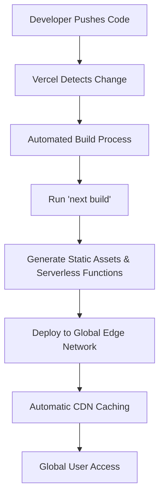
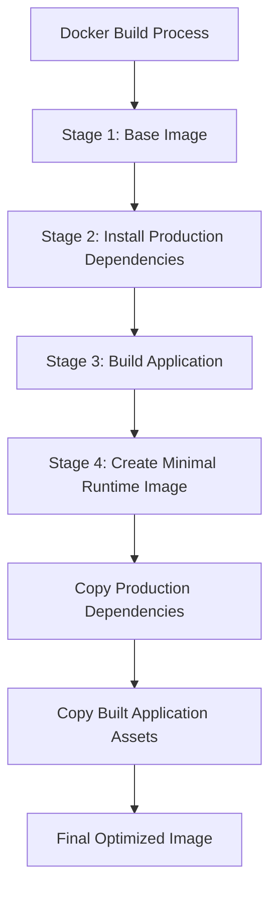
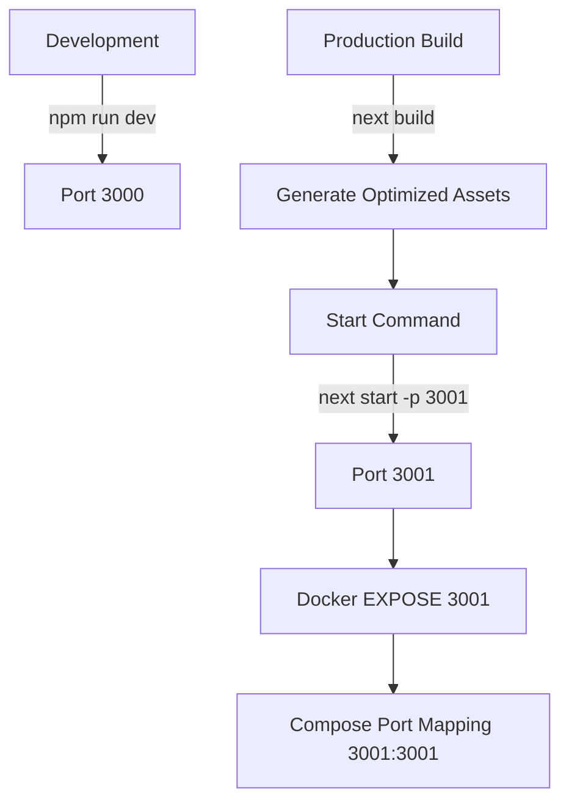

# Deployment Options

<cite>
**Referenced Files in This Document**   
- [Dockerfile](file://Dockerfile)
- [compose.yaml](file://compose.yaml)
- [package.json](file://package.json)
- [next.config.ts](file://next.config.ts)
- [README.md](file://README.md)
- [README.Docker.md](file://README.Docker.md)
- [.dockerignore](file://.dockerignore)
</cite>

## Table of Contents
1. [Introduction](#introduction)
2. [Vercel Deployment](#vercel-deployment)
3. [Docker-Based Deployment](#docker-based-deployment)
4. [Environment Configuration](#environment-configuration)
5. [Build and Port Configuration](#build-and-port-configuration)
6. [Scaling and Performance](#scaling-and-performance)
7. [Security Practices](#security-practices)
8. [Monitoring and Logging](#monitoring-and-logging)
9. [Deployment Guides](#deployment-guides)
10. [Conclusion](#conclusion)

## Introduction
This document outlines the deployment architecture for the Code Speeder application, detailing two primary deployment methods: Vercel for cloud-native deployment and Docker for self-hosted containerized deployment. The application is built using Next.js 16.1.1 with React 19.2.3, leveraging modern web development practices and optimizations. The documentation covers configuration, build processes, environment management, and operational considerations for both deployment options.

**Section sources**
- [README.md](file://README.md#L1-L37)
- [package.json](file://package.json#L2-L5)

## Vercel Deployment

### Primary Deployment Method
Vercel serves as the primary deployment platform for the Next.js application, offering seamless integration with the framework's optimizations. The deployment leverages Next.js serverless functions, automatic CDN integration, and built-in performance optimizations. As highlighted in the project's README, Vercel provides the easiest deployment path for Next.js applications, with automatic configuration detection and zero-configuration deployment.

### Next.js Optimizations
The application utilizes Next.js features such as automatic code splitting, image optimization, and font optimization through `next/font`. The configuration includes the React Compiler (enabled in `next.config.ts`), which optimizes React component rendering. Vercel automatically detects the Next.js framework and applies appropriate build settings, including running `next build` during the deployment process and serving the application through optimized serverless functions.

### Serverless Architecture
Vercel deploys the application using a serverless architecture, where each route is deployed as an independent serverless function. This approach provides automatic scaling, reduced cold start times, and cost efficiency based on actual usage. The platform handles SSL termination, CDN caching, and global distribution automatically, ensuring low latency for users worldwide.

**Diagram sources**
- [next.config.ts](file://next.config.ts#L1-L9)
- [README.md](file://README.md#L32-L37)

**Section sources**
- [README.md](file://README.md#L32-L37)
- [next.config.ts](file://next.config.ts#L5-L6)

## Docker-Based Deployment

### Containerization Strategy
The Docker-based deployment uses a multi-stage build process defined in the Dockerfile to optimize image size and build efficiency. The strategy separates dependency installation, application building, and runtime execution into distinct stages, minimizing the final image size and attack surface. This approach follows Docker best practices for Node.js applications, ensuring efficient builds and secure runtime environments.

### Multi-Stage Build Process
The Dockerfile implements a four-stage build process:
1. **Base stage**: Establishes the Node.js runtime environment using Alpine Linux
2. **Deps stage**: Installs production dependencies with caching optimization
3. **Build stage**: Installs all dependencies (including devDependencies) and runs the Next.js build process
4. **Final stage**: Creates a minimal runtime image with only production dependencies and built assets

This multi-stage approach leverages Docker's layer caching to speed up subsequent builds and reduces the final image size by excluding development dependencies and build tools from the runtime environment.

### Container Orchestration
The `compose.yaml` file defines a Docker Compose configuration for local development and testing, orchestrating both the application server and a PostgreSQL database. The configuration exposes the application on port 3001 and includes environment variable settings for both services. This setup enables developers to run the complete application stack with a single command, facilitating local testing and development.

**Diagram sources**
- [Dockerfile](file://Dockerfile#L9-L76)
- [compose.yaml](file://compose.yaml#L1-L31)

**Section sources**
- [Dockerfile](file://Dockerfile#L1-L77)
- [compose.yaml](file://compose.yaml#L1-L31)
- [README.Docker.md](file://README.Docker.md#L1-L22)

## Environment Configuration

### Environment Variable Management
The deployment configuration utilizes environment variables for runtime configuration. In the Docker Compose setup, the application environment is set to production through the `NODE_ENV` variable in the `compose.yaml` file. The PostgreSQL database configuration includes environment variables for user credentials and database name, following the 12-factor app methodology for configuration management.

### Sensitive Data Protection
The `.dockerignore` file explicitly excludes environment-specific configuration files such as `.env`, preventing accidental exposure of sensitive credentials in container images. This security measure ensures that environment variables must be provided through secure mechanisms during deployment rather than being baked into the container image.

### Database Integration
The Docker Compose configuration includes a PostgreSQL database service with persistent storage through a named volume (`db-data`). This setup provides a complete development environment with data persistence across container restarts. For production deployments, external database services are recommended to ensure data durability and high availability.

**Section sources**
- [compose.yaml](file://compose.yaml#L9-L28)
- [.dockerignore](file://.dockerignore#L1-L35)
- [Dockerfile](file://Dockerfile#L58-L59)

## Build and Port Configuration

### Production Build Process
The application build process is defined in the `package.json` scripts, where the `build` command executes `next build`. This command generates optimized production assets, including static pages, server-side rendered components, and API routes. The Docker build process automatically invokes this script during the build stage, ensuring consistent builds across environments.

### Port Configuration
The application is configured to run on port 3001, as specified in multiple locations:
- The `start` script in `package.json` includes the `-p 3001` flag
- The Dockerfile exposes port 3001 using the `EXPOSE` instruction
- The Docker Compose configuration maps host port 3001 to container port 3001

This consistent port configuration ensures that the application is accessible on the expected port across different deployment environments.

**Diagram sources**
- [package.json](file://package.json#L8-L8)
- [Dockerfile](file://Dockerfile#L72-L73)
- [compose.yaml](file://compose.yaml#L12-L12)

**Section sources**
- [package.json](file://package.json#L7-L8)
- [Dockerfile](file://Dockerfile#L72-L76)
- [compose.yaml](file://compose.yaml#L11-L13)

## Scaling and Performance

### Horizontal Scaling
The application architecture supports horizontal scaling through both deployment methods. On Vercel, scaling is automatic and handled by the platform based on traffic patterns. For Docker deployments, the application can be scaled horizontally using container orchestration platforms like Kubernetes or Docker Swarm, with the stateless nature of the Next.js application facilitating easy scaling.

### Caching Strategies
The deployment leverages multiple caching layers:
- **Vercel CDN**: Automatic global CDN caching for static assets and serverless function responses
- **Browser caching**: Next.js automatic asset hashing for long-term browser caching
- **Docker layer caching**: Build-time caching of dependency installation to speed up deployments
- **Application-level caching**: Potential for Redis or similar in-memory caching for database queries

### CDN Integration
Vercel provides automatic CDN integration, distributing content globally with low latency. For Docker deployments, CDN integration can be achieved through third-party services like Cloudflare, AWS CloudFront, or similar, requiring additional configuration at the infrastructure level.

**Section sources**
- [README.md](file://README.md#L21-L22)
- [Dockerfile](file://Dockerfile#L27-L34)

## Security Practices

### Container Security
The Docker deployment implements several security best practices:
- **Minimal base image**: Uses Alpine Linux to reduce attack surface
- **Non-root user**: Runs the application as the `node` user rather than root
- **Dependency isolation**: Separates production and development dependencies
- **Image optimization**: Multi-stage build excludes build tools from runtime

### API Endpoint Protection
While specific API security configurations are not detailed in the provided files, Next.js provides mechanisms for securing API routes through authentication, rate limiting, and input validation. The application should implement appropriate security measures for any API endpoints, including CORS configuration, authentication middleware, and input sanitization.

### Image Vulnerability Management
The use of specific Node.js and Alpine versions (defined in the Dockerfile ARGs) allows for controlled updates and vulnerability patching. Regular updates to the base image and dependencies are recommended to address security vulnerabilities.

**Section sources**
- [Dockerfile](file://Dockerfile#L60-L61)
- [Dockerfile](file://Dockerfile#L9-L10)

## Monitoring and Logging

### Production Monitoring
For Vercel deployments, monitoring is provided through the Vercel dashboard, including performance metrics, error tracking, and usage analytics. For Docker deployments, external monitoring solutions should be implemented, such as:
- Application performance monitoring (APM) tools
- Log aggregation systems
- Infrastructure monitoring
- Error tracking services

### Logging Configuration
The current configuration does not specify custom logging mechanisms. By default, Next.js applications output logs to stdout/stderr, which can be captured by container orchestration platforms or Vercel's logging system. For production applications, structured logging and centralized log management are recommended.

### Observability Recommendations
To enhance observability in production:
- Implement structured JSON logging
- Use distributed tracing for request flow tracking
- Set up alerting for critical errors and performance degradation
- Monitor resource utilization and scaling events
- Track business metrics alongside technical metrics

**Section sources**
- [Dockerfile](file://Dockerfile#L75-L76)
- [package.json](file://package.json#L6-L10)

## Deployment Guides

### Vercel Deployment Steps
1. Push code to a Git repository (GitHub, GitLab, or Bitbucket)
2. Sign in to Vercel and import the project
3. Vercel automatically detects the Next.js framework
4. Configure environment variables if needed
5. Deploy the application with default settings
6. Access the application at the provided Vercel URL

### Docker Deployment Steps
1. Build the Docker image: `docker build -t code-speeder .`
2. Run with Docker Compose: `docker compose up --build`
3. Access the application at http://localhost:3001
4. For production deployment:
   - Build for target platform: `docker build --platform=linux/amd64 -t myregistry.com/code-speeder .`
   - Push to container registry: `docker push myregistry.com/code-speeder`
   - Deploy to container orchestration platform

**Section sources**
- [README.Docker.md](file://README.Docker.md#L3-L19)
- [README.md](file://README.md#L32-L37)
- [Dockerfile](file://Dockerfile#L1-L77)

## Conclusion
The Code Speeder application supports two robust deployment options: Vercel for cloud-native, zero-configuration deployment and Docker for self-hosted, containerized deployment. Both methods leverage Next.js optimizations and provide scalable, secure production environments. The multi-stage Docker build process ensures efficient, secure container images, while Vercel offers automatic optimizations and global distribution. Environment configuration, port settings, and build processes are consistently defined across both deployment methods, ensuring predictable behavior in different environments.