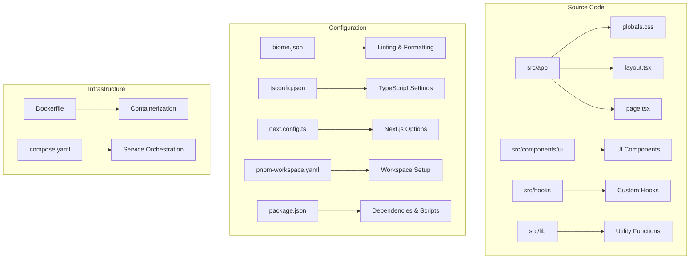
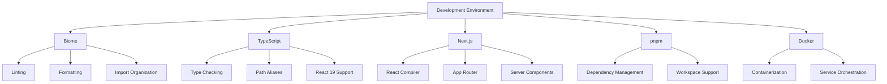
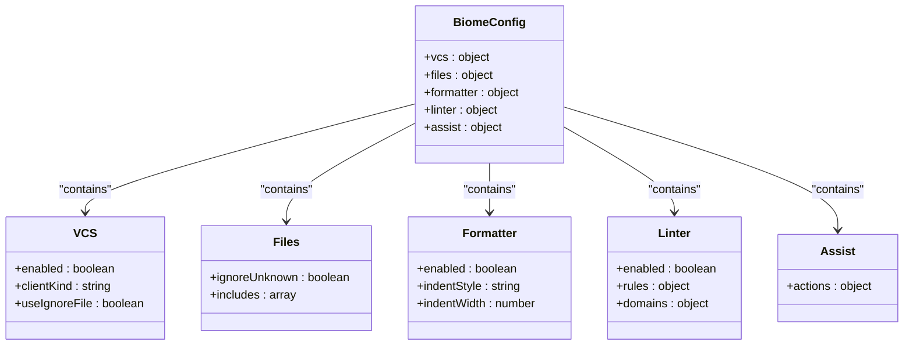
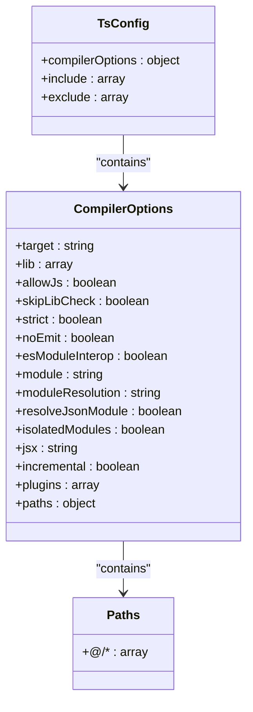
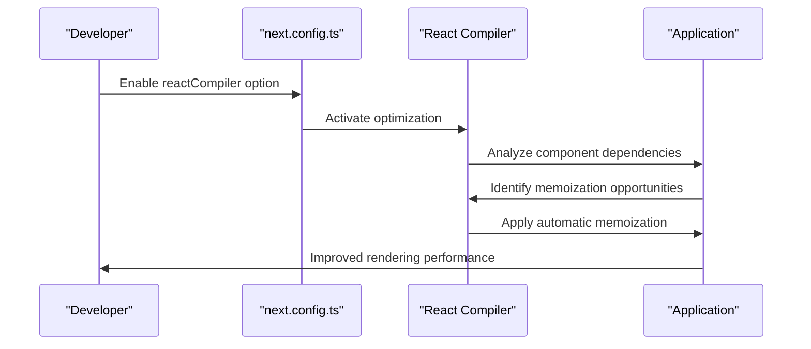
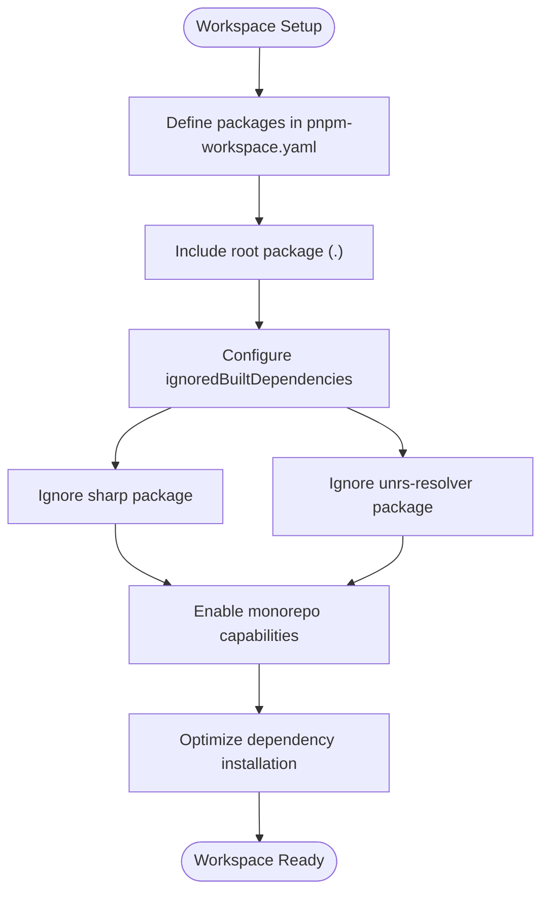
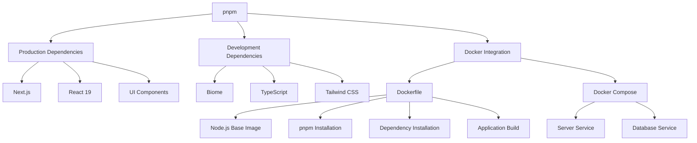

# Development Environment Setup

<cite>
**Referenced Files in This Document**   
- [biome.json](file://biome.json)
- [tsconfig.json](file://tsconfig.json)
- [next.config.ts](file://next.config.ts)
- [pnpm-workspace.yaml](file://pnpm-workspace.yaml)
- [package.json](file://package.json)
- [components.json](file://components.json)
- [postcss.config.mjs](file://postcss.config.mjs)
- [Dockerfile](file://Dockerfile)
- [compose.yaml](file://compose.yaml)
</cite>

## Table of Contents
1. [Introduction](#introduction)
2. [Project Structure](#project-structure)
3. [Core Components](#core-components)
4. [Architecture Overview](#architecture-overview)
5. [Detailed Component Analysis](#detailed-component-analysis)
6. [Dependency Analysis](#dependency-analysis)
7. [Performance Considerations](#performance-considerations)
8. [Troubleshooting Guide](#troubleshooting-guide)
9. [Conclusion](#conclusion)

## Introduction
This document provides comprehensive guidance for setting up the development environment for the Code Speeder project. The application is built using Next.js 16 with React 19, TypeScript, and Biome for linting and formatting. The setup includes configuration for pnpm as the package manager, path aliases for improved import organization, and IDE support for modern web development practices. This guide covers all necessary steps to configure a consistent development environment across the team, ensuring code quality and maintainability.

## Project Structure
The project follows a standard Next.js App Router structure with organized component libraries and utility functions. The source code is located in the `src` directory, which contains the `app` directory for page routing, `components/ui` for reusable UI components, `hooks` for custom React hooks, and `lib` for utility functions. Configuration files are located at the root level, including biome.json for linting, tsconfig.json for TypeScript configuration, and next.config.ts for Next.js-specific settings. The project uses pnpm as the package manager with workspace configuration for potential monorepo expansion.

**Diagram sources**
- [src/app](file://src/app)
- [src/components/ui](file://src/components/ui)
- [biome.json](file://biome.json#L1-L38)
- [tsconfig.json](file://tsconfig.json#L1-L35)
- [next.config.ts](file://next.config.ts#L1-L9)
- [pnpm-workspace.yaml](file://pnpm-workspace.yaml#L1-L6)
- [Dockerfile](file://Dockerfile#L1-L77)
- [compose.yaml](file://compose.yaml#L1-L31)

**Section sources**
- [package.json](file://package.json#L1-L74)
- [project_structure](file://project_structure)

## Core Components
The core components of the development environment include Biome for code quality assurance, TypeScript for type safety, and Next.js for framework functionality. Biome handles both linting and formatting tasks, replacing traditional tools like ESLint and Prettier. TypeScript configuration enables path aliases and React 19 compatibility, while Next.js compiler options optimize performance. The pnpm workspace configuration supports potential monorepo expansion, allowing multiple packages to share dependencies efficiently.

**Section sources**
- [biome.json](file://biome.json#L1-L38)
- [tsconfig.json](file://tsconfig.json#L1-L35)
- [next.config.ts](file://next.config.ts#L1-L9)
- [pnpm-workspace.yaml](file://pnpm-workspace.yaml#L1-L6)

## Architecture Overview
The development environment architecture integrates multiple tools to ensure code quality and consistency. Biome serves as the primary tool for code analysis, combining linting, formatting, and import organization. TypeScript provides type checking with path alias support, while Next.js enables React 19 features and compiler optimizations. The pnpm package manager manages dependencies efficiently, with workspace configuration allowing for future monorepo expansion. Docker and Docker Compose provide containerization for consistent deployment across environments.

**Diagram sources**
- [biome.json](file://biome.json#L1-L38)
- [tsconfig.json](file://tsconfig.json#L1-L35)
- [next.config.ts](file://next.config.ts#L1-L9)
- [pnpm-workspace.yaml](file://pnpm-workspace.yaml#L1-L6)
- [Dockerfile](file://Dockerfile#L1-L77)
- [compose.yaml](file://compose.yaml#L1-L31)

## Detailed Component Analysis

### Biome Configuration Analysis
The Biome configuration provides comprehensive code quality enforcement through integrated linting and formatting rules. The tool replaces traditional ESLint and Prettier setups with a single, faster solution that handles both concerns. Configuration includes VCS integration, file inclusion patterns, and domain-specific rules for React and Next.js development.

**Diagram sources**
- [biome.json](file://biome.json#L1-L38)

**Section sources**
- [biome.json](file://biome.json#L1-L38)
- [package.json](file://package.json#L9-L10)

### TypeScript Configuration Analysis
The TypeScript configuration enables modern development practices with path aliases and React 19 compatibility. The setup includes strict type checking, ES module support, and JSX transformation for React applications. Path aliases simplify imports by allowing `@/*` syntax to reference files in the `src` directory.

**Diagram sources**
- [tsconfig.json](file://tsconfig.json#L1-L35)

**Section sources**
- [tsconfig.json](file://tsconfig.json#L1-L35)
- [components.json](file://components.json#L15-L19)

### Next.js Configuration Analysis
The Next.js configuration enables the React Compiler for optimized rendering performance. This experimental feature automatically optimizes React components by determining which parts should be memoized, reducing unnecessary re-renders and improving application performance.

**Diagram sources**
- [next.config.ts](file://next.config.ts#L1-L9)

**Section sources**
- [next.config.ts](file://next.config.ts#L1-L9)
- [package.json](file://package.json#L50-L51)

### pnpm Workspace Configuration Analysis
The pnpm workspace configuration enables monorepo capabilities by defining package locations and ignored dependencies. This setup allows multiple packages to share dependencies efficiently while maintaining isolated dependency trees.

**Diagram sources**
- [pnpm-workspace.yaml](file://pnpm-workspace.yaml#L1-L6)

**Section sources**
- [pnpm-workspace.yaml](file://pnpm-workspace.yaml#L1-L6)
- [package.json](file://package.json#L1-L74)

## Dependency Analysis
The project dependencies are managed through pnpm with a clear separation between production and development dependencies. The configuration ensures efficient dependency resolution and installation while supporting containerized deployment through Docker.

**Diagram sources**
- [package.json](file://package.json#L1-L74)
- [Dockerfile](file://Dockerfile#L1-L77)
- [compose.yaml](file://compose.yaml#L1-L31)

**Section sources**
- [package.json](file://package.json#L1-L74)
- [Dockerfile](file://Dockerfile#L1-L77)
- [compose.yaml](file://compose.yaml#L1-L31)

## Performance Considerations
The development environment includes several performance optimizations. The React Compiler automatically optimizes component rendering, reducing unnecessary re-renders. Biome provides fast linting and formatting compared to traditional ESLint/Prettier setups. The pnpm package manager uses hard links to save disk space and improve installation speed. Docker caching strategies in the Dockerfile optimize build times by leveraging layer caching for dependency installation.

**Section sources**
- [next.config.ts](file://next.config.ts#L5)
- [biome.json](file://biome.json#L12-L16)
- [Dockerfile](file://Dockerfile#L20-L45)

## Troubleshooting Guide
Common issues in the development environment typically relate to tool configuration, type checking, or dependency management. This section provides solutions for frequent problems encountered during setup and development.

### Biome Configuration Issues
When Biome doesn't recognize globals or produces unexpected linting errors, ensure the configuration is properly loaded and that the Biome CLI is correctly installed. The vcs configuration in biome.json enables Git integration, which may affect file discovery.

**Section sources**
- [biome.json](file://biome.json#L3-L7)

### TypeScript Type Errors
Type errors related to path aliases can occur when IDEs don't properly recognize the @/* import syntax. Ensure that both tsconfig.json and components.json are correctly configured with matching path definitions.

**Section sources**
- [tsconfig.json](file://tsconfig.json#L21-L23)
- [components.json](file://components.json#L15-L19)

### ESLint Conflict Resolution
Since Biome replaces ESLint functionality, remove any ESLint configurations or dependencies to prevent conflicts. The package.json shows Biome as the linting tool with "biome check" as the lint script.

**Section sources**
- [package.json](file://package.json#L9)
- [biome.json](file://biome.json#L17-L29)

## Conclusion
The development environment for Code Speeder is configured with modern tools and best practices to ensure code quality, performance, and maintainability. Biome provides integrated linting and formatting, TypeScript enables type safety with convenient path aliases, and Next.js supports the latest React features including the React Compiler. The pnpm workspace configuration allows for future monorepo expansion, while Docker ensures consistent deployment across environments. By following this setup, developers can maintain a consistent and efficient development workflow.