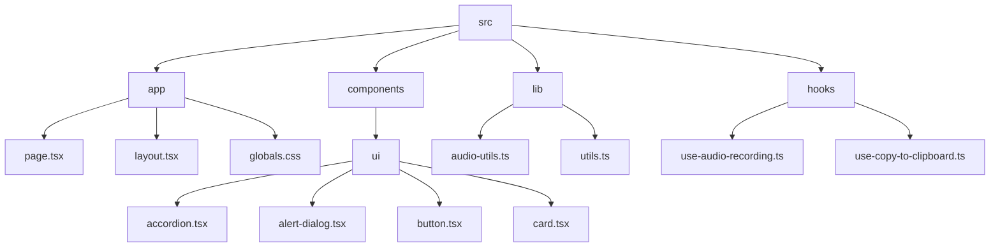
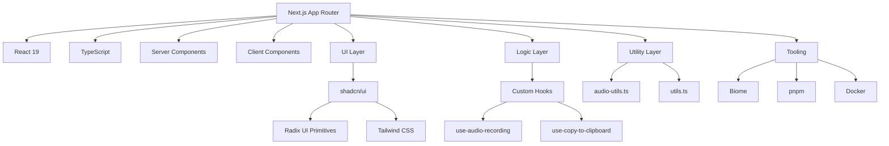
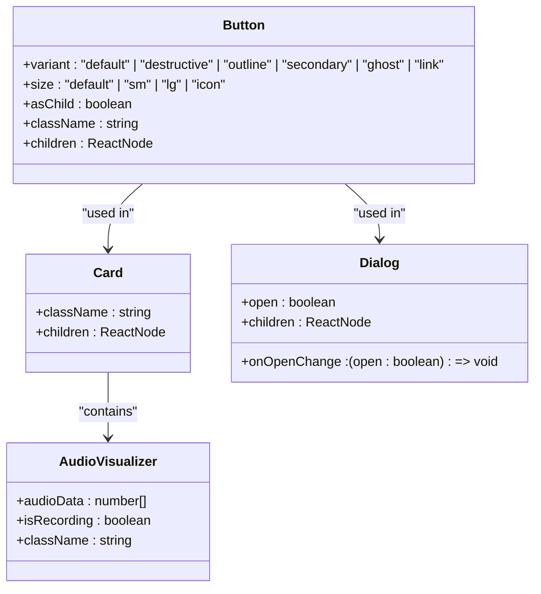
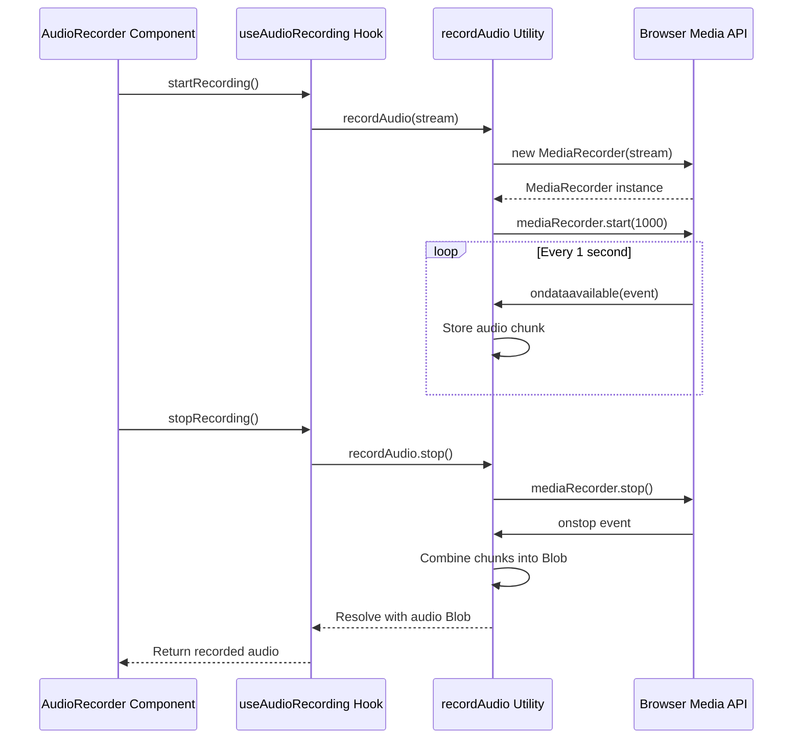
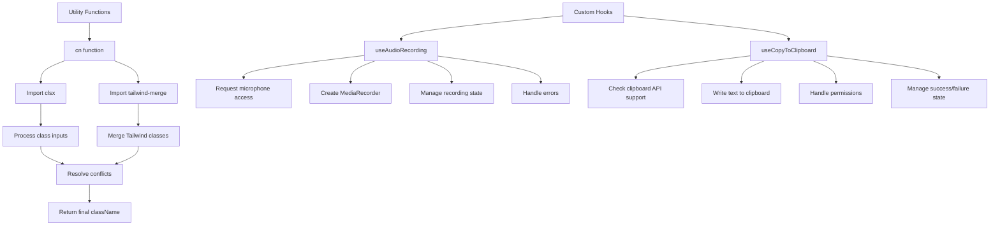

# Project Overview

<cite>
**Referenced Files in This Document**   
- [page.tsx](file://src/app/page.tsx)
- [layout.tsx](file://src/app/layout.tsx)
- [globals.css](file://src/app/globals.css)
- [audio-utils.ts](file://src/lib/audio-utils.ts)
- [utils.ts](file://src/lib/utils.ts)
- [components.json](file://components.json)
- [package.json](file://package.json)
- [biome.json](file://biome.json)
- [Dockerfile](file://Dockerfile)
- [tsconfig.json](file://tsconfig.json)
</cite>

## Table of Contents
1. [Introduction](#introduction)
2. [Project Structure](#project-structure)
3. [Core Components](#core-components)
4. [Architecture Overview](#architecture-overview)
5. [Detailed Component Analysis](#detailed-component-analysis)
6. [Dependency Analysis](#dependency-analysis)
7. [Performance Considerations](#performance-considerations)
8. [Troubleshooting Guide](#troubleshooting-guide)
9. [Conclusion](#conclusion)

## Introduction
The code-speeder project is a modern frontend application built on the Next.js framework, designed to support audio recording, visualization, and potential transcription integration. It leverages the latest web technologies including React 19, Next.js App Router, and TypeScript to deliver a responsive and interactive user experience. The application follows a component-driven architecture using shadcn/ui and Radix UI primitives for consistent, accessible UI elements. Developer tooling is enhanced with Biome for linting and formatting, pnpm for package management, and Docker for containerized deployment. This document provides a comprehensive overview of the project's structure, architecture, and key functionality.

**Section sources**
- [README.md](file://README.md#L1-L37)
- [package.json](file://package.json#L2-L74)

## Project Structure
The code-speeder project follows a standard Next.js App Router structure with a clear separation of concerns. The `src/app` directory contains the application's entry points, including `page.tsx` for the main page and `layout.tsx` for the root layout. UI components are organized under `src/components/ui`, following the shadcn/ui pattern of reusable, accessible components built on Radix UI primitives. Custom hooks are located in `src/hooks`, providing reusable logic for audio recording, clipboard operations, and responsive design detection. Utility functions are centralized in `src/lib`, with `utils.ts` handling class name merging and `audio-utils.ts` managing audio recording functionality. Configuration files include `components.json` for shadcn/ui settings, `biome.json` for code quality tools, and `Dockerfile` for containerization.



**Diagram sources**
- [src/app/page.tsx](file://src/app/page.tsx#L1-L66)
- [src/components/ui](file://src/components/ui)
- [src/lib](file://src/lib)
- [src/hooks](file://src/hooks)

**Section sources**
- [src/app/page.tsx](file://src/app/page.tsx#L1-L66)
- [src/app/layout.tsx](file://src/app/layout.tsx#L1-L35)
- [src/lib/audio-utils.ts](file://src/lib/audio-utils.ts#L1-L51)
- [src/lib/utils.ts](file://src/lib/utils.ts#L1-L7)

## Core Components
The core components of the code-speeder application are built using a combination of shadcn/ui and Radix UI primitives, ensuring accessibility and consistency across the interface. The UI component library in `src/components/ui` includes a comprehensive set of elements such as buttons, cards, dialogs, and form controls, all styled with Tailwind CSS and configured through the `components.json` file. The application leverages React 19 features and the Next.js App Router for server components and routing. Key functionality is encapsulated in custom hooks and utility functions, with audio recording capabilities provided by the `recordAudio` function in `audio-utils.ts`. The `cn` utility function combines `clsx` and `tailwind-merge` for reliable class name composition, addressing common styling conflicts in Tailwind CSS applications.

**Section sources**
- [components.json](file://components.json#L1-L23)
- [src/lib/utils.ts](file://src/lib/utils.ts#L1-L7)
- [src/lib/audio-utils.ts](file://src/lib/audio-utils.ts#L1-L51)
- [package.json](file://package.json#L13-L60)

## Architecture Overview
The code-speeder application follows a modern frontend architecture built on Next.js with React 19, utilizing the App Router pattern for server-side rendering and client component management. The architecture is component-driven, with UI elements built using shadcn/ui components that wrap Radix UI primitives for accessibility and functionality. The application structure separates concerns into distinct directories: `app` for routing and page layout, `components/ui` for reusable UI elements, `hooks` for custom React hooks, and `lib` for utility functions. Styling is managed through Tailwind CSS with custom theme variables defined in `globals.css`, supporting both light and dark modes. The build and development tooling includes Biome for code quality, pnpm for package management, and Docker for containerized deployment, ensuring consistency across development and production environments.



**Diagram sources**
- [package.json](file://package.json#L48-L52)
- [components.json](file://components.json#L1-L23)
- [src/lib/audio-utils.ts](file://src/lib/audio-utils.ts#L1-L51)
- [src/lib/utils.ts](file://src/lib/utils.ts#L1-L7)
- [biome.json](file://biome.json#L1-L38)
- [Dockerfile](file://Dockerfile#L1-L77)

**Section sources**
- [package.json](file://package.json#L48-L52)
- [tsconfig.json](file://tsconfig.json#L1-L35)
- [components.json](file://components.json#L1-L23)
- [biome.json](file://biome.json#L1-L38)

## Detailed Component Analysis

### UI Component System
The UI component system in code-speeder is built on the shadcn/ui pattern, which provides pre-styled React components that wrap Radix UI primitives. These components are located in `src/components/ui` and include essential elements like buttons, cards, dialogs, and form controls. Each component is designed to be accessible, responsive, and customizable through props. The component library leverages Tailwind CSS for styling, with theme variables defined in `globals.css` to support consistent design tokens across light and dark modes. The `components.json` configuration file sets up path aliases and styling preferences, enabling clean imports throughout the application.



**Diagram sources**
- [components.json](file://components.json#L1-L23)
- [src/components/ui/button.tsx](file://src/components/ui/button.tsx)
- [src/components/ui/card.tsx](file://src/components/ui/card.tsx)
- [src/components/ui/dialog.tsx](file://src/components/ui/dialog.tsx)

**Section sources**
- [components.json](file://components.json#L1-L23)
- [src/components/ui](file://src/components/ui)

### Audio Processing Module
The audio processing functionality in code-speeder is centered around the `recordAudio` utility function in `src/lib/audio-utils.ts`. This function creates a MediaRecorder instance to capture audio from a MediaStream, collecting audio chunks and assembling them into a Blob when recording stops. The implementation uses the Web Audio API with the "audio/webm;codecs=opus" MIME type for efficient compression and broad browser compatibility. The function returns a promise that resolves with the recorded audio Blob, enabling asynchronous processing of the recorded audio. Error handling is implemented to catch MediaRecorder errors and provide meaningful error messages. The utility is designed to be used with React hooks to manage state and lifecycle events in the component layer.



**Diagram sources**
- [src/lib/audio-utils.ts](file://src/lib/audio-utils.ts#L1-L51)

**Section sources**
- [src/lib/audio-utils.ts](file://src/lib/audio-utils.ts#L1-L51)

### Utility Functions and Hooks
The code-speeder project includes a collection of utility functions and custom hooks that provide reusable functionality across the application. The `cn` function in `src/lib/utils.ts` combines `clsx` and `tailwind-merge` to safely compose Tailwind CSS classes, resolving conflicts and ensuring predictable styling. Custom hooks in the `src/hooks` directory encapsulate component logic for audio recording, clipboard operations, and responsive design detection. These hooks follow React best practices for state management and side effects, making them reusable across different components. The `use-audio-recording` hook would typically manage the MediaRecorder state and provide start/stop recording functionality, while `use-copy-to-clipboard` would handle copying text to the system clipboard with appropriate error handling.



**Diagram sources**
- [src/lib/utils.ts](file://src/lib/utils.ts#L1-L7)
- [src/hooks/use-audio-recording.ts](file://src/hooks/use-audio-recording.ts)
- [src/hooks/use-copy-to-clipboard.ts](file://src/hooks/use-copy-to-clipboard.ts)

**Section sources**
- [src/lib/utils.ts](file://src/lib/utils.ts#L1-L7)

## Dependency Analysis
The code-speeder project has a well-defined dependency structure with clear separation between production and development dependencies. Production dependencies include essential libraries for UI development such as React 19, Next.js 16.1.1, and various Radix UI components that power the shadcn/ui library. The UI toolkit is enhanced with utility libraries like `class-variance-authority`, `clsx`, and `tailwind-merge` for styling, while `lucide-react` provides icons. State management and form handling are supported by `react-hook-form` and `zod` for validation. Development dependencies include Biome for code quality, TypeScript for type checking, and Tailwind CSS for styling. The project also includes specialized libraries for animations (`framer-motion`), charts (`recharts`), and toast notifications (`sonner`).

```mermaid
graph TD
A[Production Dependencies] --> B[React 19.2.3]
A --> C[Next.js 16.1.1]
A --> D[Radix UI Components]
A --> E[shadcn/ui]
A --> F[Tailwind CSS Utilities]
A --> G[Form Libraries]
A --> H[Icon Library]
B --> I[React DOM]
C --> J[Next Font]
D --> K[@radix-ui/react-button]
D --> L[@radix-ui/react-dialog]
D --> M[@radix-ui/react-dropdown-menu]
E --> N[class-variance-authority]
E --> O[clsx]
E --> P[tailwind-merge]
G --> Q[react-hook-form]
G --> R[zod]
H --> S[lucide-react]
T[Development Dependencies] --> U[Biome 2.2.0]
T --> V[TypeScript]
T --> W[Tailwind CSS]
T --> X[@types/node]
T --> Y[@types/react]
U --> Z[Linting]
U --> AA[Formatting]
U --> AB[Type Checking]
```

**Diagram sources**
- [package.json](file://package.json#L13-L60)

**Section sources**
- [package.json](file://package.json#L13-L60)

## Performance Considerations
The code-speeder application implements several performance optimizations for audio processing in browser environments. The audio recording functionality uses the MediaRecorder API with the Opus codec in WebM containers, which provides efficient compression and small file sizes while maintaining good audio quality. The recording is configured with a 1-second time slice to balance memory usage and responsiveness, preventing excessive memory consumption during long recordings. The application leverages Next.js's built-in optimizations including automatic code splitting, image optimization, and font optimization through the Geist font loader. The component architecture follows React best practices with reusable components and proper state management to minimize re-renders. For production deployment, the Docker configuration optimizes the build process with multi-stage builds and cache mounting to speed up dependency installation and application building.

**Section sources**
- [src/lib/audio-utils.ts](file://src/lib/audio-utils.ts#L1-L51)
- [package.json](file://package.json#L8-L9)
- [Dockerfile](file://Dockerfile#L1-L77)
- [next.config.ts](file://next.config.ts)

## Troubleshooting Guide
Common issues in the code-speeder project typically relate to audio recording permissions, development environment setup, and build configuration. For audio recording functionality, ensure that the browser has microphone permissions enabled for the application, as the MediaRecorder API requires user consent. Development environment issues may arise from using the wrong package manager; the project is configured for pnpm, so use `pnpm install` and `pnpm dev` commands rather than npm or yarn. Type checking errors can occur if TypeScript is not properly configured; ensure that the `tsconfig.json` file is correctly set up with the appropriate compiler options. When building with Docker, verify that the NODE_VERSION and PNPM_VERSION arguments in the Dockerfile match the versions used in development. Biome formatting and linting issues can be resolved by running `pnpm format` and `pnpm lint` commands to ensure code style consistency.

**Section sources**
- [package.json](file://package.json#L6-L11)
- [Dockerfile](file://Dockerfile#L9-L10)
- [biome.json](file://biome.json#L1-L38)
- [tsconfig.json](file://tsconfig.json#L1-L35)

## Conclusion
The code-speeder project represents a modern, well-structured frontend application built with Next.js, React 19, and TypeScript. Its component-driven architecture using shadcn/ui and Radix UI primitives ensures a consistent, accessible user interface. The application is designed to support audio recording and visualization with potential transcription integration, leveraging the Web Audio API and efficient Opus encoding. The development environment is enhanced with modern tooling including Biome for code quality, pnpm for package management, and Docker for containerized deployment. The clear separation of concerns between UI components, custom hooks, and utility functions makes the codebase maintainable and extensible. With its comprehensive component library and well-defined architecture, code-speeder provides a solid foundation for building audio-focused web applications.