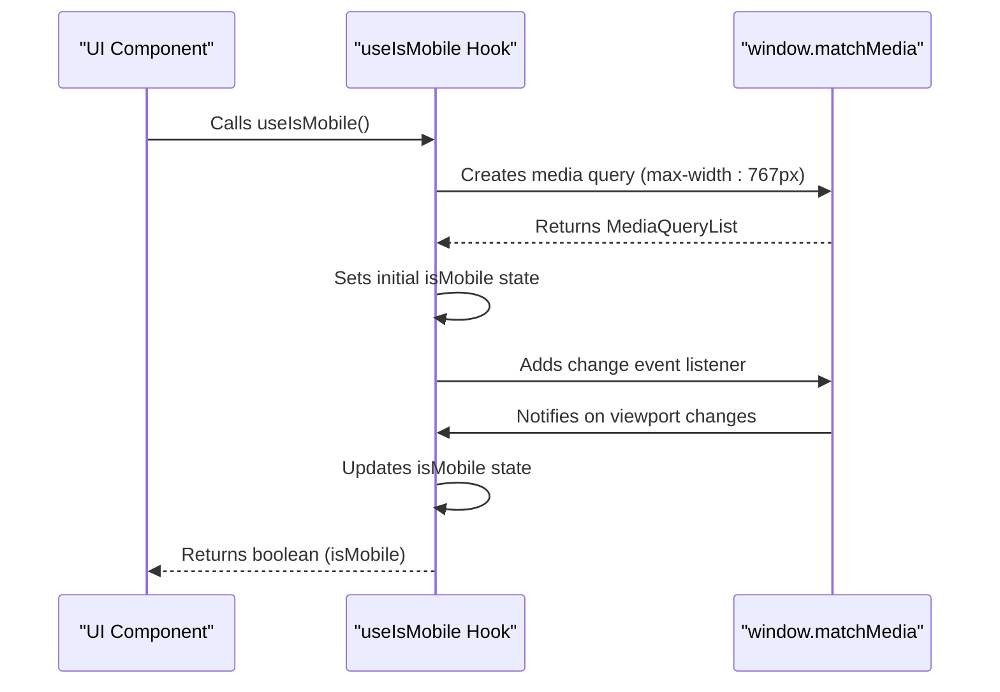
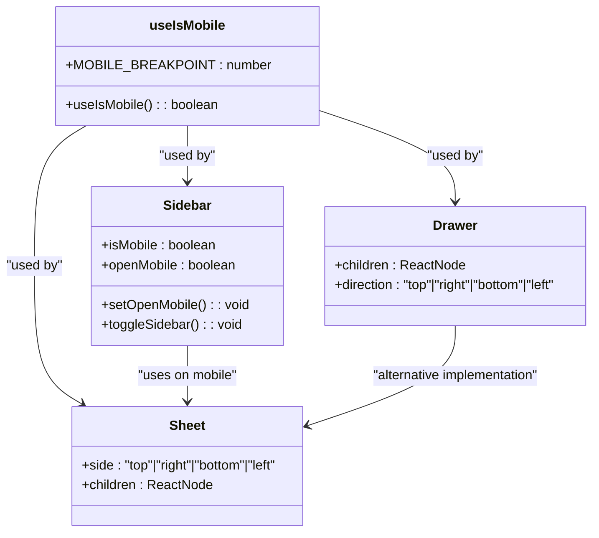
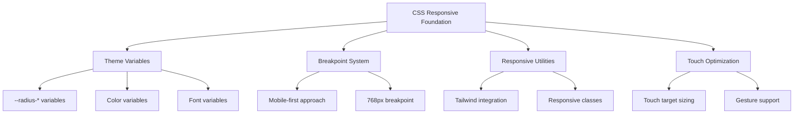
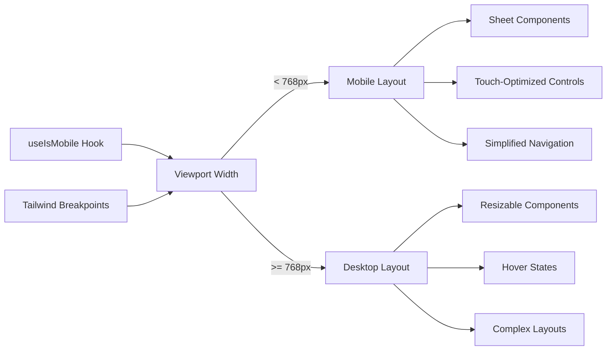
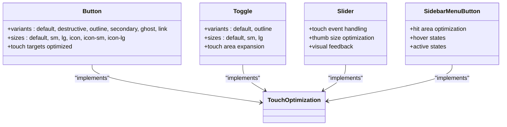
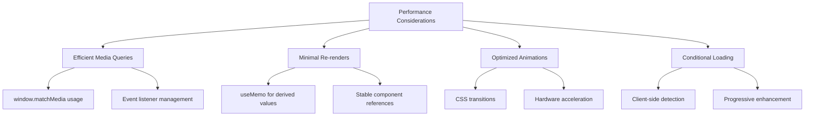
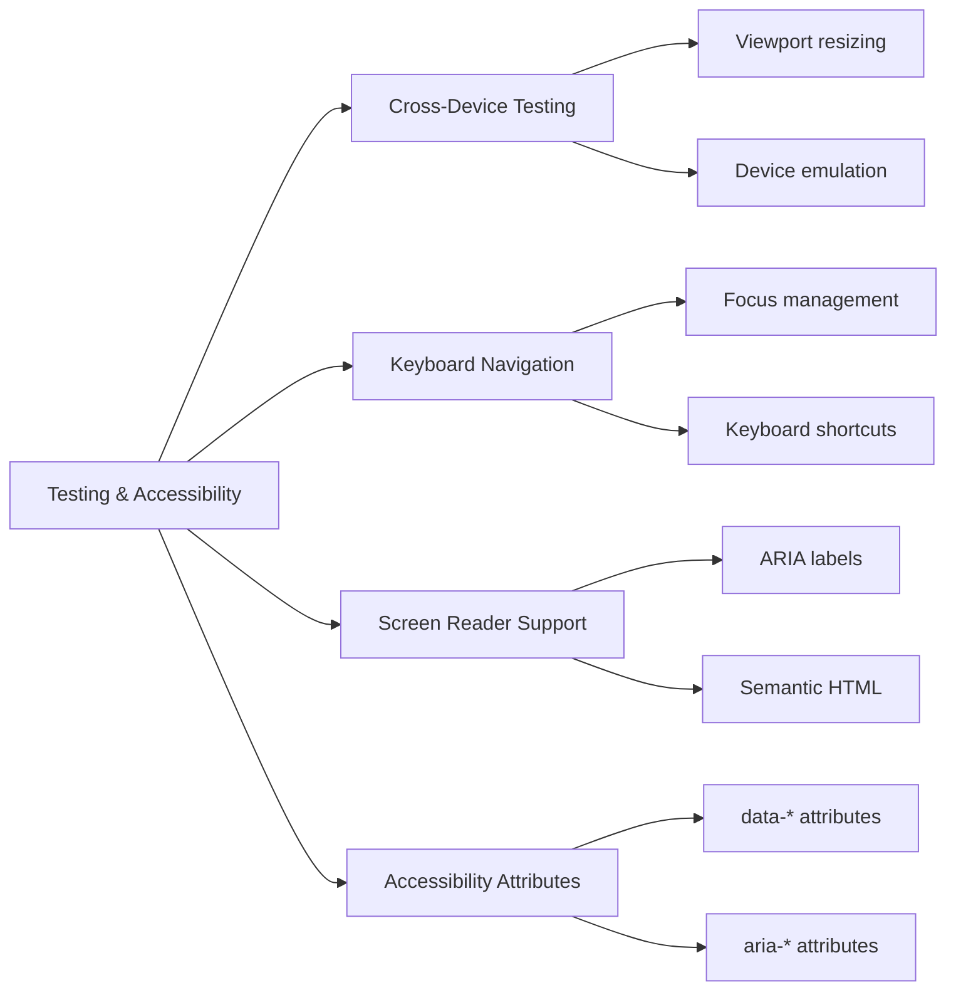

# Responsive Design & Mobile Support

<cite>
**Referenced Files in This Document**   
- [use-mobile.ts](file://src/hooks/use-mobile.ts)
- [globals.css](file://src/app/globals.css)
- [sidebar.tsx](file://src/components/ui/sidebar.tsx)
- [sheet.tsx](file://src/components/ui/sheet.tsx)
- [button.tsx](file://src/components/ui/button.tsx)
- [toggle.tsx](file://src/components/ui/toggle.tsx)
- [slider.tsx](file://src/components/ui/slider.tsx)
- [layout.tsx](file://src/app/layout.tsx)
- [page.tsx](file://src/app/page.tsx)
- [utils.ts](file://src/lib/utils.ts)
</cite>

## Table of Contents
1. [Introduction](#introduction)
2. [Mobile Detection with useIsMobile Hook](#mobile-detection-with-useismobile-hook)
3. [Responsive Component Implementation](#responsive-component-implementation)
4. [CSS Strategies for Responsive Design](#css-strategies-for-responsive-design)
5. [Conditional Rendering and Breakpoints](#conditional-rendering-and-breakpoints)
6. [Touch-Friendly Controls and Interaction Patterns](#touch-friendly-controls-and-interaction-patterns)
7. [Performance Considerations for Mobile Devices](#performance-considerations-for-mobile-devices)
8. [Testing and Accessibility](#testing-and-accessibility)
9. [Conclusion](#conclusion)

## Introduction
This document provides comprehensive documentation on the responsive design and mobile optimization strategies implemented in the codebase. The system employs a mobile-first approach with adaptive UI rendering based on device characteristics. Key components include a custom `useIsMobile` hook for device detection, responsive UI components that adapt to different screen sizes, and CSS strategies that ensure optimal user experience across devices. The implementation leverages Tailwind CSS for responsive breakpoints and provides specialized components for touch interfaces.

## Mobile Detection with useIsMobile Hook

The `useIsMobile` hook is the foundation of the responsive design system, providing reliable device type detection through window.matchMedia. This hook determines whether the current device should be treated as mobile based on screen width, enabling conditional rendering and adaptive behavior throughout the application.

**Diagram sources**
- [use-mobile.ts](file://src/hooks/use-mobile.ts#L1-L19)

**Section sources**
- [use-mobile.ts](file://src/hooks/use-mobile.ts#L1-L19)

### Implementation Details
The `useIsMobile` hook implements a robust mobile detection mechanism with the following characteristics:

- **Breakpoint Configuration**: Uses a mobile breakpoint of 768px, consistent with common responsive design practices
- **Media Query Integration**: Leverages `window.matchMedia` for efficient viewport detection without continuous window resize event listeners
- **State Management**: Maintains the mobile state using React.useState with proper initialization
- **Event Handling**: Adds and removes event listeners appropriately in useEffect cleanup
- **SSR Compatibility**: Returns undefined initially, then determines mobile state during component mount

The hook returns `true` when the viewport width is less than 768px and `false` otherwise, providing a simple boolean interface for components to adapt their behavior based on device type.

## Responsive Component Implementation

The codebase includes several components specifically designed to provide optimal user experiences on both desktop and mobile devices. These components adapt their layout, behavior, and interaction patterns based on the detected device type.

**Diagram sources**
- [use-mobile.ts](file://src/hooks/use-mobile.ts#L1-L19)
- [sidebar.tsx](file://src/components/ui/sidebar.tsx#L1-L727)
- [sheet.tsx](file://src/components/ui/sheet.tsx#L1-L140)
- [drawer.tsx](file://src/components/ui/drawer.tsx#L1-L136)

**Section sources**
- [sidebar.tsx](file://src/components/ui/sidebar.tsx#L1-L727)
- [sheet.tsx](file://src/components/ui/sheet.tsx#L1-L140)
- [drawer.tsx](file://src/components/ui/drawer.tsx#L1-L136)

### Sidebar Component
The Sidebar component demonstrates sophisticated responsive behavior by adapting its presentation based on device type:

- **Desktop**: Displays as a persistent sidebar with collapsible states
- **Mobile**: Transforms into a Sheet component that slides in from the side
- **State Management**: Maintains separate open states for desktop and mobile views
- **Cookie Persistence**: Stores sidebar state in cookies for user preference retention

The component uses the `useIsMobile` hook to determine the current device type and renders appropriate UI elements accordingly, ensuring optimal space utilization on smaller screens.

### Sheet and Drawer Components
The Sheet and Drawer components provide mobile-friendly alternatives to traditional modal dialogs:

- **Slide Animations**: Implement smooth entrance and exit animations appropriate for mobile interfaces
- **Touch Gestures**: Support swipe gestures for dismissing the component
- **Overlay Interaction**: Clicking the overlay closes the sheet, providing intuitive mobile behavior
- **Fixed Positioning**: Use fixed positioning to maintain visibility during page scrolling

These components are designed with touch interfaces in mind, featuring adequate touch targets and visual feedback for user interactions.

## CSS Strategies for Responsive Design

The CSS implementation in globals.css provides a comprehensive foundation for responsive design, establishing consistent styling patterns and responsive behaviors across the application.

**Diagram sources**
- [globals.css](file://src/app/globals.css#L1-L126)
- [utils.ts](file://src/lib/utils.ts#L1-L7)

**Section sources**
- [globals.css](file://src/app/globals.css#L1-L126)
- [utils.ts](file://src/lib/utils.ts#L1-L7)

### Theme and Spacing System
The CSS implementation includes a comprehensive theme system with:

- **Radius Variables**: A systematic approach to border radii with multiple sizes from sm to 4xl
- **Color Variables**: Consistent color palette with light and dark mode support
- **Font Variables**: Standardized font families for sans and mono text
- **CSS Custom Properties**: Theme variables that can be easily customized

The radius system, in particular, provides a consistent approach to component corner styling, with values calculated relative to a base radius of 0.625rem (10px).

### Responsive Utilities
The CSS strategy incorporates several responsive utilities:

- **Mobile-First Approach**: Styles are designed to work on mobile devices first, with enhancements for larger screens
- **Dark Mode Support**: Comprehensive dark theme with appropriate color adjustments
- **Accessibility Features**: Focus states, keyboard navigation support, and screen reader optimizations
- **Performance Optimization**: Efficient CSS with minimal specificity and optimized selectors

The implementation uses Tailwind CSS for responsive utilities, allowing components to easily adapt to different screen sizes using utility classes.

## Conditional Rendering and Breakpoints

The application implements conditional rendering patterns that adapt the UI based on device characteristics, primarily using the 768px breakpoint to distinguish between mobile and desktop experiences.

**Diagram sources**
- [use-mobile.ts](file://src/hooks/use-mobile.ts#L1-L19)
- [globals.css](file://src/app/globals.css#L1-L126)
- [page.tsx](file://src/app/page.tsx#L1-L66)

**Section sources**
- [use-mobile.ts](file://src/hooks/use-mobile.ts#L1-L19)
- [globals.css](file://src/app/globals.css#L1-L126)
- [page.tsx](file://src/app/page.tsx#L1-L66)

### Implementation Patterns
The codebase demonstrates several patterns for conditional rendering:

- **Hook-Based Detection**: Using `useIsMobile` to determine device type in functional components
- **Tailwind Responsive Classes**: Leveraging Tailwind's responsive prefixes (sm:, md:, lg:) for CSS-based adaptations
- **Component Substitution**: Replacing desktop components with mobile-optimized alternatives
- **Layout Adjustments**: Modifying layout structures based on available screen space

The page.tsx file demonstrates the use of Tailwind's responsive classes, with different alignment and text positioning for mobile (centered) versus desktop (left-aligned) views.

## Touch-Friendly Controls and Interaction Patterns

The UI components are designed with touch interfaces in mind, implementing patterns that enhance usability on mobile devices.

**Diagram sources**
- [button.tsx](file://src/components/ui/button.tsx#L1-L63)
- [toggle.tsx](file://src/components/ui/toggle.tsx#L1-L48)
- [slider.tsx](file://src/components/ui/slider.tsx#L1-L64)
- [sidebar.tsx](file://src/components/ui/sidebar.tsx#L1-L727)

**Section sources**
- [button.tsx](file://src/components/ui/button.tsx#L1-L63)
- [toggle.tsx](file://src/components/ui/toggle.tsx#L1-L48)
- [slider.tsx](file://src/components/ui/slider.tsx#L1-L64)

### Touch Target Optimization
Several components include specific optimizations for touch interfaces:

- **Increased Hit Areas**: Components like SidebarMenuButton include after elements that expand the touch target while maintaining visual design
- **Adequate Spacing**: Sufficient spacing between interactive elements to prevent mis-taps
- **Visual Feedback**: Clear visual states for hover, active, and focus conditions
- **Gesture Support**: Support for common mobile gestures like swiping and tapping

The button component, for example, includes specific styling for touch devices with appropriate sizing and spacing to ensure comfortable interaction on smaller screens.

## Performance Considerations for Mobile Devices

The responsive design implementation considers performance implications, particularly for lower-end mobile devices with limited processing power and memory.

**Diagram sources**
- [use-mobile.ts](file://src/hooks/use-mobile.ts#L1-L19)
- [sidebar.tsx](file://src/components/ui/sidebar.tsx#L1-L727)
- [sheet.tsx](file://src/components/ui/sheet.tsx#L1-L140)

**Section sources**
- [use-mobile.ts](file://src/hooks/use-mobile.ts#L1-L19)
- [sidebar.tsx](file://src/components/ui/sidebar.tsx#L1-L727)
- [sheet.tsx](file://src/components/ui/sheet.tsx#L1-L140)

### Optimization Strategies
The implementation includes several performance optimizations:

- **Efficient Media Query Handling**: Using window.matchMedia instead of window resize events reduces unnecessary re-renders
- **Proper Cleanup**: Event listeners are properly removed in useEffect cleanup functions to prevent memory leaks
- **Memoization**: Derived values are memoized to prevent unnecessary recalculations
- **Conditional Rendering**: Components are only rendered when needed, reducing the DOM size on mobile devices

The useIsMobile hook exemplifies these principles by using media queries rather than resize events, which are more efficient and battery-friendly on mobile devices.

## Testing and Accessibility

The responsive design system incorporates considerations for testing and accessibility, ensuring a consistent experience across devices and for users with different needs.

**Diagram sources**
- [sidebar.tsx](file://src/components/ui/sidebar.tsx#L1-L727)
- [sheet.tsx](file://src/components/ui/sheet.tsx#L1-L140)
- [button.tsx](file://src/components/ui/button.tsx#L1-L63)

**Section sources**
- [sidebar.tsx](file://src/components/ui/sidebar.tsx#L1-L727)
- [sheet.tsx](file://src/components/ui/sheet.tsx#L1-L140)
- [button.tsx](file://src/components/ui/button.tsx#L1-L63)

### Accessibility Features
The components include several accessibility features:

- **Keyboard Navigation**: Support for keyboard interaction with proper focus management
- **Screen Reader Compatibility**: ARIA attributes and semantic HTML elements
- **Focus Indicators**: Visible focus states for keyboard users
- **Reduced Motion Options**: Consideration for users who prefer reduced animations

The sidebar component, for example, includes keyboard shortcuts (Ctrl/Cmd + B) for toggling the sidebar, enhancing accessibility for keyboard users.

## Conclusion
The responsive design and mobile optimization implementation in this codebase demonstrates a comprehensive approach to creating adaptive user interfaces. By combining a reliable device detection mechanism with thoughtfully designed components and CSS strategies, the system provides an optimal user experience across a wide range of devices. The useIsMobile hook serves as the foundation for conditional rendering, while components like Sidebar, Sheet, and Drawer adapt their behavior based on device characteristics. CSS variables and Tailwind utilities enable consistent styling and responsive layouts, while touch-friendly controls ensure usability on mobile devices. Performance considerations and accessibility features further enhance the overall user experience, making this a robust foundation for responsive web applications.