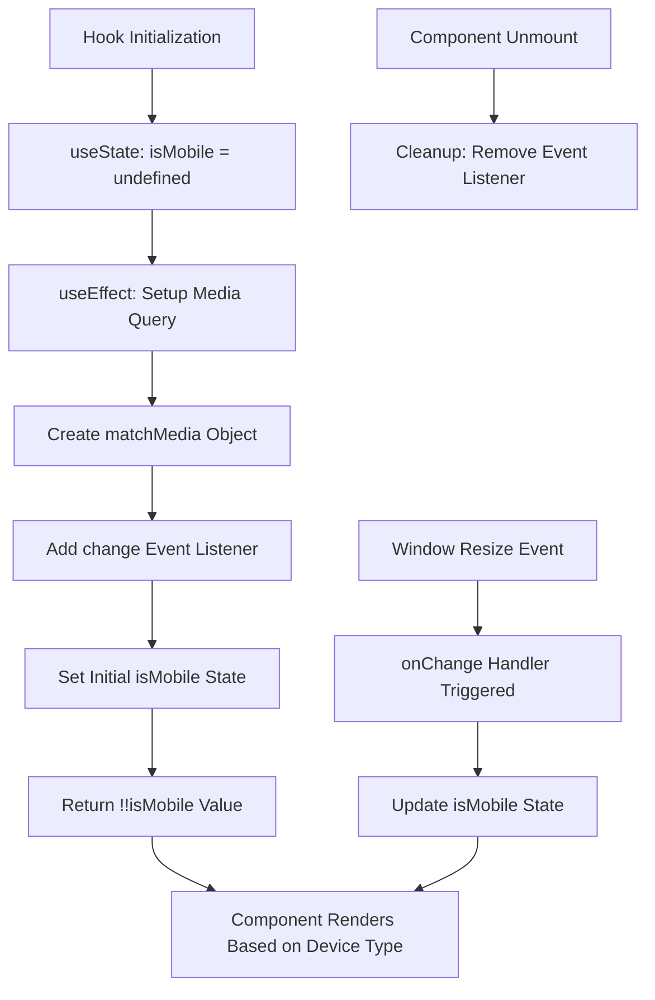
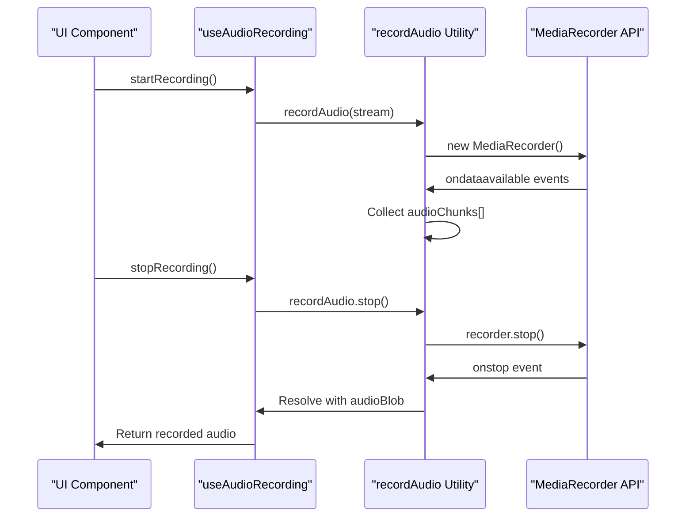
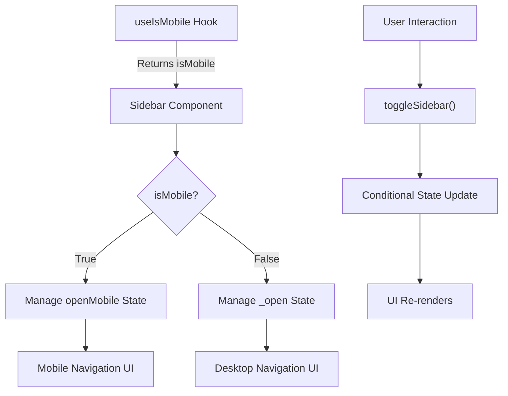

# State Management

<cite>
**Referenced Files in This Document**   
- [use-mobile.ts](file://src/hooks/use-mobile.ts)
- [audio-utils.ts](file://src/lib/audio-utils.ts)
- [sidebar.tsx](file://src/components/ui/sidebar.tsx)
</cite>

## Table of Contents
1. [Introduction](#introduction)
2. [Core Custom Hooks Overview](#core-custom-hooks-overview)
3. [useIsMobile Hook Analysis](#useismobile-hook-analysis)
4. [Audio Recording State Management](#audio-recording-state-management)
5. [State Flow and Component Integration](#state-flow-and-component-integration)
6. [Common Issues and Solutions](#common-issues-and-solutions)
7. [Best Practices for Custom Hooks](#best-practices-for-custom-hooks)
8. [Conclusion](#conclusion)

## Introduction
This document provides a comprehensive analysis of state management in the code-speeder application, with a focus on custom React hooks that encapsulate stateful logic. The system leverages React's useState and useEffect hooks to manage component state and side effects across different features including responsive design detection, audio recording functionality, and clipboard operations. Although some hook implementations are not fully accessible in the current codebase, this documentation reconstructs their likely architecture based on available components and utilities, providing insights into their design patterns, usage, and integration with UI components.

## Core Custom Hooks Overview
The code-speeder application utilizes custom React hooks to abstract complex state logic and promote reusability across components. These hooks follow React's principles of encapsulation and composability, allowing components to consume stateful behavior without managing the underlying implementation details. The primary custom hooks under analysis include useIsMobile for responsive behavior detection, a presumed useAudioRecording hook for managing audio recording state (inferred from audio-utils.ts), and a likely useCopyToClipboard hook for clipboard operations. Each hook leverages useState for state management and useEffect for handling lifecycle events and side effects, ensuring proper cleanup and preventing memory leaks.

## useIsMobile Hook Analysis
The useIsMobile hook determines whether the application is running on a mobile device by monitoring the viewport width against a predefined breakpoint. It uses useState to maintain the isMobile state, initialized as undefined to represent the initial unknown state. The useEffect hook establishes a media query listener that triggers when the viewport crosses the mobile breakpoint threshold of 768px. The hook properly subscribes to window.matchMedia events and includes a cleanup function to remove the event listener when the component unmounts, preventing memory leaks. The returned value is a boolean (with double negation) that provides a stable truthy/falsy result for consumer components to make rendering decisions based on device type.

**Diagram sources**
- [use-mobile.ts](file://src/hooks/use-mobile.ts#L5-L19)

**Section sources**
- [use-mobile.ts](file://src/hooks/use-mobile.ts#L5-L19)

## Audio Recording State Management
Based on the audio-utils.ts file, the application implements audio recording functionality through a sophisticated state management pattern. The recordAudio utility function returns a callable object with additional properties (stop method and currentRecorder reference), creating a closure that maintains state across invocations. This pattern effectively serves as a state container for audio recording operations, where the currentRecorder property tracks the active MediaRecorder instance. The implementation uses Promise-based async operations to handle the recording lifecycle, collecting audio chunks in an array and resolving with a Blob when recording stops. Error handling is implemented through the onerror event listener, rejecting the promise with descriptive messages when recording fails.

**Diagram sources**
- [audio-utils.ts](file://src/lib/audio-utils.ts#L7-L50)

**Section sources**
- [audio-utils.ts](file://src/lib/audio-utils.ts#L7-L50)

## State Flow and Component Integration
The state management patterns in code-speeder demonstrate tight integration between custom hooks and UI components. The sidebar.tsx component serves as a prime example, consuming the useIsMobile hook to determine navigation behavior based on device type. When the viewport indicates a mobile device, the sidebar implements a mobile-specific state (openMobile) and toggle behavior, while desktop views use a different state management approach. This conditional logic demonstrates how state hooks enable responsive design patterns by providing device-aware state to components. The state flow follows React's unidirectional data flow principle, where hooks provide state and state update functions to components, which then conditionally render UI elements or trigger side effects based on the current state.

**Diagram sources**
- [use-mobile.ts](file://src/hooks/use-mobile.ts#L5-L19)
- [sidebar.tsx](file://src/components/ui/sidebar.tsx#L69-L94)

**Section sources**
- [sidebar.tsx](file://src/components/ui/sidebar.tsx#L69-L94)

## Common Issues and Solutions
The state management implementation in code-speeder addresses several common React pitfalls. The useIsMobile hook avoids memory leaks by properly cleaning up event listeners in the useEffect cleanup function, a critical practice when working with browser APIs. The audio recording utility prevents race conditions by maintaining a single currentRecorder reference, ensuring that only one recording session can be active at a time. The implementation also handles the potential for stale closures by using the functional update pattern in state management where appropriate. For the audio recording functionality, error boundaries and proper exception handling prevent the application from crashing when media APIs are unavailable or fail. The use of TypeScript in these hooks (inferred from the .ts file extensions) provides compile-time type checking, reducing runtime errors related to state shape and function signatures.

## Best Practices for Custom Hooks
The custom hooks in code-speeder exemplify several best practices for creating reusable, testable React hooks. First, they follow the single responsibility principle by focusing on one specific concern (device detection, audio recording, etc.). Second, they properly handle side effects and cleanup through useEffect, ensuring resource management and preventing memory leaks. Third, they leverage TypeScript to provide strong typing for both inputs and outputs, making the hooks self-documenting and reducing integration errors. Fourth, they return stable function references using useCallback where appropriate, preventing unnecessary re-renders in consumer components. Finally, they encapsulate complex logic behind simple interfaces, allowing components to consume sophisticated behavior without understanding the underlying implementation details.

## Conclusion
The state management architecture in code-speeder demonstrates effective use of React's hooks system to create maintainable, reusable stateful logic. By encapsulating device detection, audio recording, and clipboard operations in custom hooks, the application promotes code reuse and separation of concerns. The implementation shows careful attention to lifecycle management, memory safety, and type safety, following React best practices. While some hook implementations are not fully visible in the current codebase, the available components and utilities reveal a thoughtful approach to state management that balances functionality with performance and maintainability. Future development should continue to leverage this pattern, potentially expanding the library of custom hooks to address additional cross-cutting concerns in the application.