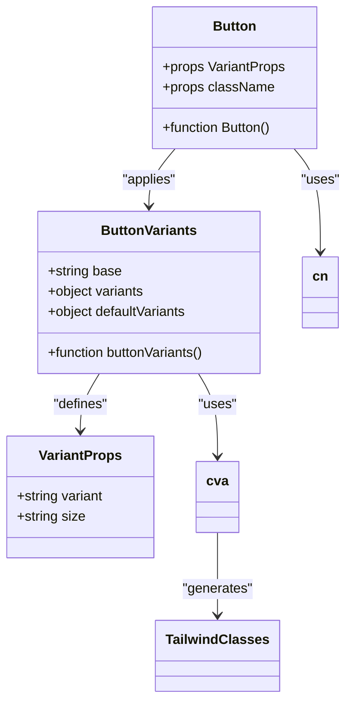
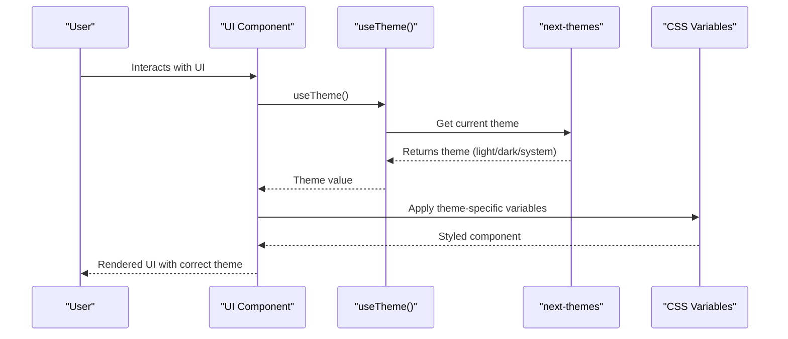
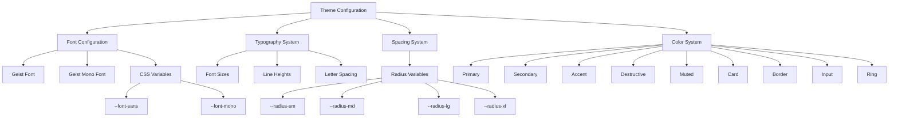

# Theming & Styling

<cite>
**Referenced Files in This Document**   
- [globals.css](file://src/app/globals.css)
- [utils.ts](file://src/lib/utils.ts)
- [button.tsx](file://src/components/ui/button.tsx)
- [input.tsx](file://src/components/ui/input.tsx)
- [card.tsx](file://src/components/ui/card.tsx)
- [layout.tsx](file://src/app/layout.tsx)
- [sonner.tsx](file://src/components/ui/sonner.tsx)
- [chart.tsx](file://src/components/ui/chart.tsx)
- [postcss.config.mjs](file://postcss.config.mjs)
- [package.json](file://package.json)
</cite>

## Table of Contents
1. [Introduction](#introduction)
2. [Theming Architecture](#theming-architecture)
3. [Utility-First Styling with Tailwind CSS](#utility-first-styling-with-tailwind-css)
4. [Variant Management with class-variance-authority](#variant-management-with-class-variance-authority)
5. [Dark Mode Implementation](#dark-mode-implementation)
6. [Component Style Composition](#component-style-composition)
7. [Theme Configuration and Customization](#theme-configuration-and-customization)
8. [Performance Optimization](#performance-optimization)
9. [Accessibility and Responsive Design](#accessibility-and-responsive-design)
10. [Conclusion](#conclusion)

## Introduction
This document provides a comprehensive overview of the theming and styling architecture in the code-speeder application. The system leverages a utility-first approach with Tailwind CSS, enhanced by class-variance-authority (cva) for consistent variant definitions across components. The architecture supports dynamic theme switching, dark mode, and responsive design while maintaining performance and accessibility standards.

**Section sources**
- [globals.css](file://src/app/globals.css#L1-L126)
- [utils.ts](file://src/lib/utils.ts#L1-L7)

## Theming Architecture
The theming system is built on CSS custom properties (variables) that define the visual design language of the application. These variables are organized in a structured hierarchy within the `:root` and `.dark` selectors in globals.css, providing a consistent foundation for both light and dark themes.

The architecture uses the OKLCH color space for defining colors, which offers perceptual uniformity and better color interpolation compared to traditional color models. This ensures consistent visual appearance across different devices and viewing conditions.

```mermaid
graph TD
ThemeSystem[Theming System] --> CSSVariables[CSS Custom Properties]
CSSVariables --> LightTheme[:root Variables]
CSSVariables --> DarkTheme[.dark Variables]
CSSVariables --> ThemeInline[@theme inline]
ThemeInline --> ColorVariables[Color Variables]
ThemeInline --> FontVariables[Font Variables]
ThemeInline --> RadiusVariables[Radius Variables]
LightTheme --> ColorDefinitions[Color Definitions]
DarkTheme --> ColorDefinitions
ColorDefinitions --> OKLCH[OKLCH Color Space]
```

**Diagram sources**
- [globals.css](file://src/app/globals.css#L49-L116)

**Section sources**
- [globals.css](file://src/app/globals.css#L49-L116)

## Utility-First Styling with Tailwind CSS
The application implements a utility-first approach using Tailwind CSS, where styles are composed from small, single-purpose classes rather than traditional CSS rules. This methodology enables rapid UI development and ensures consistency across the application.

The PostCSS configuration in postcss.config.mjs integrates Tailwind CSS into the build process, allowing the utility classes to be processed and optimized. The utility-first approach reduces CSS bloat by only including classes that are actually used in the application.

```mermaid
flowchart TD
Tailwind[Tailwind CSS] --> UtilityClasses[Utility Classes]
UtilityClasses --> AtomicClasses[Atomic/Single-Purpose]
UtilityClasses --> Composable[Composable]
UtilityClasses --> Responsive[Responsive by Default]
Responsive --> Breakpoints[Breakpoint Prefixes]
Breakpoints --> sm[sm:]
Breakpoints --> md[md:]
Breakpoints --> lg[lg:]
Breakpoints --> xl[xl:]
Composable --> cn[cn() Utility]
cn --> ClassMerging[Class Merging Logic]
ClassMerging --> TailwindMerge[tailwind-merge]
ClassMerging --> Clsx[clsx]
```

**Diagram sources**
- [postcss.config.mjs](file://postcss.config.mjs#L1-L8)
- [utils.ts](file://src/lib/utils.ts#L1-L7)

**Section sources**
- [postcss.config.mjs](file://postcss.config.mjs#L1-L8)
- [utils.ts](file://src/lib/utils.ts#L1-L7)

## Variant Management with class-variance-authority
The application uses class-variance-authority (cva) to create consistent, reusable component variants. This library provides a type-safe way to define component variants that can be shared across different UI components.

In the button component, cva is used to define multiple variants (default, destructive, outline, secondary, ghost, link) and sizes (default, sm, lg, icon variants). These variants are then applied conditionally based on component props, ensuring consistent styling across all instances of the component.



**Diagram sources**
- [button.tsx](file://src/components/ui/button.tsx#L7-L37)

**Section sources**
- [button.tsx](file://src/components/ui/button.tsx#L7-L63)

## Dark Mode Implementation
Dark mode is implemented using next-themes, which provides a React hook for theme management. The system supports three theme modes: light, dark, and system (which follows the user's operating system preference).

The implementation uses CSS variables to define different color values for light and dark themes. When the theme changes, the appropriate CSS variables are applied, creating a seamless transition between themes. The sonner toast component demonstrates how components can access the current theme using the useTheme hook.



**Diagram sources**
- [sonner.tsx](file://src/components/ui/sonner.tsx#L10-L15)
- [globals.css](file://src/app/globals.css#L84-L116)

**Section sources**
- [sonner.tsx](file://src/components/ui/sonner.tsx#L10-L41)
- [globals.css](file://src/app/globals.css#L84-L116)

## Component Style Composition
Component styles are composed using the cn() utility function, which merges class names intelligently. This function combines clsx for conditional class evaluation and tailwind-merge for deduplicating and optimizing Tailwind classes.

The composition pattern allows for base styles, variant styles, and custom className props to be merged seamlessly. This approach ensures that conflicting classes are properly resolved and that the final class string is optimized for performance.

```mermaid
flowchart TD
StyleComposition[Style Composition] --> cn[cn() Utility]
cn --> InputClasses[Input Classes]
InputClasses --> BaseClasses[Base Classes]
InputClasses --> VariantClasses[Variant Classes]
InputClasses --> ConditionalClasses[Conditional Classes]
InputClasses --> CustomClasses[Custom className]
cn --> Processing[Processing Pipeline]
Processing --> clsx[clsx Library]
Processing --> tailwindMerge[tailwind-merge Library]
clsx --> ConditionalEvaluation[Conditional Evaluation]
tailwindMerge --> ClassOptimization[Class Deduplication & Optimization]
ClassOptimization --> Output[Optimized Class String]
```

**Diagram sources**
- [utils.ts](file://src/lib/utils.ts#L4-L6)
- [button.tsx](file://src/components/ui/button.tsx#L56)

**Section sources**
- [utils.ts](file://src/lib/utils.ts#L1-L7)
- [button.tsx](file://src/components/ui/button.tsx#L56)

## Theme Configuration and Customization
The theme configuration includes custom fonts (Geist and Geist Mono) imported from next/font/google and applied globally through CSS variables. The layout.tsx file sets up these font variables, which are then referenced throughout the application.

The system also defines custom radius values using CSS calculations based on a base radius variable. This creates a consistent spacing system that can be easily adjusted globally. The chart component demonstrates advanced theming with dynamic CSS variable injection based on component configuration.



**Diagram sources**
- [layout.tsx](file://src/app/layout.tsx#L5-L13)
- [globals.css](file://src/app/globals.css#L6-L47)

**Section sources**
- [layout.tsx](file://src/app/layout.tsx#L1-L35)
- [globals.css](file://src/app/globals.css#L6-L47)

## Performance Optimization
The styling architecture includes several performance optimizations to minimize CSS bundle size and improve runtime performance. The utility-first approach with Tailwind CSS enables aggressive purging of unused styles during the build process.

The cn() utility function optimizes class names by removing duplicates and conflicting classes. The dynamic theme system uses CSS variables rather than generating separate CSS rules for each theme, reducing the overall CSS payload. The chart component demonstrates runtime optimization by dynamically generating only the CSS variables needed for the specific chart configuration.

```mermaid
flowchart TD
Performance[Performance Optimization] --> CSSPurging[CSS Purging]
CSSPurging --> TailwindConfig[Tailwind Configuration]
CSSPurging --> ContentFiles[Content File Scanning]
CSSPurging --> UnusedRemoval[Remove Unused Classes]
Performance --> ClassOptimization[Class Optimization]
ClassOptimization --> cn[cn() Utility]
ClassOptimization --> tailwindMerge[tailwind-merge]
ClassOptimization --> DuplicateRemoval[Remove Duplicates]
ClassOptimization --> ConflictResolution[Resolve Conflicts]
Performance --> RuntimeOptimization[Runtime Optimization]
RuntimeOptimization --> DynamicCSS[Dynamic CSS Generation]
RuntimeOptimization --> ChartStyle[ChartStyle Component]
RuntimeOptimization --> OnDemand[On-Demand Variables]
Performance --> BundleSize[Bundle Size Reduction]
BundleSize --> SmallerCSS[Smaller CSS Files]
BundleSize --> FasterLoad[Faster Load Times]
BundleSize --> ImprovedPerformance[Improved Runtime Performance]
```

**Diagram sources**
- [utils.ts](file://src/lib/utils.ts#L4-L6)
- [chart.tsx](file://src/components/ui/chart.tsx#L72-L103)

**Section sources**
- [utils.ts](file://src/lib/utils.ts#L1-L7)
- [chart.tsx](file://src/components/ui/chart.tsx#L72-L103)

## Accessibility and Responsive Design
The theming system prioritizes accessibility through careful color contrast ratios and semantic color naming. The OKLCH color space ensures consistent visual appearance across different devices and lighting conditions, which benefits users with various visual impairments.

The responsive design system uses Tailwind's breakpoint prefixes (sm, md, lg, xl) to create adaptive layouts. Components like the card header use container queries (@container) to respond to their parent container's size rather than the viewport, enabling more flexible and reusable components.

```mermaid
graph TD
Accessibility[Accessibility] --> ColorContrast[Color Contrast]
ColorContrast --> WCAG[WCAG Compliance]
ColorContrast --> OKLCH[OKLCH Color Space]
ColorContrast --> Foreground[Foreground-Background Ratio]
Accessibility --> SemanticNaming[Semantic Color Names]
SemanticNaming --> primary[primary]
SemanticNaming --> secondary[secondary]
SemanticNaming --> destructive[destructive]
SemanticNaming --> muted[muted]
Responsive[Responsive Design] --> Breakpoints[Breakpoint System]
Breakpoints --> sm[sm: prefix]
Breakpoints --> md[md: prefix]
Breakpoints --> lg[lg: prefix]
Breakpoints --> xl[xl: prefix]
Responsive --> ContainerQueries[Container Queries]
ContainerQueries --> CardHeader[@container/card-header]
ContainerQueries --> GridAutoRows[grid-auto-rows]
ContainerQueries --> AutoSizing[Auto-sizing Elements]
Accessibility --> Responsive
```

**Diagram sources**
- [globals.css](file://src/app/globals.css#L51-L115)
- [card.tsx](file://src/components/ui/card.tsx#L23)

**Section sources**
- [globals.css](file://src/app/globals.css#L51-L115)
- [card.tsx](file://src/components/ui/card.tsx#L18-L28)

## Conclusion
The theming and styling architecture in code-speeder provides a robust, scalable system for managing visual design across the application. By combining Tailwind CSS's utility-first approach with class-variance-authority for variant management and next-themes for dynamic theme switching, the system achieves consistency, maintainability, and performance.

The use of CSS custom properties with the OKLCH color space ensures high-quality visual output across different devices and viewing conditions. The cn() utility function enables clean, optimized class composition, while the overall architecture supports accessibility and responsive design principles.

This comprehensive styling system allows for easy theme customization, consistent component variants, and efficient performance optimization, making it well-suited for a complex application like code-speeder.