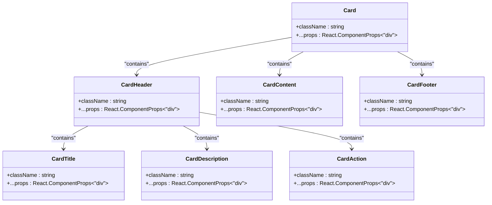
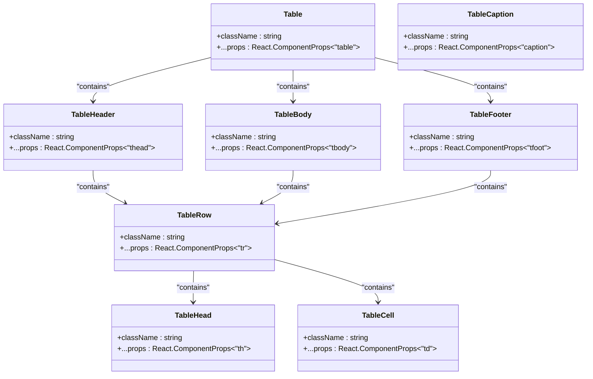
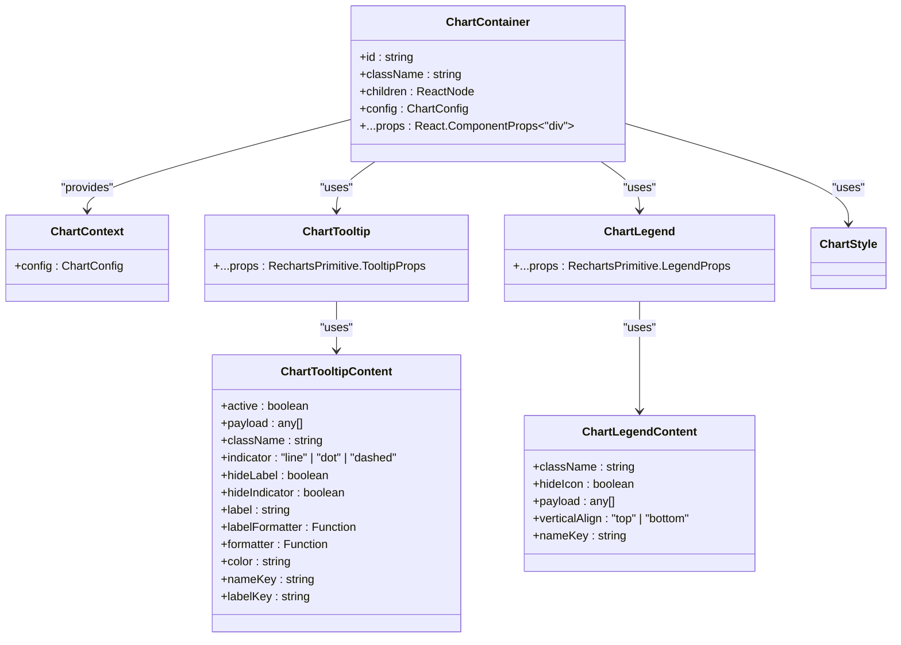
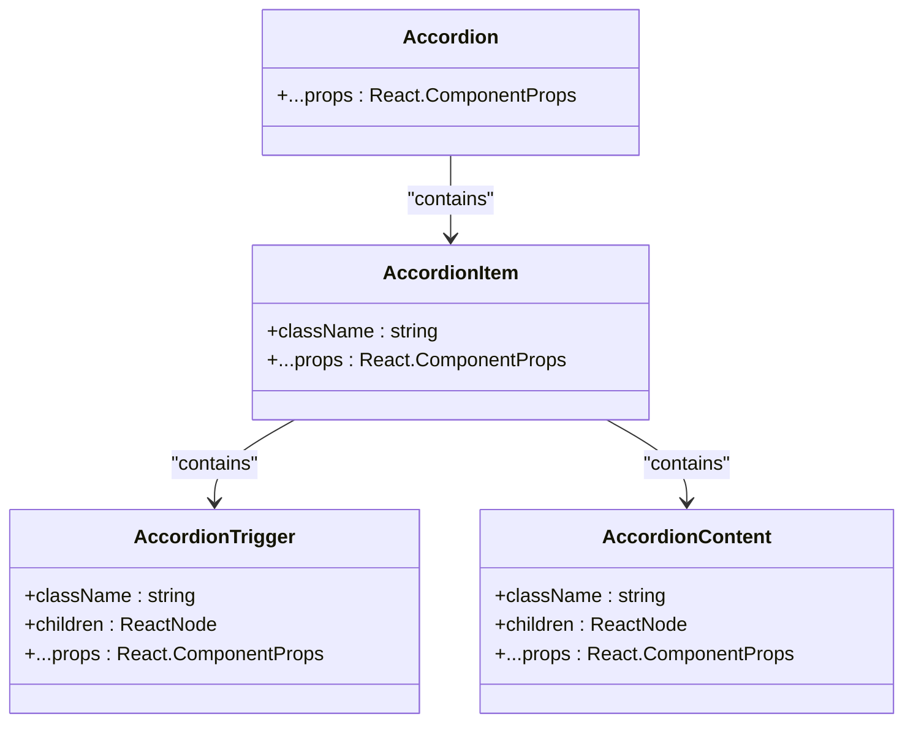
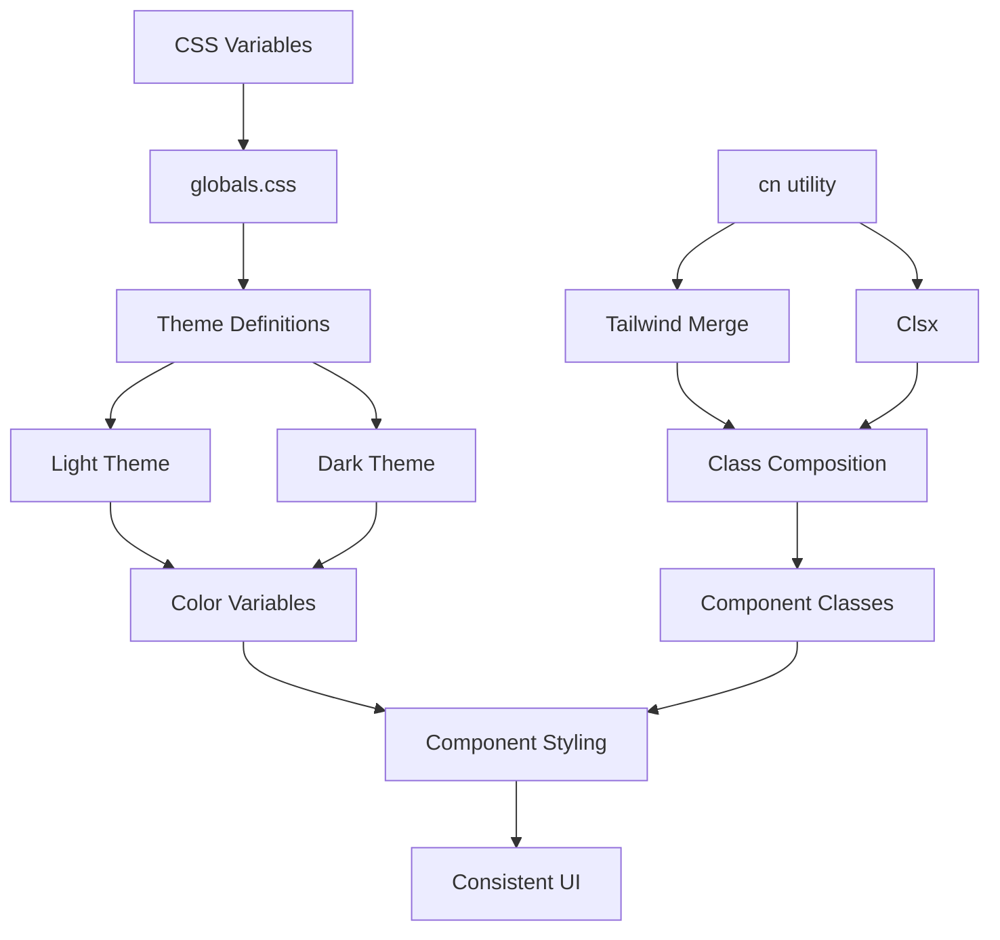
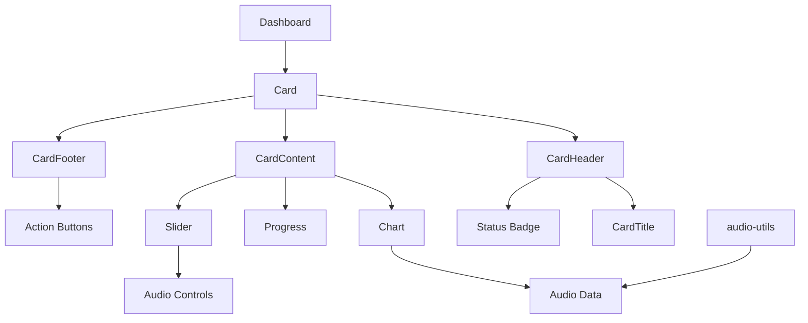

# Data Display Components

<cite>
**Referenced Files in This Document**   
- [card.tsx](file://src/components/ui/card.tsx)
- [table.tsx](file://src/components/ui/table.tsx)
- [chart.tsx](file://src/components/ui/chart.tsx)
- [accordion.tsx](file://src/components/ui/accordion.tsx)
- [badge.tsx](file://src/components/ui/badge.tsx)
- [progress.tsx](file://src/components/ui/progress.tsx)
- [slider.tsx](file://src/components/ui/slider.tsx)
- [utils.ts](file://src/lib/utils.ts)
- [globals.css](file://src/app/globals.css)
- [audio-utils.ts](file://src/lib/audio-utils.ts)
</cite>

## Table of Contents
1. [Introduction](#introduction)
2. [Card Component](#card-component)
3. [Table Component](#table-component)
4. [Chart Component](#chart-component)
5. [Accordion Component](#accordion-component)
6. [Badge Component](#badge-component)
7. [Progress and Slider Components](#progress-and-slider-components)
8. [Theming and Styling System](#theming-and-styling-system)
9. [Component Composition Examples](#component-composition-examples)
10. [Conclusion](#conclusion)

## Introduction
This document provides comprehensive documentation for the data display and visualization components within the codebase. These components are designed to present information clearly and effectively in user interfaces, with a focus on accessibility, responsiveness, and visual consistency. The components leverage a shared styling system using Tailwind CSS and the `cn` utility function for consistent theming across light and dark modes. This documentation covers the structure, functionality, and usage patterns of key components including Card, Table, Chart, Accordion, Badge, Progress, and Slider, along with their integration in dashboard-like interfaces and real-time data presentation scenarios.

## Card Component

The Card component provides a structured container for grouping related content with a consistent visual hierarchy. It consists of multiple compound slots that define its internal structure and layout.

The Card component uses a flex-based layout with a column direction, providing a rounded border, subtle shadow, and appropriate spacing between elements. It supports a header section that can contain a title, description, and action element, with the action positioned at the end of the header row using CSS grid. The content area provides horizontal padding, while the footer aligns items horizontally with appropriate spacing.



**Diagram sources**
- [card.tsx](file://src/components/ui/card.tsx#L5-L92)

**Section sources**
- [card.tsx](file://src/components/ui/card.tsx#L5-L92)

## Table Component

The Table component implements accessible markup for tabular data presentation with responsive handling and visual indicators for sorting. It wraps the standard HTML table elements with enhanced styling and accessibility features.

The component uses a container div with overflow-x auto to ensure horizontal scrolling on smaller screens, making it responsive. The table itself uses a relative width and caption positioning for accessibility. Table headers are styled with proper alignment, font weight, and text wrapping control. The implementation includes distinct styles for table rows, with hover states and selection indicators that enhance user interaction.



**Diagram sources**
- [table.tsx](file://src/components/ui/table.tsx#L7-L116)

**Section sources**
- [table.tsx](file://src/components/ui/table.tsx#L7-L116)

## Chart Component

The Chart component provides an integration point for data visualization, built on top of the Recharts library. It is designed to handle various chart types and support theming through CSS variables, making it suitable for visualizing dynamic data such as audio frequency information.

The component implements a context-based configuration system that allows for theme-aware color definitions. It uses a ChartContainer as the main wrapper that provides configuration to child components through React Context. The implementation includes specialized tooltip and legend components that extract configuration from the context, enabling consistent styling across different chart elements.

The ChartContainer applies a video aspect ratio by default and includes comprehensive styling for all Recharts elements through CSS custom properties. The theming system supports both static colors and theme-specific color definitions, allowing components to adapt to light and dark modes.



**Diagram sources**
- [chart.tsx](file://src/components/ui/chart.tsx#L37-L357)

**Section sources**
- [chart.tsx](file://src/components/ui/chart.tsx#L37-L357)

## Accordion Component

The Accordion component implements controlled state management for expandable content sections with smooth animation behavior. Built on Radix UI's Accordion primitive, it provides accessible interactions and visual feedback for users.

The component consists of an Accordion root that manages the state of multiple AccordionItem children. Each item contains a trigger button and content panel. The trigger includes a ChevronDownIcon that rotates 180 degrees when the accordion is open, providing visual feedback. The content panel uses data attributes to control CSS animations for smooth opening and closing transitions.

The implementation includes proper keyboard navigation and focus management, with visible focus rings and disabled states. The styling ensures that only the active trigger receives the hover underline effect, and the component handles disabled states appropriately.



**Diagram sources**
- [accordion.tsx](file://src/components/ui/accordion.tsx#L9-L66)

**Section sources**
- [accordion.tsx](file://src/components/ui/accordion.tsx#L9-L66)

## Badge Component

The Badge component provides visual indicators with multiple variants for different semantic purposes. It supports text content and optional icons, with consistent styling across all variants.

The component uses class-variance-authority (cva) to define its styling variants, which include default, secondary, destructive, and outline styles. Each variant has specific color combinations that convey different meanings: default for primary information, secondary for neutral content, destructive for warnings or errors, and outline for subtle indicators.

The implementation includes proper focus states with visible rings and handles invalid states with appropriate styling. The badge supports the Slot pattern, allowing it to be used as a wrapper for other components while maintaining its styling.

```mermaid
classDiagram
class Badge {
+className : string
+variant : "default" | "secondary" | "destructive" | "outline"
+asChild : boolean
+...props : React.ComponentProps<"span">
}
class badgeVariants {
+variants : {
default : string,
secondary : string,
destructive : string,
outline : string
}
+defaultVariants : { variant : "default" }
}
Badge --> badgeVariants : "uses"
```

**Diagram sources**
- [badge.tsx](file://src/components/ui/badge.tsx#L7-L46)

**Section sources**
- [badge.tsx](file://src/components/ui/badge.tsx#L7-L46)

## Progress and Slider Components

The Progress and Slider components provide visual representations of values and user input controls respectively. The Progress component displays a completion percentage, while the Slider supports both single and multi-thumb configurations for value selection.

The Progress component uses a container with a background color and an indicator that transforms based on the value prop, creating a fill effect from right to left. It supports accessibility attributes and has a smooth transition for value changes.

The Slider component implements a flexible track with one or more thumbs that can be dragged to select values. It supports both horizontal and vertical orientations and includes disabled states. The implementation calculates the number of thumbs based on the value or defaultValue props, allowing for multi-thumb scenarios such as range selection.

```mermaid
classDiagram
class Progress {
+className : string
+value : number
+...props : React.ComponentProps<typeof ProgressPrimitive.Root>
}
class ProgressPrimitive_Root {
+data-slot : "progress"
+className : string
+...props : any
}
class ProgressPrimitive_Indicator {
+data-slot : "progress-indicator"
+className : string
+style : { transform : string }
}
class Slider {
+className : string
+defaultValue : number | number[]
+value : number | number[]
+min : number
+max : number
+...props : React.ComponentProps<typeof SliderPrimitive.Root>
}
class SliderPrimitive_Root {
+data-slot : "slider"
+className : string
+...props : any
}
class SliderPrimitive_Track {
+data-slot : "slider-track"
+className : string
}
class SliderPrimitive_Range {
+data-slot : "slider-range"
+className : string
}
class SliderPrimitive_Thumb {
+data-slot : "slider-thumb"
+className : string
}
Progress --> ProgressPrimitive_Root : "uses"
ProgressPrimitive_Root --> ProgressPrimitive_Indicator : "contains"
Slider --> SliderPrimitive_Root : "uses"
SliderPrimitive_Root --> SliderPrimitive_Track : "contains"
SliderPrimitive_Track --> SliderPrimitive_Range : "contains"
SliderPrimitive_Root --> SliderPrimitive_Thumb : "contains multiple"
```

**Diagram sources**
- [progress.tsx](file://src/components/ui/progress.tsx#L8-L31)
- [slider.tsx](file://src/components/ui/slider.tsx#L8-L63)

**Section sources**
- [progress.tsx](file://src/components/ui/progress.tsx#L8-L31)
- [slider.tsx](file://src/components/ui/slider.tsx#L8-L63)

## Theming and Styling System

The components use a consistent theming system based on Tailwind CSS variables and the `cn` utility function for class composition. This system ensures visual consistency across light and dark modes and enables easy customization.

The `cn` utility function combines class-variance-authority (cva) variants with additional class names, handling conditional class application and ensuring that conflicting Tailwind classes are properly merged. This prevents style conflicts and ensures that the most specific classes take precedence.

The theming system is defined in globals.css using CSS custom properties that map to semantic color names. These variables are used throughout the components, allowing for easy theme switching by changing the root variables. The system supports both light and dark themes with appropriate color values for each mode.



**Diagram sources**
- [utils.ts](file://src/lib/utils.ts#L4-L6)
- [globals.css](file://src/app/globals.css#L49-L116)

**Section sources**
- [utils.ts](file://src/lib/utils.ts#L4-L6)
- [globals.css](file://src/app/globals.css#L49-L116)

## Component Composition Examples

The data display components can be composed to create complex dashboard-like interfaces and real-time data presentation systems. For example, a monitoring dashboard might combine Cards with Charts, Progress indicators, and Badges to present audio recording metrics.

A typical composition pattern involves using a Card as the container, with a header containing a title and potentially a status Badge. The content area could include a Chart for visualizing audio frequency data over time, with a Progress component showing recording duration. An Accordion could be used to hide detailed metrics that are less frequently accessed.

For real-time audio visualization, the Chart component could be integrated with audio data from the audio-utils module, which provides recording functionality. The Slider component could control audio parameters, while Badges indicate recording status (e.g., "Recording" with a destructive variant, "Paused" with a secondary variant).



**Diagram sources**
- [card.tsx](file://src/components/ui/card.tsx#L5-L92)
- [chart.tsx](file://src/components/ui/chart.tsx#L37-L357)
- [progress.tsx](file://src/components/ui/progress.tsx#L8-L31)
- [slider.tsx](file://src/components/ui/slider.tsx#L8-L63)
- [badge.tsx](file://src/components/ui/badge.tsx#L7-L46)
- [audio-utils.ts](file://src/lib/audio-utils.ts#L7-L50)

**Section sources**
- [card.tsx](file://src/components/ui/card.tsx#L5-L92)
- [chart.tsx](file://src/components/ui/chart.tsx#L37-L357)
- [progress.tsx](file://src/components/ui/progress.tsx#L8-L31)
- [slider.tsx](file://src/components/ui/slider.tsx#L8-L63)
- [badge.tsx](file://src/components/ui/badge.tsx#L7-L46)
- [audio-utils.ts](file://src/lib/audio-utils.ts#L7-L50)

## Conclusion

The data display and visualization components provide a comprehensive toolkit for presenting information in a clear, accessible, and visually consistent manner. The Card component offers a structured container for grouped content, while the Table component ensures accessible tabular data presentation. The Chart component integrates with Recharts for sophisticated data visualization, including potential use cases for audio frequency data.

The Accordion component enables space-efficient content organization with smooth animations, and the Badge component provides semantic visual indicators. The Progress and Slider components offer both visual feedback and user input capabilities, with the Slider supporting advanced multi-thumb scenarios.

All components share a common styling system using the `cn` utility and Tailwind CSS variables, ensuring consistent theming across light and dark modes. This cohesive design system allows for the creation of complex dashboard interfaces and real-time data presentation applications, such as audio recording monitoring systems, by combining these components in meaningful ways.