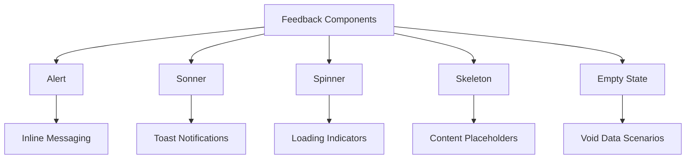
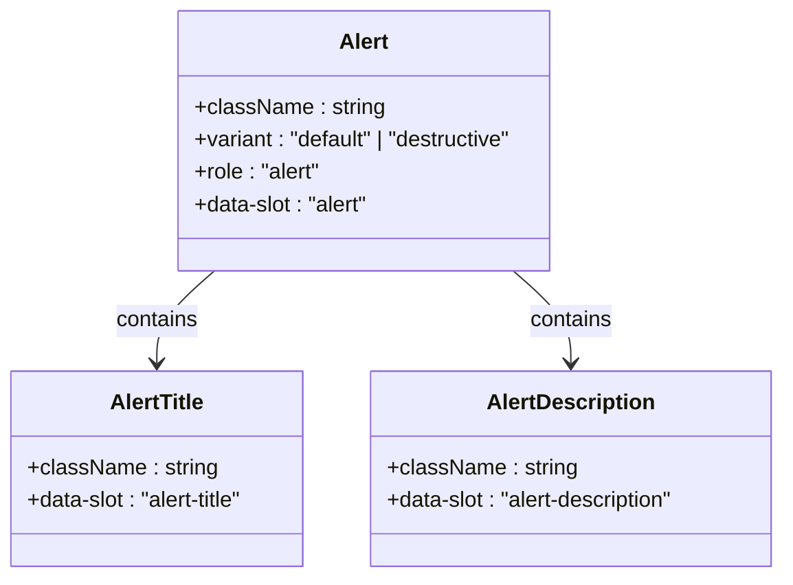
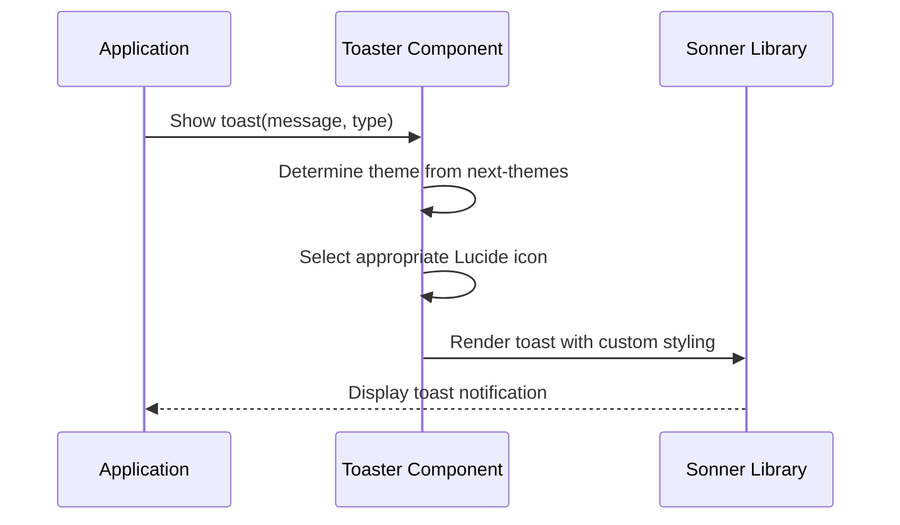
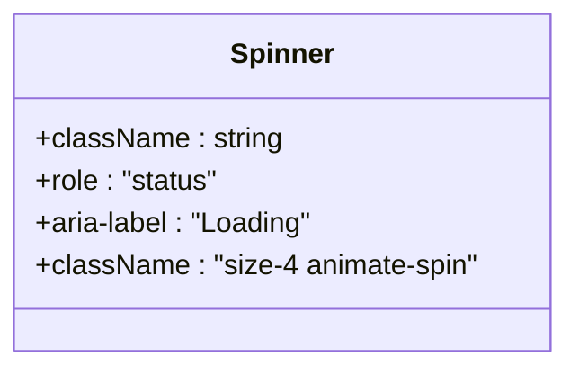
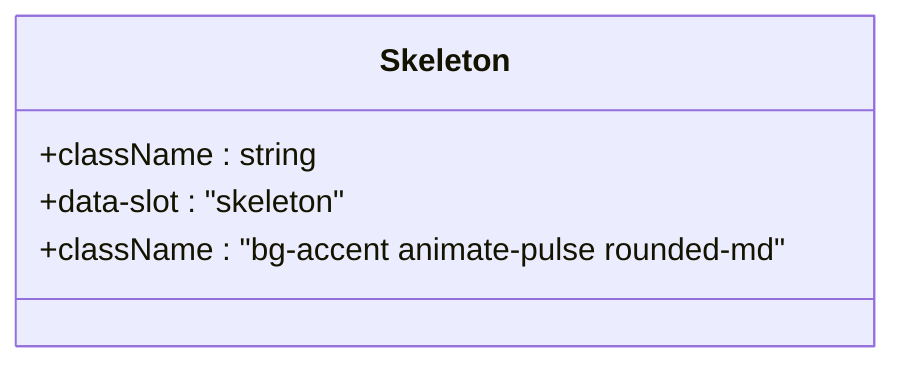
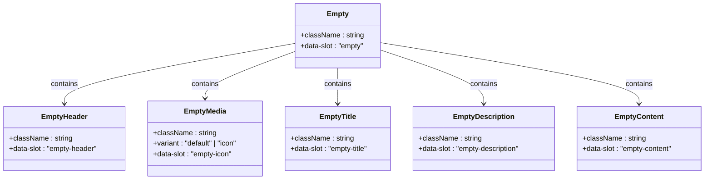
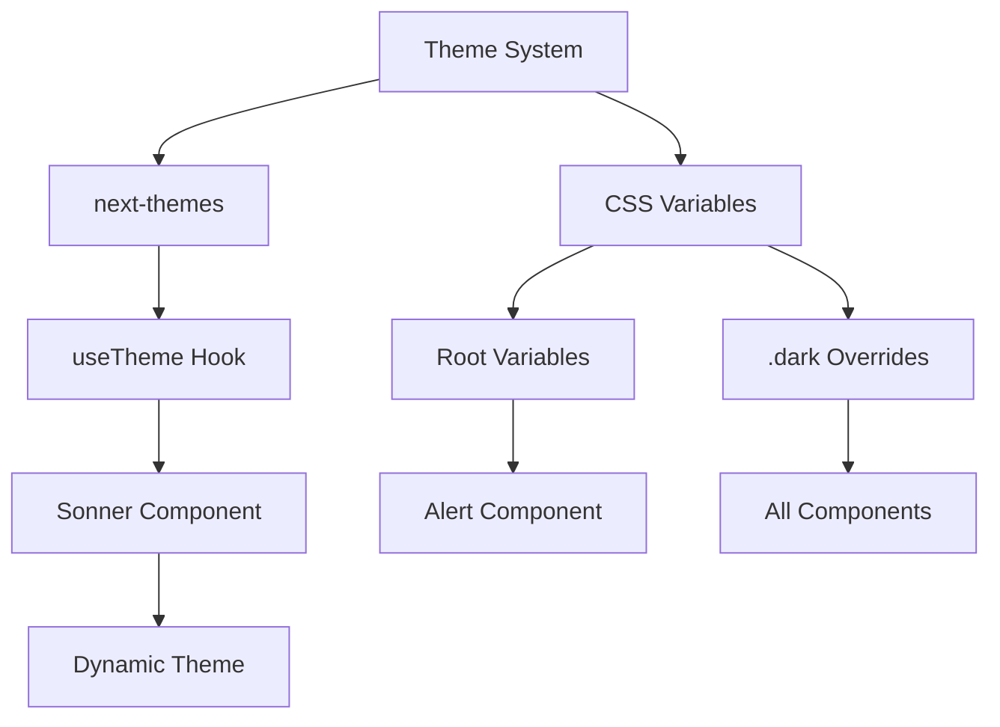
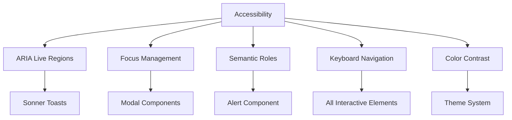
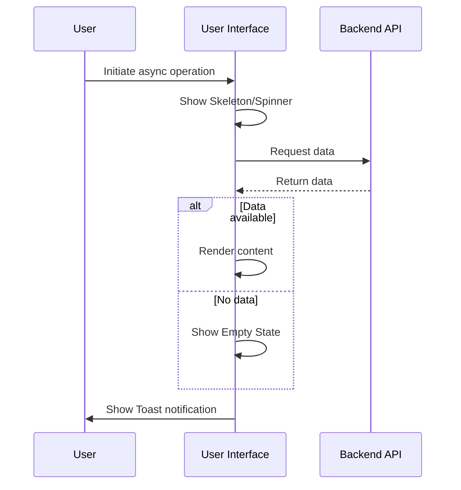
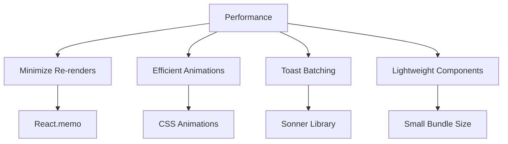

# Feedback Components

<cite>
**Referenced Files in This Document**   
- [alert.tsx](file://src/components/ui/alert.tsx)
- [sonner.tsx](file://src/components/ui/sonner.tsx)
- [spinner.tsx](file://src/components/ui/spinner.tsx)
- [skeleton.tsx](file://src/components/ui/skeleton.tsx)
- [empty.tsx](file://src/components/ui/empty.tsx)
- [globals.css](file://src/app/globals.css)
- [utils.ts](file://src/lib/utils.ts)
- [sidebar.tsx](file://src/components/ui/sidebar.tsx)
- [package.json](file://package.json)
</cite>

## Table of Contents
1. [Introduction](#introduction)
2. [Core Feedback Components](#core-feedback-components)
3. [Alert Component](#alert-component)
4. [Sonner Toast Notifications](#sonner-toast-notifications)
5. [Spinner Component](#spinner-component)
6. [Skeleton Component](#skeleton-component)
7. [Empty State Component](#empty-state-component)
8. [Theming and Dark Mode Support](#theming-and-dark-mode-support)
9. [Accessibility Implementation](#accessibility-implementation)
10. [Usage Patterns](#usage-patterns)
11. [Performance Optimization](#performance-optimization)

## Introduction
This document provides comprehensive documentation for the feedback and state communication components in the code-speeder application. These components are essential for providing visual feedback to users during various application states including loading, success, errors, and empty data scenarios. The components are designed with accessibility, theming, and performance in mind, following modern React patterns and leveraging Tailwind CSS for styling.

The feedback system consists of several key components: Alert for inline messaging, Sonner for toast notifications, Spinner for loading indicators, Skeleton for content placeholders, and Empty state for representing void data scenarios. All components support dark mode through CSS variables and ensure accessibility through proper ARIA attributes and focus management.

**Section sources**
- [alert.tsx](file://src/components/ui/alert.tsx)
- [sonner.tsx](file://src/components/ui/sonner.tsx)
- [spinner.tsx](file://src/components/ui/spinner.tsx)
- [skeleton.tsx](file://src/components/ui/skeleton.tsx)
- [empty.tsx](file://src/components/ui/empty.tsx)

## Core Feedback Components
The feedback component system is designed to provide consistent user communication across the application. Each component serves a specific purpose in the user feedback lifecycle:

- **Alert**: Inline messages for important information
- **Sonner**: Programmatic toast notifications for system events
- **Spinner**: Visual loading indicators for asynchronous operations
- **Skeleton**: Content placeholders during data loading
- **Empty state**: Visual representation of void data scenarios

These components work together to create a cohesive user experience, providing feedback at different levels of user interaction. The components are built using React with TypeScript, leveraging the Radix UI primitives for accessibility and the Sonner library for toast notifications.

**Diagram sources**
- [alert.tsx](file://src/components/ui/alert.tsx)
- [sonner.tsx](file://src/components/ui/sonner.tsx)
- [spinner.tsx](file://src/components/ui/spinner.tsx)
- [skeleton.tsx](file://src/components/ui/skeleton.tsx)
- [empty.tsx](file://src/components/ui/empty.tsx)

**Section sources**
- [alert.tsx](file://src/components/ui/alert.tsx)
- [sonner.tsx](file://src/components/ui/sonner.tsx)
- [spinner.tsx](file://src/components/ui/spinner.tsx)
- [skeleton.tsx](file://src/components/ui/skeleton.tsx)
- [empty.tsx](file://src/components/ui/empty.tsx)

## Alert Component
The Alert component provides inline messaging with different intent variants to communicate various types of information to users. It supports three variants: default, destructive, and success (inferred from context).

The component is implemented as a compound component with three sub-components:
- `Alert`: The container element with role="alert"
- `AlertTitle`: For the alert heading
- `AlertDescription`: For the alert content

The destructive variant uses the application's destructive color theme and applies appropriate styling to child elements. Icons from Lucide are integrated through the parent component's content rather than being built into the Alert component itself, allowing for flexible icon usage.

**Diagram sources**
- [alert.tsx](file://src/components/ui/alert.tsx)

**Section sources**
- [alert.tsx](file://src/components/ui/alert.tsx)

## Sonner Toast Notifications
The Sonner component provides a customizable toast notification system built on the Sonner library. It serves as a wrapper around the Sonner toast component, integrating it with the application's theming system.

Key features include:
- Automatic theme detection via next-themes
- Custom icon configuration using Lucide icons
- CSS variable-based styling for consistent appearance
- Configurable positioning and stacking behavior

The component maps Sonner's built-in toast types (success, info, warning, error, loading) to corresponding Lucide icons, ensuring visual consistency across the application. The loading state automatically applies a spin animation to the loader icon.

**Diagram sources**
- [sonner.tsx](file://src/components/ui/sonner.tsx)

**Section sources**
- [sonner.tsx](file://src/components/ui/sonner.tsx)

## Spinner Component
The Spinner component provides a simple loading indicator using the Loader2Icon from Lucide. It's designed to be lightweight and easily customizable through standard React props.

Key characteristics:
- Implements the animate-spin Tailwind CSS class for rotation animation
- Uses role="status" and aria-label="Loading" for accessibility
- Default size of 4 units (1rem) with ability to customize via className
- Built with React.forwardRef to support ref forwarding

The spinner is optimized for performance with minimal re-renders and can be easily integrated into buttons, form fields, or standalone loading indicators.

**Diagram sources**
- [spinner.tsx](file://src/components/ui/spinner.tsx)

**Section sources**
- [spinner.tsx](file://src/components/ui/spinner.tsx)

## Skeleton Component
The Skeleton component provides content placeholders during loading states, creating a better user experience by showing the expected layout before content is available.

Implementation details:
- Uses animate-pulse animation for shimmer effect
- Styled with bg-accent and rounded-md classes
- Applies data-slot="skeleton" attribute for styling hooks
- Can be customized in size and shape through className prop

The component is used in conjunction with loading states to maintain layout stability and provide visual feedback that content is being loaded.

**Diagram sources**
- [skeleton.tsx](file://src/components/ui/skeleton.tsx)

**Section sources**
- [skeleton.tsx](file://src/components/ui/skeleton.tsx)

## Empty State Component
The Empty State component provides a comprehensive solution for representing void data scenarios with illustrative content. It's designed as a compound component with multiple sub-components for flexible composition.

Available sub-components:
- `Empty`: Main container
- `EmptyHeader`: Header section
- `EmptyMedia`: Media/icon container with default and icon variants
- `EmptyTitle`: Title text
- `EmptyDescription`: Descriptive text
- `EmptyContent`: Content container

The component supports different media variants and provides proper spacing and alignment for a polished appearance. It's particularly useful for data-driven interfaces where content may not be immediately available.

**Diagram sources**
- [empty.tsx](file://src/components/ui/empty.tsx)

**Section sources**
- [empty.tsx](file://src/components/ui/empty.tsx)

## Theming and Dark Mode Support
The feedback components support dark mode through a comprehensive CSS variable system defined in the application's globals.css file. The theme is managed using next-themes, which provides a React hook for theme detection.

Key aspects of the theming system:
- CSS custom properties for all color values
- Root-level variables for light mode
- .dark class overrides for dark mode
- OKLCH color space for perceptual uniformity
- Theme inheritance through CSS custom properties

The Sonner toast component specifically sets its styling using inline CSS properties that reference the application's CSS variables, ensuring consistency with the overall theme. Components like Alert and Skeleton inherit their styling from the global theme variables.

**Diagram sources**
- [globals.css](file://src/app/globals.css)
- [sonner.tsx](file://src/components/ui/sonner.tsx)

**Section sources**
- [globals.css](file://src/app/globals.css)
- [sonner.tsx](file://src/components/ui/sonner.tsx)

## Accessibility Implementation
All feedback components are designed with accessibility as a core principle, following WCAG guidelines and using semantic HTML attributes.

Key accessibility features:
- **ARIA live regions**: The Sonner toast system uses appropriate ARIA live regions to announce notifications to screen readers
- **Focus management**: Modal components properly manage focus, though this is primarily handled by Radix UI primitives
- **Semantic roles**: The Alert component uses role="alert" to convey its purpose to assistive technologies
- **Keyboard navigation**: All interactive elements are keyboard accessible
- **Color contrast**: The theme system ensures sufficient contrast ratios in both light and dark modes

The components use data-slot attributes to provide styling hooks without interfering with accessibility attributes, allowing for consistent styling while maintaining semantic HTML.

**Diagram sources**
- [alert.tsx](file://src/components/ui/alert.tsx)
- [sonner.tsx](file://src/components/ui/sonner.tsx)
- [globals.css](file://src/app/globals.css)

**Section sources**
- [alert.tsx](file://src/components/ui/alert.tsx)
- [sonner.tsx](file://src/components/ui/sonner.tsx)
- [globals.css](file://src/app/globals.css)

## Usage Patterns
The feedback components are designed to be used in various scenarios throughout the application, particularly in conjunction with asynchronous operations and user interactions.

Common usage patterns include:

### Audio Recording Workflows
While the specific audio recording hook is not available, the components would typically be used as follows:
- **Spinner**: During audio recording initialization
- **Toast notifications**: On successful recording completion or errors
- **Alert**: For inline instructions or warnings about recording limitations

### Form Submissions
- **Spinner**: On submit button during form processing
- **Toast notifications**: For submission success or validation errors
- **Alert**: For inline form validation messages
- **Skeleton**: During form data loading

### Asynchronous Operations
- **Skeleton**: As content placeholders during data fetching
- **Toast notifications**: For background operation status
- **Empty state**: When API returns no data
- **Spinner**: For loading indicators on specific elements

**Diagram sources**
- [skeleton.tsx](file://src/components/ui/skeleton.tsx)
- [spinner.tsx](file://src/components/ui/spinner.tsx)
- [empty.tsx](file://src/components/ui/empty.tsx)
- [sonner.tsx](file://src/components/ui/sonner.tsx)

**Section sources**
- [skeleton.tsx](file://src/components/ui/skeleton.tsx)
- [spinner.tsx](file://src/components/ui/spinner.tsx)
- [empty.tsx](file://src/components/ui/empty.tsx)
- [sonner.tsx](file://src/components/ui/sonner.tsx)

## Performance Optimization
The feedback components are designed with performance in mind, particularly for scenarios involving frequent updates like toast notifications.

Key performance considerations:
- **Minimizing re-renders**: Components use React.memo where appropriate and avoid unnecessary re-renders
- **Efficient animations**: CSS animations are used instead of JavaScript where possible
- **Toast batching**: The Sonner library likely implements batching for multiple toast updates
- **Lightweight components**: Components have minimal overhead and small bundle impact

For frequent toast updates, the following best practices are recommended:
- Use descriptive but concise messages to minimize layout shifts
- Limit the number of simultaneous toasts to avoid overwhelming users
- Use appropriate toast durations based on message importance
- Consider grouping related notifications when possible

The Skeleton component uses a random width generation pattern (as seen in SidebarMenuSkeleton) to create a more natural loading experience, avoiding the uniform appearance of static placeholders.

**Diagram sources**
- [sonner.tsx](file://src/components/ui/sonner.tsx)
- [skeleton.tsx](file://src/components/ui/skeleton.tsx)
- [sidebar.tsx](file://src/components/ui/sidebar.tsx)

**Section sources**
- [sonner.tsx](file://src/components/ui/sonner.tsx)
- [skeleton.tsx](file://src/components/ui/skeleton.tsx)
- [sidebar.tsx](file://src/components/ui/sidebar.tsx)