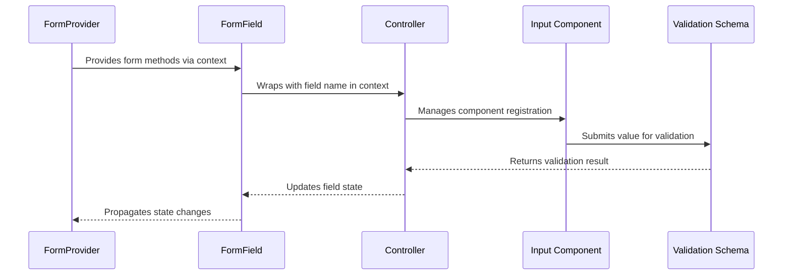
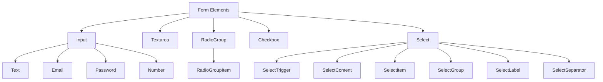
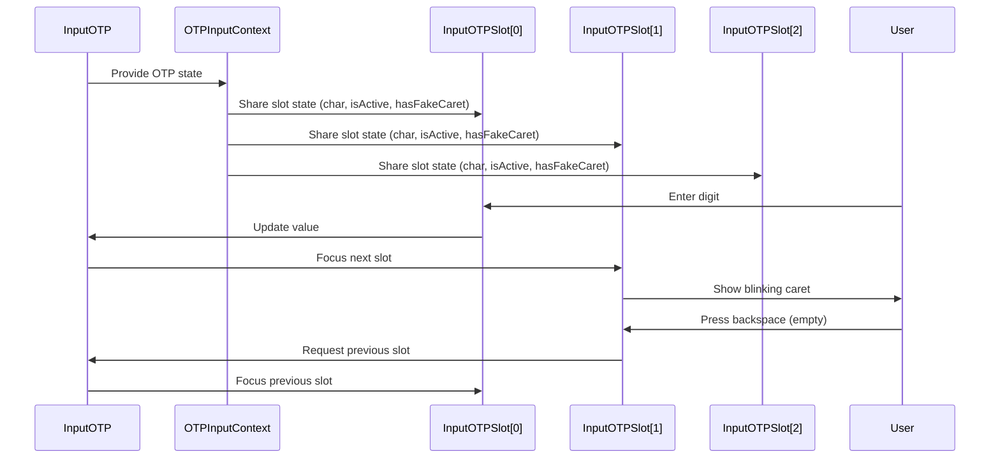
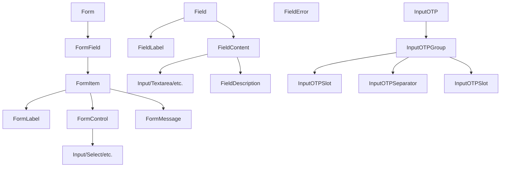

# Form Components

<cite>
**Referenced Files in This Document**   
- [form.tsx](file://src/components/ui/form.tsx)
- [field.tsx](file://src/components/ui/field.tsx)
- [input.tsx](file://src/components/ui/input.tsx)
- [label.tsx](file://src/components/ui/label.tsx)
- [textarea.tsx](file://src/components/ui/textarea.tsx)
- [radio-group.tsx](file://src/components/ui/radio-group.tsx)
- [checkbox.tsx](file://src/components/ui/checkbox.tsx)
- [select.tsx](file://src/components/ui/select.tsx)
- [input-otp.tsx](file://src/components/ui/input-otp.tsx)
- [utils.ts](file://src/lib/utils.ts)
</cite>

## Table of Contents
1. [Introduction](#introduction)
2. [Form Integration with React Hook Form and Zod](#form-integration-with-react-hook-form-and-zod)
3. [Field Component Composition Pattern](#field-component-composition-pattern)
4. [Form Element Components](#form-element-components)
5. [Accessibility and ARIA Attributes](#accessibility-and-aria-attributes)
6. [OTP Input Handling](#otp-input-handling)
7. [Styling with class-variance-authority and cn](#styling-with-class-variance-authority-and-cn)
8. [Usage Examples](#usage-examples)
9. [Best Practices for Extending Components](#best-practices-for-extending-components)
10. [Conclusion](#conclusion)

## Introduction
The code-speeder application implements a comprehensive form component system that integrates React Hook Form for form state management and validation, with support for Zod schema validation. The system provides a collection of reusable UI components including Input, Textarea, RadioGroup, Checkbox, Select, and specialized components like InputOTP for one-time password inputs. The architecture emphasizes accessibility, responsive design, and type safety through a composition pattern centered around the Field component for structured form layout.

**Section sources**
- [form.tsx](file://src/components/ui/form.tsx#L1-L167)
- [field.tsx](file://src/components/ui/field.tsx#L1-L249)

## Form Integration with React Hook Form and Zod

The form system in code-speeder is built on React Hook Form, providing efficient form state management with minimal re-renders. The `Form` component is a re-export of React Hook Form's `FormProvider`, enabling access to form methods throughout the component tree via context.

The `FormField` component serves as a wrapper that integrates individual form fields with React Hook Form's `Controller` component. It uses React context (`FormFieldContext`) to pass the field name to child components, ensuring proper connection to the form state. This pattern allows for controlled components to be seamlessly integrated into the form system while maintaining the benefits of uncontrolled component performance.

For validation, the system is designed to work with Zod, a TypeScript-first schema declaration and validation library. While the component implementation doesn't directly include Zod, it's structured to accept validation rules through React Hook Form's validation API, which can be derived from Zod schemas using libraries like `@hookform/resolvers`.

The `useFormField` hook provides access to the current field's state, including validation errors, touched status, and other metadata. This hook consumes multiple contexts (`FormFieldContext` and `FormItemContext`) to gather all necessary information about the field's state and generate appropriate accessibility attributes.



**Diagram sources**
- [form.tsx](file://src/components/ui/form.tsx#L19-L43)
- [form.tsx](file://src/components/ui/form.tsx#L45-L66)

**Section sources**
- [form.tsx](file://src/components/ui/form.tsx#L1-L167)

## Field Component Composition Pattern

The `Field` component implements a flexible composition pattern for structuring form elements with consistent labeling and content layout. It serves as a container that organizes form controls with their associated labels, descriptions, and error messages in a semantically correct structure.

The component supports multiple orientation variants through the `fieldVariants` function from class-variance-authority: vertical (stacked), horizontal (inline), and responsive (vertical on mobile, horizontal on desktop). This allows for adaptive layouts that respond to screen size changes.

The `Field` component works in conjunction with several subcomponents:
- `FieldLabel`: For the primary label element
- `FieldDescription`: For helper text or instructions
- `FieldContent`: For wrapping the actual input element and additional content
- `FieldError`: For displaying validation errors
- `FieldGroup`: For grouping multiple fields together
- `FieldSet` and `FieldLegend`: For semantic grouping of related fields

This composition pattern ensures consistent spacing, alignment, and styling across all forms in the application while providing flexibility for different layout requirements.

```mermaid
classDiagram
class Field {
+orientation : "vertical"|"horizontal"|"responsive"
+className : string
}
class FieldLabel {
+className : string
}
class FieldDescription {
+className : string
}
class FieldContent {
+className : string
}
class FieldError {
+errors : Array<{message? : string}>
+children : ReactNode
}
class FieldGroup {
+className : string
}
class FieldSet {
+className : string
}
class FieldLegend {
+variant : "legend"|"label"
+className : string
}
Field --> FieldLabel : contains
Field --> FieldDescription : contains
Field --> FieldContent : contains
Field --> FieldError : contains
FieldGroup --> Field : contains
FieldSet --> FieldLegend : contains
FieldSet --> FieldGroup : contains
```

**Diagram sources**
- [field.tsx](file://src/components/ui/field.tsx#L81-L95)
- [field.tsx](file://src/components/ui/field.tsx#L97-L235)

**Section sources**
- [field.tsx](file://src/components/ui/field.tsx#L1-L249)

## Form Element Components

The code-speeder application provides a comprehensive set of form element components that follow a consistent design system and accessibility pattern. Each component is built on top of Radix UI primitives, ensuring proper accessibility attributes and keyboard navigation.

The `Input` component is a styled text input that supports all standard HTML input attributes. It includes styling for focus states, invalid states, and disabled states, with appropriate visual feedback. The component uses the `cn` utility to merge class names, allowing for easy customization while maintaining the base styling.

The `Textarea` component follows the same pattern as Input but is optimized for multi-line text entry. It includes auto-sizing capabilities and appropriate styling for larger text areas.

The `RadioGroup` component implements a group of radio buttons with proper keyboard navigation and ARIA attributes. It uses Radix UI's `RadioGroupPrimitive` to ensure accessibility compliance, with visual styling that highlights the selected option.

The `Checkbox` component provides a styled checkbox input with a custom check indicator. It supports indeterminate states and includes appropriate visual feedback for all states (checked, unchecked, indeterminate, disabled).

The `Select` component implements a custom dropdown select menu that replaces the browser's default select element. It includes a trigger button, content panel, scroll buttons, and support for groups, labels, separators, and custom items. The component handles keyboard navigation and ensures the dropdown is properly positioned and accessible.



**Diagram sources**
- [input.tsx](file://src/components/ui/input.tsx#L5-L21)
- [textarea.tsx](file://src/components/ui/textarea.tsx#L5-L18)
- [radio-group.tsx](file://src/components/ui/radio-group.tsx#L9-L45)
- [checkbox.tsx](file://src/components/ui/checkbox.tsx#L9-L32)
- [select.tsx](file://src/components/ui/select.tsx#L9-L190)

**Section sources**
- [input.tsx](file://src/components/ui/input.tsx#L1-L22)
- [textarea.tsx](file://src/components/ui/textarea.tsx#L1-L19)
- [radio-group.tsx](file://src/components/ui/radio-group.tsx#L1-L46)
- [checkbox.tsx](file://src/components/ui/checkbox.tsx#L1-L33)
- [select.tsx](file://src/components/ui/select.tsx#L1-L191)

## Accessibility and ARIA Attributes

The form components in code-speeder prioritize accessibility by leveraging Radix UI primitives and implementing proper ARIA attributes. Each form control is associated with its label through programmatic relationships, ensuring screen reader users can understand the purpose of each input.

The `FormLabel` component automatically connects to its associated input using the `htmlFor` attribute, which is generated by the `useFormField` hook. This creates a clickable label that focuses the associated input when clicked.

ARIA attributes are used extensively to communicate the state of form elements:
- `aria-invalid` indicates when a field has failed validation
- `aria-describedby` references elements that provide additional description or error messages
- `aria-required` indicates required fields
- `role="group"` is used for grouping related form controls

The `FormControl` component, which uses Radix UI's `Slot` component, automatically receives these ARIA attributes based on the field's validation state. This ensures that screen readers can announce error states and other important information to users.

Error messages are implemented with `role="alert"` to ensure they are announced immediately when they appear. The `FormMessage` component conditionally renders error messages only when they exist, preventing unnecessary announcements for valid fields.

```mermaid
flowchart TD
A[User Interaction] --> B{Field Valid?}
B --> |Yes| C[No ARIA attributes added]
B --> |No| D[Add aria-invalid="true"]
D --> E[Add aria-describedby to reference error message]
E --> F[Render error message with role="alert"]
F --> G[Screen reader announces error]
H[Label Click] --> I[Focus associated input]
I --> J[Programmatic connection via htmlFor]
K[Required Field] --> L[Add aria-required="true"]
```

**Diagram sources**
- [form.tsx](file://src/components/ui/form.tsx#L107-L123)
- [form.tsx](file://src/components/ui/form.tsx#L138-L156)
- [label.tsx](file://src/components/ui/label.tsx#L8-L24)

**Section sources**
- [form.tsx](file://src/components/ui/form.tsx#L1-L167)
- [label.tsx](file://src/components/ui/label.tsx#L1-L25)

## OTP Input Handling

The `InputOTP` component provides specialized handling for one-time password inputs, breaking a single OTP value into multiple individual digit inputs for improved user experience. This component uses the `input-otp` library to manage the complex state and behavior required for OTP inputs.

The component is composed of several subcomponents:
- `InputOTP`: The main container that manages the overall OTP state
- `InputOTPGroup`: Groups related OTP slots
- `InputOTPSlot`: Individual input slots for each digit
- `InputOTPSeparator`: Visual separators between slots

Each `InputOTPSlot` displays the current character and provides visual feedback for the active state, including a blinking caret indicator. The component handles keyboard navigation between slots automatically, advancing to the next slot when a digit is entered and moving back when backspace is pressed in an empty slot.

The implementation uses React context (`OTPInputContext`) to share state between the parent `InputOTP` component and its child slots. This allows each slot to access information about its position, value, and focus state without requiring prop drilling.

The styling includes responsive design considerations, with appropriate sizing and spacing to ensure the OTP input is usable on various device sizes. Error states are handled consistently with the rest of the form system, using the same visual indicators for invalid inputs.



**Diagram sources**
- [input-otp.tsx](file://src/components/ui/input-otp.tsx#L9-L77)

**Section sources**
- [input-otp.tsx](file://src/components/ui/input-otp.tsx#L1-L78)

## Styling with class-variance-authority and cn

The form components utilize `class-variance-authority` (CVA) for defining reusable style variants and the `cn` utility for merging class names. This approach provides a type-safe way to manage component variants while maintaining consistency across the UI.

The `fieldVariants` function in `field.tsx` defines the orientation variants for the `Field` component using CVA. This creates a type-safe API for the orientation prop, ensuring only valid values can be used. The variants are defined with responsive prefixes (`@md/field-group:`) to enable different layouts at different breakpoints.

The `cn` utility is a composition of `clsx` and `tailwind-merge`, which allows for conditional class application and automatic deduplication of conflicting Tailwind classes. This prevents issues that can occur when multiple conflicting utility classes are applied to the same element.

For example, in the `Input` component, multiple states are represented through conditional classes:
- Focus state: `focus-visible:border-ring focus-visible:ring-ring/50`
- Invalid state: `aria-invalid:ring-destructive/20`
- Disabled state: `disabled:opacity-50`

These classes are merged with any custom classes passed via the `className` prop, ensuring that component consumers can easily customize the appearance without disrupting the base styling.

The styling system also leverages CSS variables defined in `globals.css` for colors and spacing, enabling theme consistency and easy theme switching. The variables follow a naming convention that indicates their purpose and relationship to design tokens.

```mermaid
graph TD
A[cn Utility] --> B[clsx]
A --> C[tailwind-merge]
B --> D[Conditional class application]
C --> E[Class deduplication]
C --> F[Conflict resolution]
G[class-variance-authority] --> H[Type-safe variants]
G --> I[Reusable style definitions]
H --> J[orientation: vertical|horizontal|responsive]
K[CSS Variables] --> L[--color-primary]
K --> M[--color-destructive]
K --> N[--radius-md]
A --> O[Input Component]
A --> P[Field Component]
G --> Q[Field Component]
K --> R[All Components]
```

**Diagram sources**
- [field.tsx](file://src/components/ui/field.tsx#L57-L78)
- [utils.ts](file://src/lib/utils.ts#L4-L6)
- [input.tsx](file://src/components/ui/input.tsx#L10-L14)

**Section sources**
- [field.tsx](file://src/components/ui/field.tsx#L1-L249)
- [utils.ts](file://src/lib/utils.ts#L1-L7)
- [input.tsx](file://src/components/ui/input.tsx#L1-L22)

## Usage Examples

The form components can be used together to create accessible, responsive forms with proper validation. A typical form implementation would use the `Form` component as the root, with `FormField` components for each input field.

For a login form, the structure would include:
- Email input with required and pattern validation
- Password input with required validation
- Submit button with loading state
- Error messages for validation failures

The OTP input component would be used for two-factor authentication flows, with a specified number of slots matching the expected OTP length. The component automatically handles the splitting of the OTP value across slots and provides visual feedback for entry.

Responsive forms can be created using the `Field` component's orientation variants. On mobile devices, fields would be displayed vertically, while on larger screens they could be displayed horizontally to save vertical space.

Form state can be managed through React Hook Form's methods, with validation rules defined either inline or through a Zod schema resolver. Error messages are automatically displayed when validation fails, with appropriate ARIA attributes to ensure accessibility.



**Diagram sources**
- [form.tsx](file://src/components/ui/form.tsx#L76-L87)
- [field.tsx](file://src/components/ui/field.tsx#L81-L95)
- [input-otp.tsx](file://src/components/ui/input-otp.tsx#L29-L36)

## Best Practices for Extending Components

When extending the form components in code-speeder, several best practices should be followed to maintain type safety, accessibility, and consistency:

1. **Preserve Accessibility Attributes**: When creating custom form components, ensure that all necessary ARIA attributes are properly forwarded and updated based on component state.

2. **Use the cn Utility**: Always use the `cn` function to merge class names, ensuring that custom styles don't conflict with base styles and that Tailwind class conflicts are properly resolved.

3. **Leverage Existing Variants**: When possible, extend existing CVA variants rather than creating new class strings to maintain design consistency.

4. **Maintain Validation Integrity**: Ensure that any custom form components properly integrate with React Hook Form's validation system and expose error states to the form context.

5. **Support All Form States**: Custom components should have visual representations for all relevant states: default, focus, hover, disabled, invalid, and readonly.

6. **Preserve Keyboard Navigation**: Ensure that custom interactive components maintain proper keyboard navigation and focus management.

7. **Use Semantic HTML**: Where possible, use appropriate HTML elements (e.g., `fieldset`, `legend`, `label`) to ensure proper semantic structure.

8. **Support Server Components**: Design components to work in both client and server components, minimizing the use of client-only features when not necessary.

By following these practices, developers can extend the form system while maintaining the high standards of accessibility, usability, and code quality established in the base components.

**Section sources**
- [form.tsx](file://src/components/ui/form.tsx#L1-L167)
- [field.tsx](file://src/components/ui/field.tsx#L1-L249)
- [utils.ts](file://src/lib/utils.ts#L1-L7)

## Conclusion

The form component system in code-speeder provides a robust, accessible, and extensible foundation for building forms in React applications. By integrating React Hook Form for state management and validation, leveraging Radix UI for accessible primitives, and implementing a consistent styling system with class-variance-authority and the cn utility, the system balances flexibility with consistency.

The composition pattern centered around the Field component enables structured, semantically correct form layouts that are responsive and accessible. Specialized components like InputOTP demonstrate the system's ability to handle complex input scenarios while maintaining a consistent API and user experience.

Developers can extend these components while maintaining type safety and validation integrity by following the established patterns and best practices. The system's design allows for both simple forms and complex, multi-step workflows with proper state management and error handling.

Overall, the form components in code-speeder represent a modern approach to form implementation in React applications, prioritizing user experience, accessibility, and developer experience.