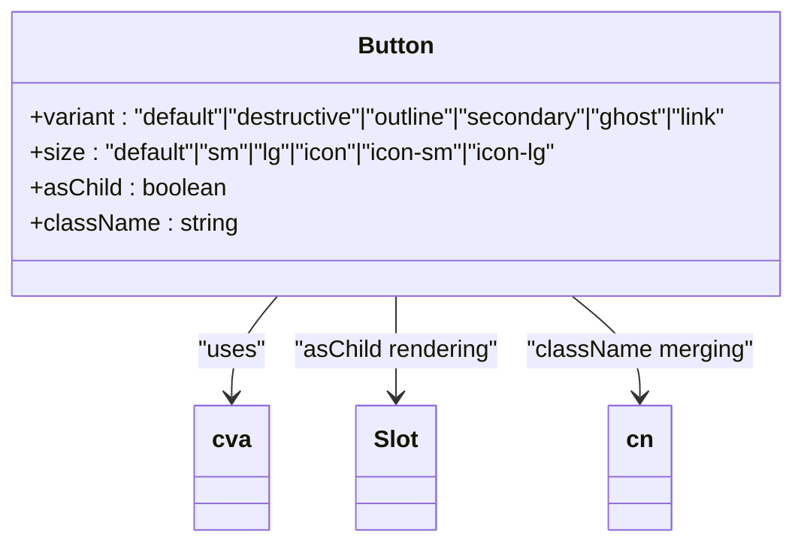
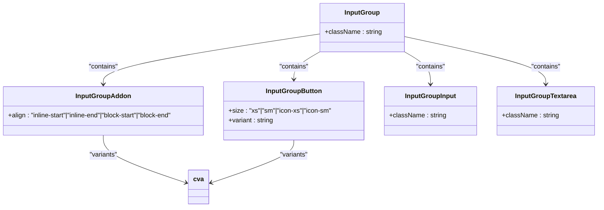
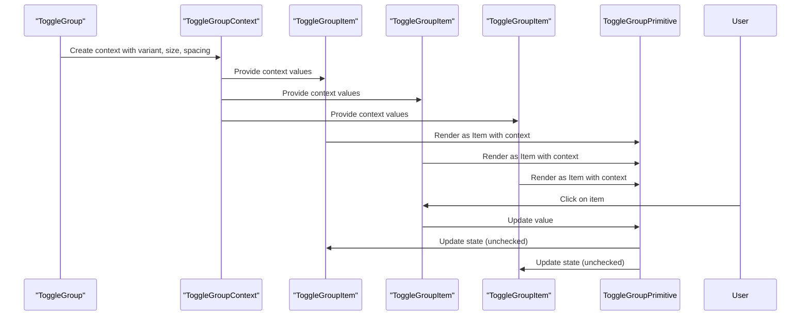
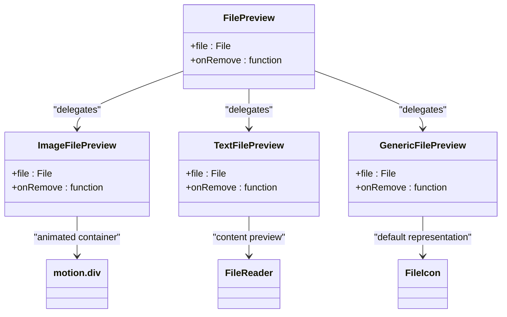
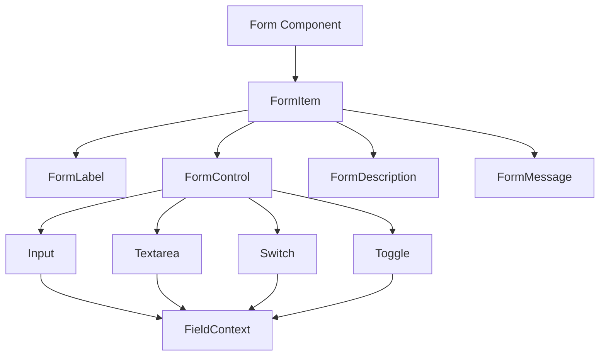

# Input Components

<cite>
**Referenced Files in This Document**   
- [button.tsx](file://src/components/ui/button.tsx)
- [input.tsx](file://src/components/ui/input.tsx)
- [textarea.tsx](file://src/components/ui/textarea.tsx)
- [switch.tsx](file://src/components/ui/switch.tsx)
- [toggle.tsx](file://src/components/ui/toggle.tsx)
- [toggle-group.tsx](file://src/components/ui/toggle-group.tsx)
- [file-preview.tsx](file://src/components/ui/file-preview.tsx)
- [input-group.tsx](file://src/components/ui/input-group.tsx)
- [input-otp.tsx](file://src/components/ui/input-otp.tsx)
- [form.tsx](file://src/components/ui/form.tsx)
- [field.tsx](file://src/components/ui/field.tsx)
- [label.tsx](file://src/components/ui/label.tsx)
- [radio-group.tsx](file://src/components/ui/radio-group.tsx)
- [utils.ts](file://src/lib/utils.ts)
</cite>

## Table of Contents
1. [Introduction](#introduction)
2. [Button Component](#button-component)
3. [Input and Textarea Components](#input-and-textarea-components)
4. [InputGroup for Enhanced Input Controls](#inputgroup-for-enhanced-input-controls)
5. [Switch and Toggle Components](#switch-and-toggle-components)
6. [ToggleGroup for Mutually Exclusive Selections](#togglegroup-for-mutually-exclusive-selections)
7. [FilePreview for File Attachments](#filepreview-for-file-attachments)
8. [InputOTP for Multi-digit Verification](#inputotp-for-multi-digit-verification)
9. [Form Integration and Accessibility](#form-integration-and-accessibility)
10. [Component Composition and Usage Patterns](#component-composition-and-usage-patterns)

## Introduction
This documentation provides comprehensive details about the interactive input components in the codebase. The components include Button, Input, Textarea, Switch, Toggle, ToggleGroup, FilePreview, and InputOTP, each designed with accessibility, responsiveness, and usability in mind. These components leverage the class-variance-authority (cva) for variant management, support keyboard navigation, and integrate seamlessly with form systems. The documentation covers variants, sizes, validation states, and composition patterns for these components.

## Button Component

The Button component is a versatile interactive element that supports multiple variants and sizes, implemented using cva for consistent styling. It serves as a primary interface element for user actions throughout the application.



**Diagram sources**
- [button.tsx](file://src/components/ui/button.tsx#L7-L62)

**Section sources**
- [button.tsx](file://src/components/ui/button.tsx#L7-L62)

### Button Variants
The Button component supports six variants, each designed for specific use cases:
- **default**: Primary action button with solid background
- **destructive**: Red color scheme for delete or dangerous actions
- **outline**: Border-only style with hover effects
- **secondary**: Secondary action with subtle background
- **ghost**: Minimal styling for contextual actions
- **link**: Text-only button with underline on hover

### Button Sizes
The component offers multiple size options:
- **default**: Standard height with balanced padding
- **sm**: Smaller version for compact spaces
- **lg**: Larger version for prominent actions
- **icon**: Square sizing for icon-only buttons (with variations: icon-sm, icon-lg)

The Button component includes focus states with ring effects, disabled states with reduced opacity, and accessibility features like proper ARIA attributes. It also supports the `asChild` prop to render alternative elements while maintaining button styling.

## Input and Textarea Components

The Input and Textarea components provide styled form controls with consistent theming, validation states, and accessibility features. Both components share similar styling patterns and behavior.

```mermaid
classDiagram
class Input {
+type : string
+className : string
}
class Textarea {
+className : string
}
Input --> cn : "className merging"
Textarea --> cn : "className merging"
Input --> "focus-visible" : "border and ring states"
Textarea --> "focus-visible" : "border and ring states"
```

**Diagram sources**
- [input.tsx](file://src/components/ui/input.tsx#L5-L21)
- [textarea.tsx](file://src/components/ui/textarea.tsx#L5-L18)

**Section sources**
- [input.tsx](file://src/components/ui/input.tsx#L5-L21)
- [textarea.tsx](file://src/components/ui/textarea.tsx#L5-L18)

### Input Component Features
The Input component includes:
- Consistent height (h-9) and padding
- Focus states with border and ring effects
- Validation states for error handling
- Support for file inputs with custom styling
- Disabled state with reduced opacity
- Selection styling that matches the theme

### Textarea Component Features
The Textarea component provides:
- Minimum height of 16 with flexible sizing
- Consistent padding and border styling
- Focus and validation states matching the Input component
- Responsive text sizing (base on mobile, sm on medium screens)
- Disabled state with appropriate styling

Both components use the `data-slot` attribute for styling consistency and support all standard HTML input/textarea attributes through props spreading.

## InputGroup for Enhanced Input Controls

The InputGroup component enables the creation of composite input controls with addons, buttons, and text elements positioned around the main input field. It supports various alignment options and integrates with validation states.



**Diagram sources**
- [input-group.tsx](file://src/components/ui/input-group.tsx#L11-L170)

**Section sources**
- [input-group.tsx](file://src/components/ui/input-group.tsx#L11-L170)

### InputGroup Structure
The InputGroup system consists of several subcomponents:
- **InputGroup**: The container that manages layout and shared states
- **InputGroupAddon**: Text or icon elements positioned around the input
- **InputGroupButton**: Action buttons integrated with the input
- **InputGroupInput**: Styled input element for single-line text
- **InputGroupTextarea**: Styled textarea for multi-line text

### Alignment Options
The InputGroupAddon supports four alignment positions:
- **inline-start**: Left side (or right in RTL) of the input
- **inline-end**: Right side (or left in RTL) of the input
- **block-start**: Above the input in a stacked layout
- **block-end**: Below the input in a stacked layout

The component system handles focus states, error states, and disabled states consistently across all parts of the group, ensuring a cohesive user experience.

## Switch and Toggle Components

The Switch and Toggle components provide boolean input controls with animated transitions and visual feedback. While both serve similar purposes, they have distinct visual styles and use cases.

```mermaid
classDiagram
class Switch {
+className : string
}
class Toggle {
+variant : "default"|"outline"
+size : "default"|"sm"|"lg"
+className : string
}
Switch --> SwitchPrimitive : "Root and Thumb"
Toggle --> cva : "variants"
Toggle --> TogglePrimitive : "Root"
Switch --> "transition-all" : "animated movement"
Toggle --> "transition-[color,box-shadow]" : "visual feedback"
```

**Diagram sources**
- [switch.tsx](file://src/components/ui/switch.tsx#L8-L31)
- [toggle.tsx](file://src/components/ui/toggle.tsx#L9-L47)

**Section sources**
- [switch.tsx](file://src/components/ui/switch.tsx#L8-L31)
- [toggle.tsx](file://src/components/ui/toggle.tsx#L9-L47)

### Switch Component
The Switch component implements a slider-style toggle with:
- Animated thumb movement using CSS transforms
- Distinct visual states for checked and unchecked
- Focus states with ring effects
- Disabled state with reduced opacity
- Proper contrast ratios for accessibility

The thumb moves from left to right when activated, providing clear visual feedback of the state change.

### Toggle Component
The Toggle component functions as a button-style switch with:
- Two variants: default (minimal) and outline (bordered)
- Three sizes: default, sm, and lg
- Visual feedback through background color changes
- Support for icons via SVG elements
- Focus and error states consistent with other components

The Toggle uses data attributes (data-[state=on]) to style the active state, providing a button-like interaction pattern for boolean selection.

## ToggleGroup for Mutually Exclusive Selections

The ToggleGroup component enables the creation of groups of Toggle components where only one item can be active at a time, similar to radio buttons but with a toggle button appearance.



**Diagram sources**
- [toggle-group.tsx](file://src/components/ui/toggle-group.tsx#L20-L83)

**Section sources**
- [toggle-group.tsx](file://src/components/ui/toggle-group.tsx#L20-L83)

### Implementation Details
The ToggleGroup component uses React context to share configuration (variant, size, spacing) with its child ToggleGroupItem components. It wraps the Radix UI ToggleGroupPrimitive to provide accessible keyboard navigation and ARIA attributes.

### Spacing Options
The component supports configurable spacing between items through the `spacing` prop, which sets a CSS variable (--gap) used in the gap utility. Special handling ensures proper border rendering when spacing is set to 0, creating a seamless pill-shaped group.

### Item Behavior
ToggleGroupItem components inherit their variant and size from the parent group by default, but can override these values individually. The component handles the visual connection between items, removing intermediate borders to create a cohesive group appearance.

## FilePreview for File Attachments

The FilePreview component displays metadata and thumbnails for uploaded files, with specialized rendering for different file types including images and text-based files.



**Diagram sources**
- [file-preview.tsx](file://src/components/ui/file-preview.tsx#L12-L153)

**Section sources**
- [file-preview.tsx](file://src/components/ui/file-preview.tsx#L12-L153)

### File Type Handling
The component uses conditional rendering based on file type:
- **Image files**: Display thumbnails using URL.createObjectURL()
- **Text files**: Show a preview of the first 50 characters
- **Other files**: Use a generic file icon with the filename

### Animation and Interaction
The component uses Framer Motion for entrance and exit animations (sliding up with fade). Each preview includes a remove button with an X icon, allowing users to delete attachments. The remove button is absolutely positioned in the top-right corner with a small border to distinguish it from the main content.

### Accessibility Features
The component includes proper ARIA labels for the remove button and uses semantic HTML structure. The filename is truncated with ellipsis when it exceeds the available space, ensuring the interface remains clean and readable.

## InputOTP for Multi-digit Verification

The InputOTP component provides a specialized input for one-time password verification, handling multiple digits with individual slots and proper focus management.

```mermaid
classDiagram
class InputOTP {
+containerClassName : string
}
class InputOTPGroup {
+className : string
}
class InputOTPSlot {
+index : number
}
class InputOTPSeparator {
}
InputOTP --> OTPInput : "wraps external component"
InputOTPGroup --> div : "container"
InputOTPSlot --> OTPInputContext : "consumes slot state"
InputOTPSlot --> "animate-caret-blink" : "fake caret"
InputOTPSeparator --> MinusIcon : "visual separator"
```

**Diagram sources**
- [input-otp.tsx](file://src/components/ui/input-otp.tsx#L9-L77)

**Section sources**
- [input-otp.tsx](file://src/components/ui/input-otp.tsx#L9-L77)

### Component Structure
The InputOTP system consists of:
- **InputOTP**: Main component that wraps the external OTPInput
- **InputOTPGroup**: Container for organizing slots
- **InputOTPSlot**: Individual digit input with visual feedback
- **InputOTPSeparator**: Visual separator between slots

### User Experience Features
The component includes a blinking caret animation in the active slot, providing clear visual feedback about where input will be entered. Each slot has focus states with ring effects and proper handling of active states. The component supports keyboard navigation between slots and handles the disabled state appropriately.

## Form Integration and Accessibility

The input components are designed to work seamlessly with form systems and meet accessibility requirements for keyboard navigation, screen readers, and assistive technologies.



**Diagram sources**
- [form.tsx](file://src/components/ui/form.tsx#L19-L167)
- [field.tsx](file://src/components/ui/field.tsx#L97-L248)

**Section sources**
- [form.tsx](file://src/components/ui/form.tsx#L19-L167)
- [field.tsx](file://src/components/ui/field.tsx#L97-L248)

### Form Component System
The form system uses React context to connect labels, controls, and messages:
- **Form**: Provider component for react-hook-form
- **FormField**: Wrapper for form fields with controller
- **FormItem**: Container with grid layout
- **FormLabel**: Accessible label with error state
- **FormControl**: Slot for the actual input component
- **FormDescription**: Helper text
- **FormMessage**: Error message display

### Accessibility Features
All components include:
- Proper focus indicators with sufficient contrast
- ARIA attributes for screen readers
- Keyboard navigation support
- Error states with visual and programmatic indicators
- Disabled states that prevent interaction
- Semantic HTML structure

The components use data attributes (data-slot, data-variant, data-size) for styling while maintaining accessibility, and leverage Radix UI primitives for robust accessibility features.

## Component Composition and Usage Patterns

The input components are designed for flexible composition, allowing developers to create complex interfaces by combining basic building blocks.

```mermaid
flowchart TD
Start["Component Composition"] --> ButtonWithIcon["Button + Icon"]
Start --> InputWithAddon["Input + InputGroupAddon"]
Start --> ToggleInGroup["Toggle + ToggleGroup"]
Start --> FileWithPreview["File input + FilePreview"]
Start --> OTPWithSeparator["InputOTP + InputOTPSeparator"]
ButtonWithIcon --> Example1["<Button><Icon />Label</Button>"]
InputWithAddon --> Example2["<InputGroup><InputGroupAddon>Prefix</InputGroupAddon><Input /></InputGroup>"]
ToggleInGroup --> Example3["<ToggleGroup><ToggleGroupItem>Option1</ToggleGroupItem></ToggleGroup>"]
FileWithPreview --> Example4["<FilePreview file={file} onRemove={handleRemove} />"]
OTPWithSeparator --> Example5["<InputOTP maxLength={6}><InputOTPGroup><InputOTPSlot index={0}/><InputOTPSeparator/><InputOTPSlot index={1}/></InputOTPGroup></InputOTP>"]
```



**Diagram sources**
- [button.tsx](file://src/components/ui/button.tsx#L39-L62)
- [input-group.tsx](file://src/components/ui/input-group.tsx#L11-L170)
- [toggle-group.tsx](file://src/components/ui/toggle-group.tsx#L20-L83)
- [file-preview.tsx](file://src/components/ui/file-preview.tsx#L12-L153)
- [input-otp.tsx](file://src/components/ui/input-otp.tsx#L9-L77)

**Section sources**
- [button.tsx](file://src/components/ui/button.tsx#L39-L62)
- [input-group.tsx](file://src/components/ui/input-group.tsx#L11-L170)
- [toggle-group.tsx](file://src/components/ui/toggle-group.tsx#L20-L83)
- [file-preview.tsx](file://src/components/ui/file-preview.tsx#L12-L153)
- [input-otp.tsx](file://src/components/ui/input-otp.tsx#L9-L77)

### Common Composition Patterns
- **Button with Icons**: Using Lucide icons within buttons for visual enhancement
- **Input with Prefix/Suffix**: Adding contextual information or actions to inputs
- **Toggle Groups**: Creating mutually exclusive selection interfaces
- **File Previews**: Displaying uploaded file information in a compact format
- **OTP Inputs**: Handling multi-digit verification codes with proper spacing

These composition patterns enable the creation of rich, interactive interfaces while maintaining consistency and accessibility across the application.