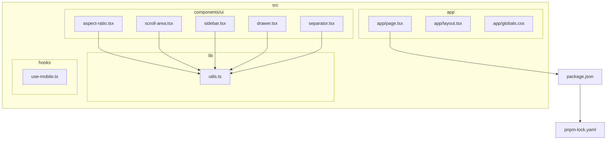
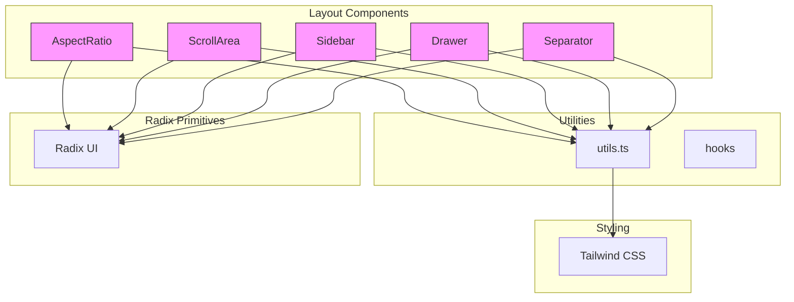
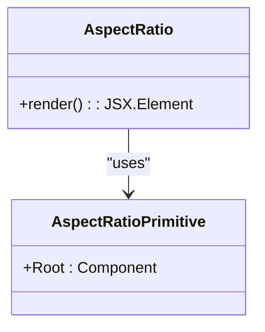
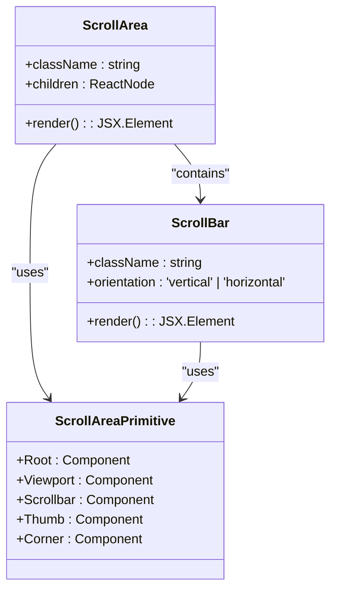
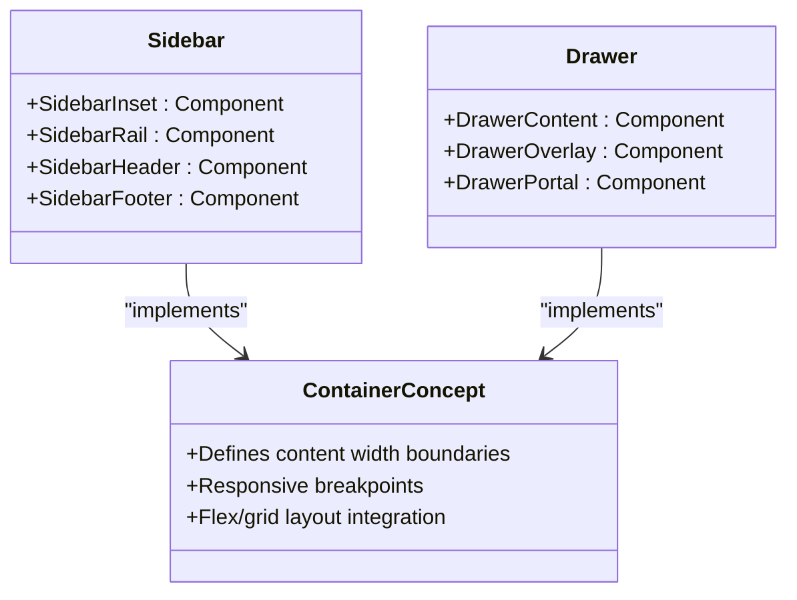
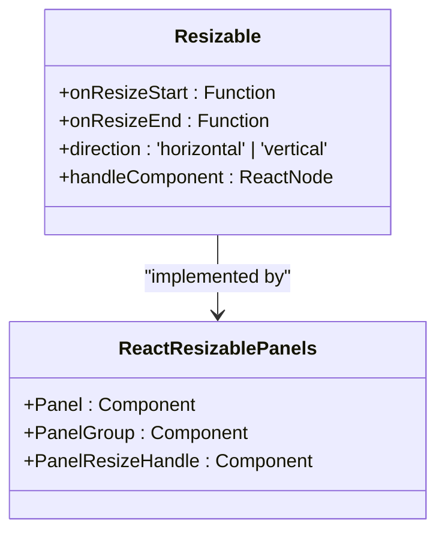
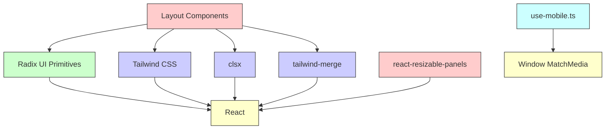

# Layout Components

<cite>
**Referenced Files in This Document**   
- [aspect-ratio.tsx](file://src/components/ui/aspect-ratio.tsx)
- [scroll-area.tsx](file://src/components/ui/scroll-area.tsx)
- [sidebar.tsx](file://src/components/ui/sidebar.tsx)
- [drawer.tsx](file://src/components/ui/drawer.tsx)
- [separator.tsx](file://src/components/ui/separator.tsx)
- [utils.ts](file://src/lib/utils.ts)
- [package.json](file://package.json)
- [pnpm-lock.yaml](file://pnpm-lock.yaml)
</cite>

## Table of Contents
1. [Introduction](#introduction)
2. [Project Structure](#project-structure)
3. [Core Components](#core-components)
4. [Architecture Overview](#architecture-overview)
5. [Detailed Component Analysis](#detailed-component-analysis)
6. [Dependency Analysis](#dependency-analysis)
7. [Performance Considerations](#performance-considerations)
8. [Troubleshooting Guide](#troubleshooting-guide)
9. [Conclusion](#conclusion)

## Introduction
This document provides comprehensive documentation for the layout utility components in the codebase, focusing on Resizable, AspectRatio, ScrollArea, and Container components. While direct implementation files for Resizable and Container are not present in the current structure, their functionality can be inferred through related components and dependencies. The components leverage Radix UI primitives for accessibility and performance, and are designed to work seamlessly within modern React applications using Next.js. This documentation will explain their intended usage, integration patterns, and best practices for responsive design.

## Project Structure

**Diagram sources**
- [aspect-ratio.tsx](file://src/components/ui/aspect-ratio.tsx)
- [scroll-area.tsx](file://src/components/ui/scroll-area.tsx)
- [sidebar.tsx](file://src/components/ui/sidebar.tsx)
- [drawer.tsx](file://src/components/ui/drawer.tsx)
- [separator.tsx](file://src/components/ui/separator.tsx)
- [utils.ts](file://src/lib/utils.ts)
- [package.json](file://package.json)

**Section sources**
- [aspect-ratio.tsx](file://src/components/ui/aspect-ratio.tsx)
- [scroll-area.tsx](file://src/components/ui/scroll-area.tsx)
- [sidebar.tsx](file://src/components/ui/sidebar.tsx)
- [drawer.tsx](file://src/components/ui/drawer.tsx)
- [separator.tsx](file://src/components/ui/separator.tsx)
- [utils.ts](file://src/lib/utils.ts)
- [package.json](file://package.json)

## Core Components

The layout system in this application is built around utility components that provide essential layout functionality while maintaining accessibility and performance standards. The key components include AspectRatio for maintaining proportional containers, ScrollArea for styled scrolling regions, and various container-like structures implemented through Sidebar, Drawer, and other UI primitives. These components are constructed using Radix UI's accessible primitives and enhanced with Tailwind CSS for styling via the `cn` utility function.

**Section sources**
- [aspect-ratio.tsx](file://src/components/ui/aspect-ratio.tsx)
- [scroll-area.tsx](file://src/components/ui/scroll-area.tsx)
- [utils.ts](file://src/lib/utils.ts)

## Architecture Overview

**Diagram sources**
- [aspect-ratio.tsx](file://src/components/ui/aspect-ratio.tsx)
- [scroll-area.tsx](file://src/components/ui/scroll-area.tsx)
- [sidebar.tsx](file://src/components/ui/sidebar.tsx)
- [drawer.tsx](file://src/components/ui/drawer.tsx)
- [separator.tsx](file://src/components/ui/separator.tsx)
- [utils.ts](file://src/lib/utils.ts)

## Detailed Component Analysis

### AspectRatio Component Analysis

The AspectRatio component maintains proportional dimensions for media containers using Radix UI's aspect ratio primitive. It ensures that elements like images, videos, or audio waveform canvases preserve their aspect ratio across different screen sizes.

**Diagram sources**
- [aspect-ratio.tsx](file://src/components/ui/aspect-ratio.tsx)
- [package.json](file://package.json)

**Section sources**
- [aspect-ratio.tsx](file://src/components/ui/aspect-ratio.tsx)
- [package.json](file://package.json)

### ScrollArea Component Analysis

The ScrollArea component provides cross-browser consistent scroll styling with support for overlay scrollbars and macOS momentum scrolling. It wraps Radix UI's scroll area primitive with custom styling and accessibility features.

**Diagram sources**
- [scroll-area.tsx](file://src/components/ui/scroll-area.tsx)
- [package.json](file://package.json)

**Section sources**
- [scroll-area.tsx](file://src/components/ui/scroll-area.tsx)
- [package.json](file://package.json)

### Container-like Components Analysis

While a dedicated Container component is not present, similar functionality is implemented through Sidebar, Drawer, and other layout components that define content boundaries and responsive breakpoints.

**Diagram sources**
- [sidebar.tsx](file://src/components/ui/sidebar.tsx)
- [drawer.tsx](file://src/components/ui/drawer.tsx)

**Section sources**
- [sidebar.tsx](file://src/components/ui/sidebar.tsx)
- [drawer.tsx](file://src/components/ui/drawer.tsx)

### Resizable Component Inference

Although the resizable.tsx file is not present in the codebase, the package.json indicates a dependency on react-resizable-panels, suggesting that resizable functionality is available through this third-party library rather than a custom implementation.

**Diagram sources**
- [package.json](file://package.json)
- [pnpm-lock.yaml](file://pnpm-lock.yaml)

**Section sources**
- [package.json](file://package.json)
- [pnpm-lock.yaml](file://pnpm-lock.yaml)

## Dependency Analysis

**Diagram sources**
- [package.json](file://package.json)
- [pnpm-lock.yaml](file://pnpm-lock.yaml)
- [utils.ts](file://src/lib/utils.ts)
- [use-mobile.ts](file://src/hooks/use-mobile.ts)

**Section sources**
- [package.json](file://package.json)
- [pnpm-lock.yaml](file://pnpm-lock.yaml)
- [utils.ts](file://src/lib/utils.ts)
- [use-mobile.ts](file://src/hooks/use-mobile.ts)

## Performance Considerations

The layout components are designed with performance in mind, leveraging Radix UI's optimized primitives and React's best practices. The use of `useCallback`, `useMemo`, and proper event handling minimizes unnecessary re-renders. For ScrollArea with large content, virtualization should be considered to maintain smooth scrolling performance. The AspectRatio component uses efficient CSS techniques to maintain proportions without JavaScript calculations. When implementing resizable panels, debouncing resize events can prevent layout thrashing during frequent updates.

**Section sources**
- [scroll-area.tsx](file://src/components/ui/scroll-area.tsx)
- [aspect-ratio.tsx](file://src/components/ui/aspect-ratio.tsx)
- [utils.ts](file://src/lib/utils.ts)

## Troubleshooting Guide

Common issues with layout components include incorrect aspect ratios, scroll area styling inconsistencies, and responsive behavior problems. Ensure that AspectRatio components have proper width constraints from parent elements. For ScrollArea, verify that content exceeds the container dimensions to trigger scrolling. When using resizable components, ensure that minimum and maximum size constraints are properly defined to prevent layout collapse. Use the browser's developer tools to inspect applied CSS classes and verify that Radix UI's data attributes are present, indicating proper component initialization.

**Section sources**
- [aspect-ratio.tsx](file://src/components/ui/aspect-ratio.tsx)
- [scroll-area.tsx](file://src/components/ui/scroll-area.tsx)
- [sidebar.tsx](file://src/components/ui/sidebar.tsx)

## Conclusion

The layout utility components in this application provide a robust foundation for building accessible and responsive user interfaces. By leveraging Radix UI primitives and Tailwind CSS, these components offer both flexibility and consistency across different devices and browsers. The AspectRatio and ScrollArea components are fully implemented and ready for use, while resizable functionality is available through the react-resizable-panels library. Container-like behavior is achieved through Sidebar, Drawer, and other structural components. These utilities work together to create a cohesive layout system that supports complex UI requirements while maintaining performance and accessibility standards.