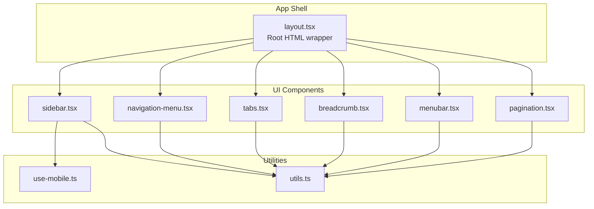
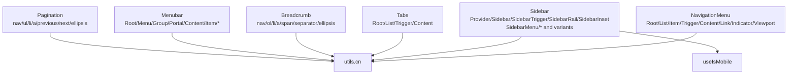
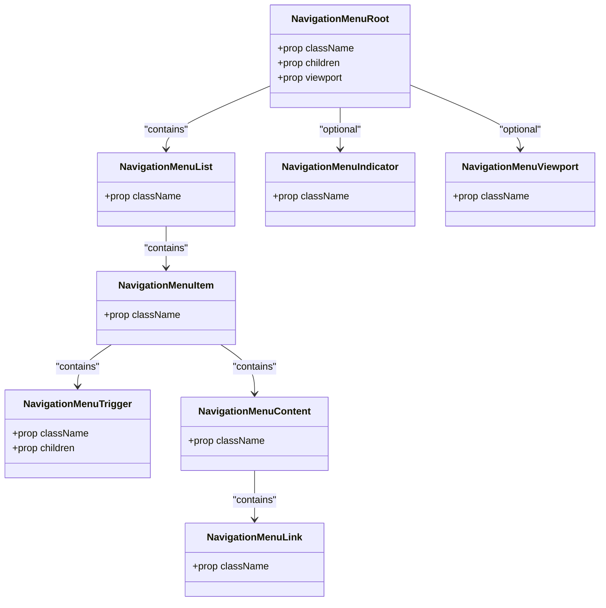
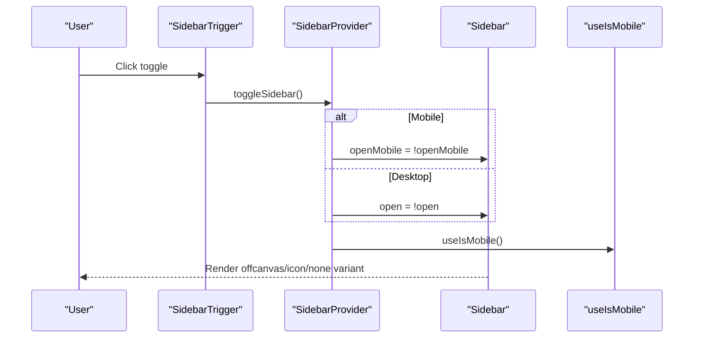
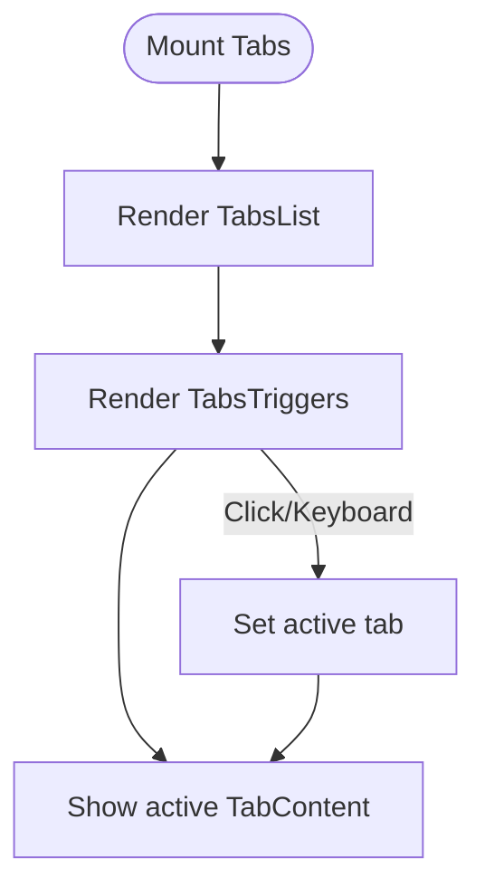
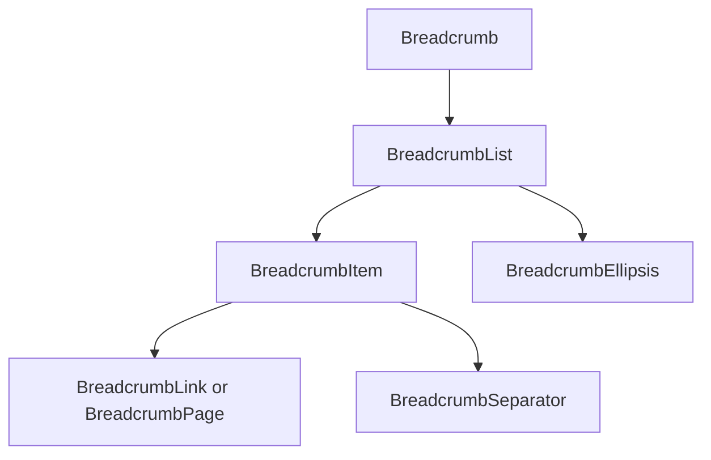
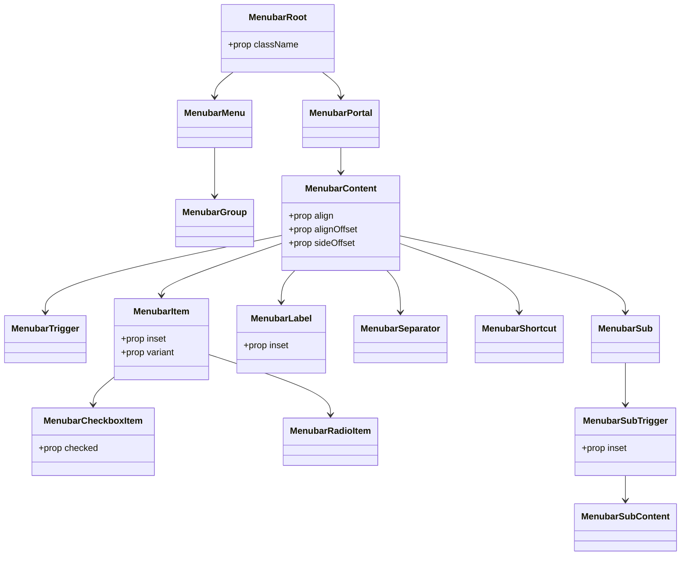
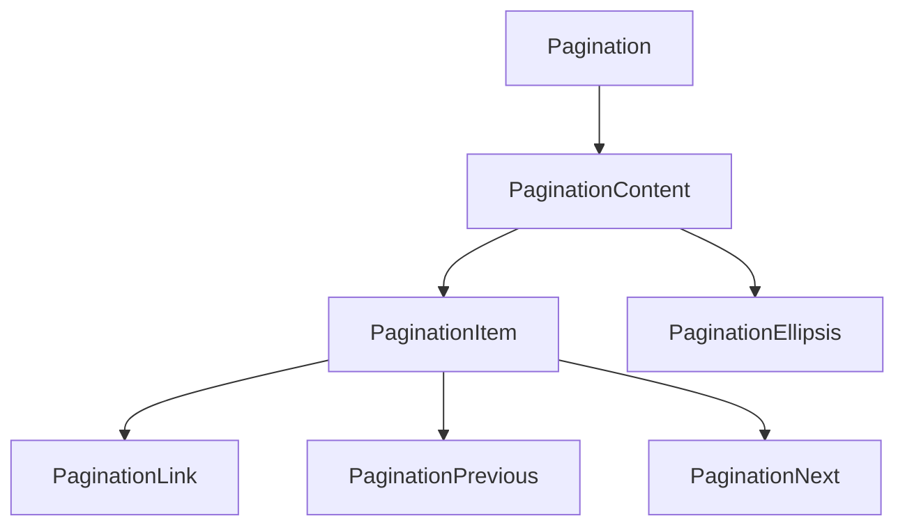
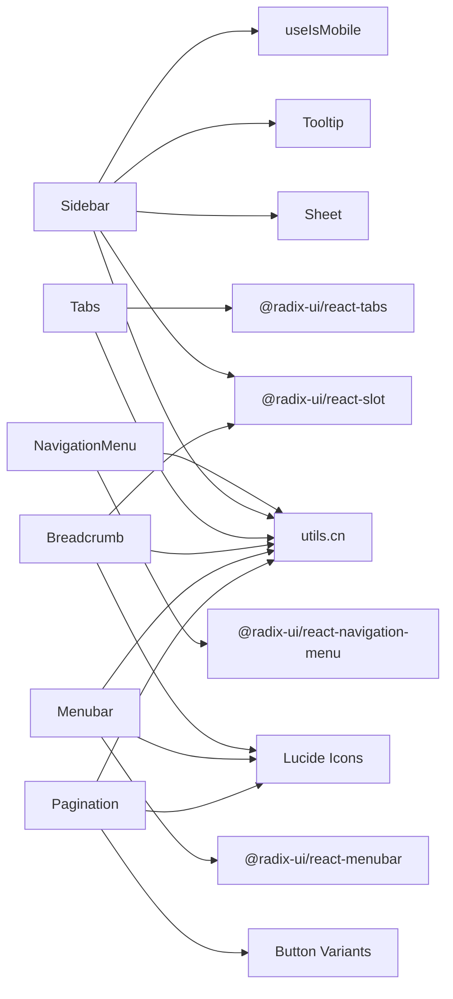

# Navigation Components

<cite>
**Referenced Files in This Document**
- [navigation-menu.tsx](file://src/components/ui/navigation-menu.tsx)
- [sidebar.tsx](file://src/components/ui/sidebar.tsx)
- [tabs.tsx](file://src/components/ui/tabs.tsx)
- [breadcrumb.tsx](file://src/components/ui/breadcrumb.tsx)
- [menubar.tsx](file://src/components/ui/menubar.tsx)
- [pagination.tsx](file://src/components/ui/pagination.tsx)
- [use-mobile.ts](file://src/hooks/use-mobile.ts)
- [layout.tsx](file://src/app/layout.tsx)
- [utils.ts](file://src/lib/utils.ts)
</cite>

## Table of Contents
1. [Introduction](#introduction)
2. [Project Structure](#project-structure)
3. [Core Components](#core-components)
4. [Architecture Overview](#architecture-overview)
5. [Detailed Component Analysis](#detailed-component-analysis)
6. [Dependency Analysis](#dependency-analysis)
7. [Performance Considerations](#performance-considerations)
8. [Troubleshooting Guide](#troubleshooting-guide)
9. [Conclusion](#conclusion)

## Introduction
This document explains the navigation and structural UI components used to build accessible, responsive, and theme-aware layouts. It focuses on:
- NavigationMenu: Accessible dropdown menus with keyboard navigation and viewport-aware positioning
- Sidebar: Collapsible navigation with theming, responsive behavior, and integration with layout
- Tabs: Content switching with ARIA-compliant tab panels
- Breadcrumb: Hierarchical navigation with customizable separators
- Menubar: Application-level menu structures
- Pagination: Data set navigation with SEO-friendly markup

It also covers compound patterns, data attributes for styling, Radix UI primitives for accessibility, responsive adaptations using the use-mobile hook, and integration with layout.tsx. Customization via cva variants and best practices for SEO-friendly navigation are included.

## Project Structure
The navigation components live under src/components/ui and are composed with Radix UI primitives and Tailwind CSS utilities. The use-mobile hook provides responsive breakpoints, and layout.tsx defines the global HTML structure.

**Diagram sources**
- [layout.tsx](file://src/app/layout.tsx#L1-L35)
- [navigation-menu.tsx](file://src/components/ui/navigation-menu.tsx#L1-L169)
- [sidebar.tsx](file://src/components/ui/sidebar.tsx#L1-L727)
- [tabs.tsx](file://src/components/ui/tabs.tsx#L1-L67)
- [breadcrumb.tsx](file://src/components/ui/breadcrumb.tsx#L1-L110)
- [menubar.tsx](file://src/components/ui/menubar.tsx#L1-L277)
- [pagination.tsx](file://src/components/ui/pagination.tsx#L1-L128)
- [use-mobile.ts](file://src/hooks/use-mobile.ts#L1-L20)
- [utils.ts](file://src/lib/utils.ts#L1-L7)

**Section sources**
- [layout.tsx](file://src/app/layout.tsx#L1-L35)
- [use-mobile.ts](file://src/hooks/use-mobile.ts#L1-L20)
- [utils.ts](file://src/lib/utils.ts#L1-L7)

## Core Components
- NavigationMenu: Implements accessible dropdown menus using @radix-ui/react-navigation-menu. It exposes compound components (Root, List, Item, Trigger, Content, Link, Indicator, Viewport) and uses data attributes for styling and motion states. It supports viewport-aware positioning and keyboard navigation out of the box via Radix primitives.
- Sidebar: Provides a robust, theme-aware navigation container with collapsible behavior, keyboard shortcut toggling, responsive variants (offcanvas, icon, none), and integration points for menus and groups. It uses data attributes for state and variant styling and integrates with layout.tsx via a provider.
- Tabs: ARIA-compliant tab panel system built on @radix-ui/react-tabs with compound parts (Root, List, Trigger, Content) and styling via data states.
- Breadcrumb: Semantic hierarchical navigation with customizable separators and ARIA roles for current page and disabled links.
- Menubar: Application-level menu structure with nested submenus, checkboxes, radios, and shortcuts, styled with data attributes and portal rendering for overlay positioning.
- Pagination: Navigation for paginated datasets with accessible labels and ARIA current page support.

**Section sources**
- [navigation-menu.tsx](file://src/components/ui/navigation-menu.tsx#L1-L169)
- [sidebar.tsx](file://src/components/ui/sidebar.tsx#L1-L727)
- [tabs.tsx](file://src/components/ui/tabs.tsx#L1-L67)
- [breadcrumb.tsx](file://src/components/ui/breadcrumb.tsx#L1-L110)
- [menubar.tsx](file://src/components/ui/menubar.tsx#L1-L277)
- [pagination.tsx](file://src/components/ui/pagination.tsx#L1-L128)

## Architecture Overview
The components rely on:
- Radix UI primitives for accessibility and state management
- Tailwind CSS utilities and class-variance-authority (cva) for styling and variants
- Data attributes for styling and runtime state
- Responsive hooks for device adaptation
- Global layout.tsx for HTML structure and fonts

**Diagram sources**
- [navigation-menu.tsx](file://src/components/ui/navigation-menu.tsx#L1-L169)
- [sidebar.tsx](file://src/components/ui/sidebar.tsx#L1-L727)
- [tabs.tsx](file://src/components/ui/tabs.tsx#L1-L67)
- [breadcrumb.tsx](file://src/components/ui/breadcrumb.tsx#L1-L110)
- [menubar.tsx](file://src/components/ui/menubar.tsx#L1-L277)
- [pagination.tsx](file://src/components/ui/pagination.tsx#L1-L128)
- [use-mobile.ts](file://src/hooks/use-mobile.ts#L1-L20)
- [utils.ts](file://src/lib/utils.ts#L1-L7)

## Detailed Component Analysis

### NavigationMenu
NavigationMenu composes Radix UI primitives to deliver accessible dropdown menus with keyboard navigation and viewport-aware positioning. It uses data attributes for styling and motion states, and exposes a trigger style computed via cva.

Key behaviors:
- Compound components: Root, List, Item, Trigger, Content, Link, Indicator, Viewport
- Keyboard navigation: Provided by @radix-ui/react-navigation-menu
- Viewport-aware positioning: Uses CSS variables for width/height and animation classes
- Styling: data-slot attributes and data-state selectors enable Tailwind-based styling

**Diagram sources**
- [navigation-menu.tsx](file://src/components/ui/navigation-menu.tsx#L1-L169)

Accessibility and keyboard navigation:
- Uses @radix-ui/react-navigation-menu primitives for focus management and keyboard interactions
- Supports open/close states via data-state attributes
- Indicator and Viewport provide visual feedback and positioning

Responsive and styling:
- data-slot attributes for targeting styles
- data-viewport controls whether the viewport is rendered
- motion classes animate transitions for open/closed states

**Section sources**
- [navigation-menu.tsx](file://src/components/ui/navigation-menu.tsx#L1-L169)

### Sidebar
Sidebar provides a flexible, theme-aware navigation container with collapsible behavior, responsive variants, and keyboard shortcut toggling. It integrates with layout.tsx via a provider and uses data attributes for styling.

Key behaviors:
- Provider manages state, open/collapsed toggles, and persistence via cookies
- Responsive variants:
  - offcanvas: sidebar slides out on desktop, uses Sheet on mobile
  - icon: collapses to icons with hover reveal
  - none: fixed width without collapsible behavior
- Theming: uses CSS variables (--sidebar-width, --sidebar-width-icon) and Tailwind classes bound to data attributes
- Accessibility: includes screen-reader-friendly labels and aria attributes
- Integration: SidebarInset wraps main content; SidebarTrigger toggles visibility

**Diagram sources**
- [sidebar.tsx](file://src/components/ui/sidebar.tsx#L1-L727)
- [use-mobile.ts](file://src/hooks/use-mobile.ts#L1-L20)

Customization and variants:
- Variants: "sidebar" | "floating" | "inset"
- Collapsible: "offcanvas" | "icon" | "none"
- Side: "left" | "right"
- Uses cva-like patterns for menu button sizing and variants
- Data attributes: data-state, data-collapsible, data-variant, data-side

Responsive adaptation:
- useIsMobile determines mobile vs desktop rendering
- Mobile uses Sheet; Desktop uses fixed position with collapsible gaps

**Section sources**
- [sidebar.tsx](file://src/components/ui/sidebar.tsx#L1-L727)
- [use-mobile.ts](file://src/hooks/use-mobile.ts#L1-L20)

### Tabs
Tabs implements ARIA-compliant tab panels using @radix-ui/react-tabs. It exposes compound components for list, triggers, and content, and applies styling via data states.

Key behaviors:
- Compound components: Root, List, Trigger, Content
- Active state styling via data-state="active"
- Focus-visible ring and outline for keyboard navigation

**Diagram sources**
- [tabs.tsx](file://src/components/ui/tabs.tsx#L1-L67)

**Section sources**
- [tabs.tsx](file://src/components/ui/tabs.tsx#L1-L67)

### Breadcrumb
Breadcrumb provides semantic hierarchical navigation with customizable separators and ARIA roles for current page and disabled links.

Key behaviors:
- Compound components: nav, ol, li, a, span
- Roles: aria-current="page" for current page; aria-disabled for disabled links
- Separator customization via BreadcrumbSeparator; ellipsis via BreadcrumbEllipsis

**Diagram sources**
- [breadcrumb.tsx](file://src/components/ui/breadcrumb.tsx#L1-L110)

**Section sources**
- [breadcrumb.tsx](file://src/components/ui/breadcrumb.tsx#L1-L110)

### Menubar
Menubar implements application-level menus with nested submenus, checkboxes, radios, and shortcuts. It uses portals for overlay positioning and data attributes for styling.

Key behaviors:
- Compound components: Root, Menu, Group, Portal, Content, Trigger, Item variants
- Submenus: Sub, SubTrigger, SubContent
- Styling: data-slot, data-inset, data-variant, data-side
- Accessibility: focus management and keyboard navigation via Radix

**Diagram sources**
- [menubar.tsx](file://src/components/ui/menubar.tsx#L1-L277)

**Section sources**
- [menubar.tsx](file://src/components/ui/menubar.tsx#L1-L277)

### Pagination
Pagination provides navigation for paginated datasets with accessible labels and ARIA current page support.

Key behaviors:
- Compound components: nav, ul, li, a, previous, next, ellipsis
- Accessibility: aria-label for navigation; aria-current="page" for active link
- Styling: uses buttonVariants for ghost/outline variants and size control

**Diagram sources**
- [pagination.tsx](file://src/components/ui/pagination.tsx#L1-L128)

**Section sources**
- [pagination.tsx](file://src/components/ui/pagination.tsx#L1-L128)

## Dependency Analysis
- NavigationMenu depends on @radix-ui/react-navigation-menu and Lucide icons; uses utils.cn for class merging.
- Sidebar depends on @radix-ui/react-slot, Sheet, Tooltip, and the useIsMobile hook; persists state via cookies.
- Tabs depends on @radix-ui/react-tabs.
- Breadcrumb depends on @radix-ui/react-slot and Lucide icons.
- Menubar depends on @radix-ui/react-menubar and Lucide icons.
- Pagination depends on buttonVariants and Lucide icons.
- All components use data-slot and data-state attributes for styling and state selection.

**Diagram sources**
- [navigation-menu.tsx](file://src/components/ui/navigation-menu.tsx#L1-L169)
- [sidebar.tsx](file://src/components/ui/sidebar.tsx#L1-L727)
- [tabs.tsx](file://src/components/ui/tabs.tsx#L1-L67)
- [breadcrumb.tsx](file://src/components/ui/breadcrumb.tsx#L1-L110)
- [menubar.tsx](file://src/components/ui/menubar.tsx#L1-L277)
- [pagination.tsx](file://src/components/ui/pagination.tsx#L1-L128)
- [use-mobile.ts](file://src/hooks/use-mobile.ts#L1-L20)
- [utils.ts](file://src/lib/utils.ts#L1-L7)

**Section sources**
- [navigation-menu.tsx](file://src/components/ui/navigation-menu.tsx#L1-L169)
- [sidebar.tsx](file://src/components/ui/sidebar.tsx#L1-L727)
- [tabs.tsx](file://src/components/ui/tabs.tsx#L1-L67)
- [breadcrumb.tsx](file://src/components/ui/breadcrumb.tsx#L1-L110)
- [menubar.tsx](file://src/components/ui/menubar.tsx#L1-L277)
- [pagination.tsx](file://src/components/ui/pagination.tsx#L1-L128)
- [use-mobile.ts](file://src/hooks/use-mobile.ts#L1-L20)
- [utils.ts](file://src/lib/utils.ts#L1-L7)

## Performance Considerations
- Prefer offcanvas or icon variants for mobile to reduce DOM and layout thrash.
- Use data attributes for targeted styling to minimize unnecessary reflows.
- Avoid heavy animations on low-end devices; leverage CSS variables for smooth transitions.
- Defer non-critical content in SidebarContent to improve initial render performance.
- Use portals judiciously (Menubar) to avoid deep DOM nesting.

## Troubleshooting Guide
- NavigationMenu viewport not visible:
  - Ensure viewport prop is enabled and CSS variables for width/height are set
  - Verify data-viewport attribute is present on the root
- Sidebar not toggling on desktop:
  - Confirm useIsMobile returns false on desktop
  - Check keyboard shortcut meta/ctrl modifier keys
- Menubar submenus not opening:
  - Ensure MenubarPortal is wrapping MenubarContent
  - Verify data-slot attributes on sub components
- Pagination active state not announced:
  - Confirm aria-current is set on the active link
- Breadcrumb separator not visible:
  - Provide a custom separator via BreadcrumbSeparator or rely on default icon

**Section sources**
- [navigation-menu.tsx](file://src/components/ui/navigation-menu.tsx#L1-L169)
- [sidebar.tsx](file://src/components/ui/sidebar.tsx#L1-L727)
- [menubar.tsx](file://src/components/ui/menubar.tsx#L1-L277)
- [pagination.tsx](file://src/components/ui/pagination.tsx#L1-L128)
- [breadcrumb.tsx](file://src/components/ui/breadcrumb.tsx#L1-L110)

## Conclusion
These navigation components combine Radix UI primitives with Tailwind CSS and data attributes to deliver accessible, responsive, and themeable navigation experiences. They support compound patterns, keyboard navigation, viewport-aware positioning, and SEO-friendly markup. Use the provided variants and data attributes to customize appearance and behavior, and integrate them with layout.tsx for consistent global structure.