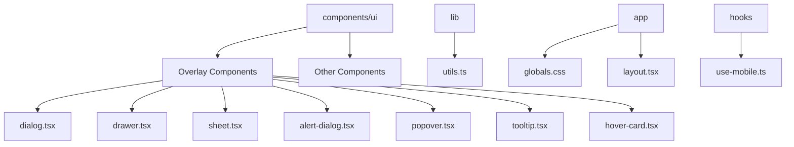
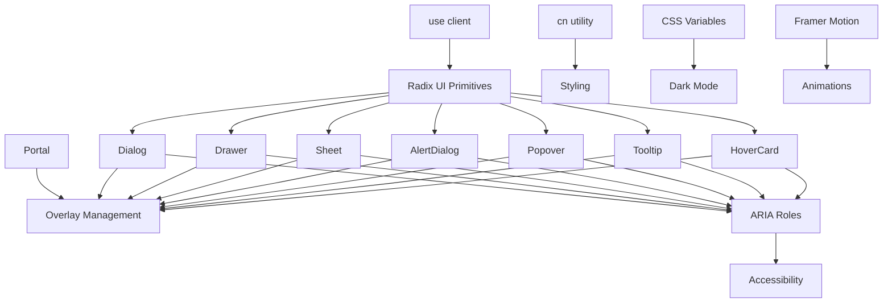
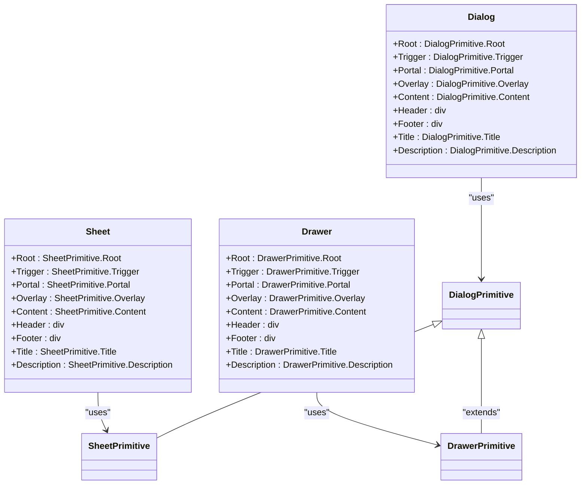
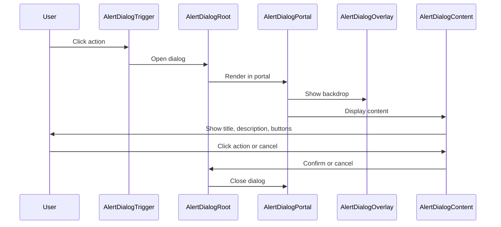
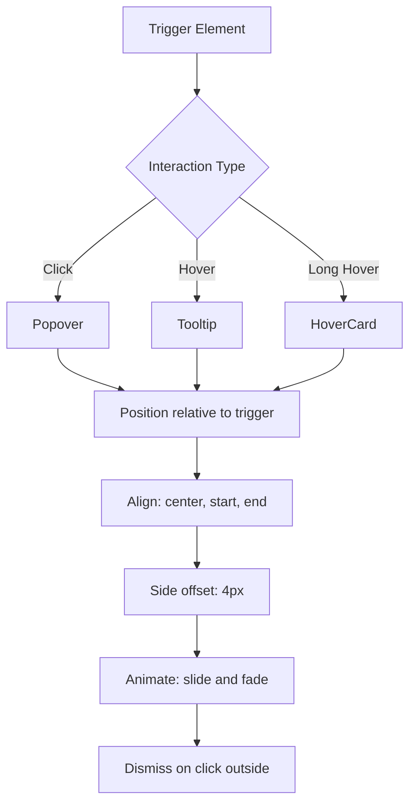

# Overlay Components

<cite>
**Referenced Files in This Document**   
- [dialog.tsx](file://src/components/ui/dialog.tsx)
- [drawer.tsx](file://src/components/ui/drawer.tsx)
- [sheet.tsx](file://src/components/ui/sheet.tsx)
- [alert-dialog.tsx](file://src/components/ui/alert-dialog.tsx)
- [popover.tsx](file://src/components/ui/popover.tsx)
- [tooltip.tsx](file://src/components/ui/tooltip.tsx)
- [hover-card.tsx](file://src/components/ui/hover-card.tsx)
- [utils.ts](file://src/lib/utils.ts)
- [globals.css](file://src/app/globals.css)
- [button.tsx](file://src/components/ui/button.tsx)
- [use-mobile.ts](file://src/hooks/use-mobile.ts)
- [interrupt-prompt.tsx](file://src/components/ui/interrupt-prompt.tsx)
</cite>

## Table of Contents
1. [Introduction](#introduction)
2. [Project Structure](#project-structure)
3. [Core Components](#core-components)
4. [Architecture Overview](#architecture-overview)
5. [Detailed Component Analysis](#detailed-component-analysis)
6. [Dependency Analysis](#dependency-analysis)
7. [Performance Considerations](#performance-considerations)
8. [Troubleshooting Guide](#troubleshooting-guide)
9. [Conclusion](#conclusion)

## Introduction
This document provides comprehensive documentation for overlay and modal UI components in the codebase, including Dialog, Drawer, Sheet, AlertDialog, Popover, Tooltip, and HoverCard. The components are built using Radix UI primitives with consistent styling through Tailwind CSS and the `cn` utility. The architecture leverages React Server Components with client-side interactivity enabled via the "use client" directive. Components support dark mode through CSS variables and next-themes integration, with animations powered by Framer Motion for enhanced user experience.

## Project Structure



**Diagram sources**
- [src/components/ui](file://src/components/ui)
- [src/lib/utils.ts](file://src/lib/utils.ts)
- [src/app/globals.css](file://src/app/globals.css)
- [src/hooks/use-mobile.ts](file://src/hooks/use-mobile.ts)

**Section sources**
- [src/components/ui](file://src/components/ui)
- [src/lib/utils.ts](file://src/lib/utils.ts)

## Core Components

The overlay components follow a consistent architectural pattern using Radix UI primitives for accessible, unstyled base components enhanced with project-specific styling and behavior. All components are client components due to their interactive nature, indicated by the "use client" directive at the top of each file. The components share common patterns for portals, overlays, and content positioning, with variations based on their specific use cases (modal dialogs, side drawers, tooltips, etc.).

**Section sources**
- [dialog.tsx](file://src/components/ui/dialog.tsx#L1-L144)
- [drawer.tsx](file://src/components/ui/drawer.tsx#L1-L136)
- [sheet.tsx](file://src/components/ui/sheet.tsx#L1-L140)

## Architecture Overview



**Diagram sources**
- [dialog.tsx](file://src/components/ui/dialog.tsx#L1-L144)
- [drawer.tsx](file://src/components/ui/drawer.tsx#L1-L136)
- [sheet.tsx](file://src/components/ui/sheet.tsx#L1-L140)
- [alert-dialog.tsx](file://src/components/ui/alert-dialog.tsx#L1-L158)
- [popover.tsx](file://src/components/ui/popover.tsx#L1-L49)
- [tooltip.tsx](file://src/components/ui/tooltip.tsx#L1-L62)
- [hover-card.tsx](file://src/components/ui/hover-card.tsx#L1-L45)
- [utils.ts](file://src/lib/utils.ts#L1-L7)

## Detailed Component Analysis

### Dialog, Drawer, and Sheet Components

These modal components share a similar architecture but differ in presentation and behavior. The Dialog appears centered with a zoom animation, the Sheet slides in from a specified side, and the Drawer uses a native-like bottom sheet behavior on mobile.

#### Component Architecture


**Diagram sources**
- [dialog.tsx](file://src/components/ui/dialog.tsx#L1-L144)
- [sheet.tsx](file://src/components/ui/sheet.tsx#L1-L140)
- [drawer.tsx](file://src/components/ui/drawer.tsx#L1-L136)

**Section sources**
- [dialog.tsx](file://src/components/ui/dialog.tsx#L1-L144)
- [sheet.tsx](file://src/components/ui/sheet.tsx#L1-L140)
- [drawer.tsx](file://src/components/ui/drawer.tsx#L1-L136)

### AlertDialog Component

The AlertDialog is a specialized dialog for critical actions that require user confirmation, with distinct action and cancel buttons.

#### Alert Dialog Flow


**Diagram sources**
- [alert-dialog.tsx](file://src/components/ui/alert-dialog.tsx#L1-L158)

**Section sources**
- [alert-dialog.tsx](file://src/components/ui/alert-dialog.tsx#L1-L158)

### Popover, Tooltip, and HoverCard Components

These components provide contextual information and actions without blocking the user interface, appearing near their trigger elements.

#### Positioning and Interaction


**Diagram sources**
- [popover.tsx](file://src/components/ui/popover.tsx#L1-L49)
- [tooltip.tsx](file://src/components/ui/tooltip.tsx#L1-L62)
- [hover-card.tsx](file://src/components/ui/hover-card.tsx#L1-L45)

**Section sources**
- [popover.tsx](file://src/components/ui/popover.tsx#L1-L49)
- [tooltip.tsx](file://src/components/ui/tooltip.tsx#L1-L62)
- [hover-card.tsx](file://src/components/ui/hover-card.tsx#L1-L45)

## Dependency Analysis

```mermaid
graph TD
A[Overlay Components] --> B[Radix UI Primitives]
A --> C[cn utility]
A --> D[CSS Variables]
A --> E[Framer Motion]
C --> F[tailwind-merge]
C --> G[clsx]
D --> H[globals.css]
E --> I[interrupt-prompt.tsx]
J[use-mobile.ts] --> K[Responsive Behavior]
L[button.tsx] --> M[buttonVariants]
M --> A
B --> N[@radix-ui/react-dialog]
B --> O[@radix-ui/react-popover]
B --> P[@radix-ui/react-tooltip]
B --> Q[vaul]
```

**Diagram sources**
- [package.json](file://package.json#L13-L59)
- [utils.ts](file://src/lib/utils.ts#L1-L7)
- [globals.css](file://src/app/globals.css#L1-L126)
- [button.tsx](file://src/components/ui/button.tsx#L1-L63)
- [use-mobile.ts](file://src/hooks/use-mobile.ts#L1-L19)
- [interrupt-prompt.tsx](file://src/components/ui/interrupt-prompt.tsx#L1-L41)

**Section sources**
- [package.json](file://package.json#L13-L59)
- [utils.ts](file://src/lib/utils.ts#L1-L7)
- [globals.css](file://src/app/globals.css#L1-L126)

## Performance Considerations

The overlay components are optimized for performance through several strategies. Portal rendering ensures overlays are positioned correctly in the DOM hierarchy without affecting layout flow. Components unmount when closed to minimize memory usage, with conditional rendering based on open state. Mobile responsiveness is handled through the useIsMobile hook, which detects screen size and can adapt component behavior accordingly. CSS animations are used for transitions rather than JavaScript where possible for better performance. The cn utility efficiently merges Tailwind classes without duplication, reducing bundle size.

**Section sources**
- [dialog.tsx](file://src/components/ui/dialog.tsx#L40-L42)
- [sheet.tsx](file://src/components/ui/sheet.tsx#L61-L69)
- [use-mobile.ts](file://src/hooks/use-mobile.ts#L1-L19)
- [utils.ts](file://src/lib/utils.ts#L1-L7)

## Troubleshooting Guide

Common issues with overlay components include scroll locking, z-index conflicts, and touch interaction bugs. Scroll locking is typically managed by Radix UI primitives, but can be customized if needed. Z-index conflicts can be resolved by ensuring consistent z-index values across components (all overlays use z-50). For touch interactions, ensure proper touch-action settings and prevent default behaviors when necessary. Animation issues may arise from missing Framer Motion dependencies or incorrect AnimatePresence usage. Focus trapping problems can be addressed by verifying ARIA attributes and using Radix UI's built-in focus management.

**Section sources**
- [dialog.tsx](file://src/components/ui/dialog.tsx#L40-L42)
- [drawer.tsx](file://src/components/ui/drawer.tsx#L40-L42)
- [sheet.tsx](file://src/components/ui/sheet.tsx#L61-L69)
- [interrupt-prompt.tsx](file://src/components/ui/interrupt-prompt.tsx#L3-L41)

## Conclusion

The overlay components in this codebase provide a comprehensive set of UI patterns for modal and non-modal interactions. Built on Radix UI primitives, they offer accessibility, customization, and consistent behavior across different use cases. The architecture effectively separates concerns between structure, styling, and behavior, with the cn utility enabling flexible class composition. Dark mode support is seamlessly integrated through CSS variables, and animations enhance the user experience. The components are well-suited for both desktop and mobile interfaces, with responsive design considerations built in.