# UI Component Library

<cite>
**Referenced Files in This Document**   
- [button.tsx](file://src/components/ui/button.tsx)
- [form.tsx](file://src/components/ui/form.tsx)
- [input.tsx](file://src/components/ui/input.tsx)
- [label.tsx](file://src/components/ui/label.tsx)
- [accordion.tsx](file://src/components/ui/accordion.tsx)
- [dropdown-menu.tsx](file://src/components/ui/dropdown-menu.tsx)
- [tabs.tsx](file://src/components/ui/tabs.tsx)
- [radio-group.tsx](file://src/components/ui/radio-group.tsx)
- [textarea.tsx](file://src/components/ui/textarea.tsx)
- [switch.tsx](file://src/components/ui/switch.tsx)
- [checkbox.tsx](file://src/components/ui/checkbox.tsx)
- [select.tsx](file://src/components/ui/select.tsx)
- [utils.ts](file://src/lib/utils.ts)
- [components.json](file://components.json)
</cite>

## Table of Contents
1. [Introduction](#introduction)
2. [Design Philosophy](#design-philosophy)
3. [Component Architecture](#component-architecture)
4. [Styling System](#styling-system)
5. [Compound Components](#compound-components)
6. [Atomic Components](#atomic-components)
7. [Component Composition](#component-composition)
8. [Accessibility and Theming](#accessibility-and-theming)
9. [Performance Considerations](#performance-considerations)
10. [Extending Components](#extending-components)
11. [Adding New Components](#adding-new-components)

## Introduction
The UI component library in `src/components/ui` provides a comprehensive set of reusable components built on modern React patterns and design principles. This documentation details the architecture, design philosophy, and implementation patterns used throughout the library, focusing on accessibility, composability, and consistent styling.

## Design Philosophy
The component library follows the design principles established by shadcn/ui and Radix UI, emphasizing accessibility, composability, and developer experience. Components are built as unstyled primitives that receive accessible behaviors from Radix UI and are enhanced with styling via Tailwind CSS.

The library prioritizes:
- **Accessibility**: All components implement proper ARIA attributes and keyboard navigation through Radix UI primitives
- **Composability**: Components are designed to be combined and extended easily
- **Consistency**: Uniform styling and behavior across all components
- **Type Safety**: Full TypeScript support with precise type definitions

**Section sources**
- [button.tsx](file://src/components/ui/button.tsx#L1-L63)
- [components.json](file://components.json#L1-L23)

## Component Architecture
The component library follows a consistent architectural pattern across all components, leveraging Radix UI for accessible primitives and implementing a uniform API surface.

### Atomic vs. Compound Components
The library distinguishes between atomic components (single-purpose elements) and compound components (multi-part elements with shared context).

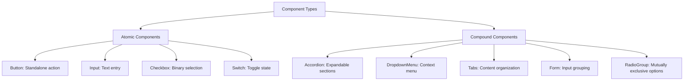

**Diagram sources**
- [button.tsx](file://src/components/ui/button.tsx#L1-L63)
- [accordion.tsx](file://src/components/ui/accordion.tsx#L1-L67)
- [dropdown-menu.tsx](file://src/components/ui/dropdown-menu.tsx#L1-L258)
- [tabs.tsx](file://src/components/ui/tabs.tsx#L1-L67)
- [radio-group.tsx](file://src/components/ui/radio-group.tsx#L1-L46)

**Section sources**
- [button.tsx](file://src/components/ui/button.tsx#L1-L63)
- [accordion.tsx](file://src/components/ui/accordion.tsx#L1-L67)
- [dropdown-menu.tsx](file://src/components/ui/dropdown-menu.tsx#L1-L258)

## Styling System
The library uses a sophisticated styling system combining Tailwind CSS with class-variance-authority (cva) for consistent variant management.

### Class Variance Authority (cva)
The `cva` function from class-variance-authority is used to define reusable variant classes across components. The Button component demonstrates this pattern:

```mermaid
classDiagram
class buttonVariants {
+variants : { variant : { default, destructive, outline, secondary, ghost, link }, size : { default, sm, lg, icon, icon-sm, icon-lg } }
+defaultVariants : { variant : "default", size : "default" }
}
class Button {
+className : string
+variant : "default" | "destructive" | "outline" | "secondary" | "ghost" | "link"
+size : "default" | "sm" | "lg" | "icon" | "icon-sm" | "icon-lg"
+asChild : boolean
}
Button --> buttonVariants : "uses"
```

**Diagram sources**
- [button.tsx](file://src/components/ui/button.tsx#L7-L37)

### Utility Functions
The `cn` utility function combines `clsx` and `tailwind-merge` to safely merge Tailwind CSS classes, resolving conflicts and ensuring consistent styling.

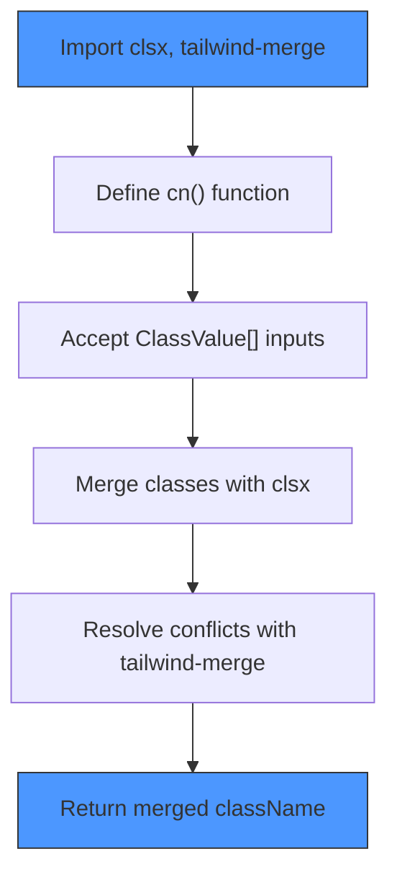

**Diagram sources**
- [utils.ts](file://src/lib/utils.ts#L1-L7)

**Section sources**
- [utils.ts](file://src/lib/utils.ts#L1-L7)
- [button.tsx](file://src/components/ui/button.tsx#L5-L63)

## Compound Components
Compound components are multi-part UI elements that share context and state. They follow the compound component pattern, exposing multiple related components under a single import.

### Accordion Component
The Accordion component provides expandable/collapsible content sections with accessible keyboard navigation.

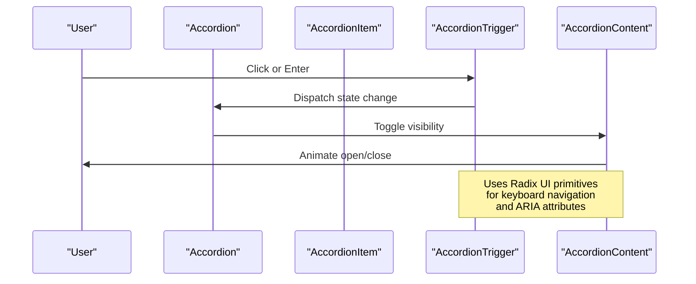

**Diagram sources**
- [accordion.tsx](file://src/components/ui/accordion.tsx#L1-L67)

### Dropdown Menu
The DropdownMenu component creates accessible context menus with nested submenus and various item types.

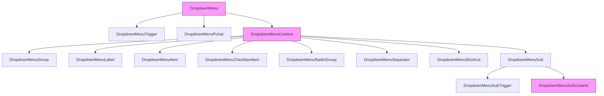

**Diagram sources**
- [dropdown-menu.tsx](file://src/components/ui/dropdown-menu.tsx#L1-L258)

**Section sources**
- [accordion.tsx](file://src/components/ui/accordion.tsx#L1-L67)
- [dropdown-menu.tsx](file://src/components/ui/dropdown-menu.tsx#L1-L258)
- [tabs.tsx](file://src/components/ui/tabs.tsx#L1-L67)

## Atomic Components
Atomic components are single-purpose elements that serve as building blocks for more complex UI.

### Button Component
The Button component demonstrates the use of variants and the Slot pattern for flexible composition.

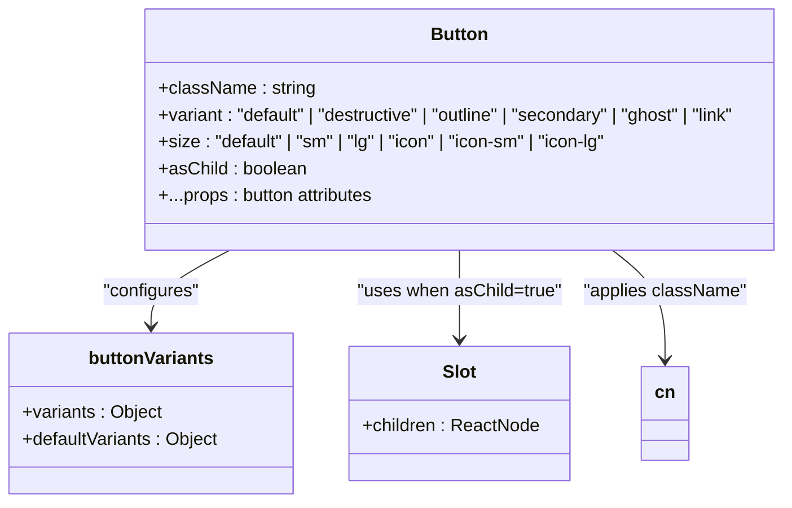

**Diagram sources**
- [button.tsx](file://src/components/ui/button.tsx#L39-L63)

### Form Components
The form component system provides a structured approach to form creation with proper accessibility attributes.

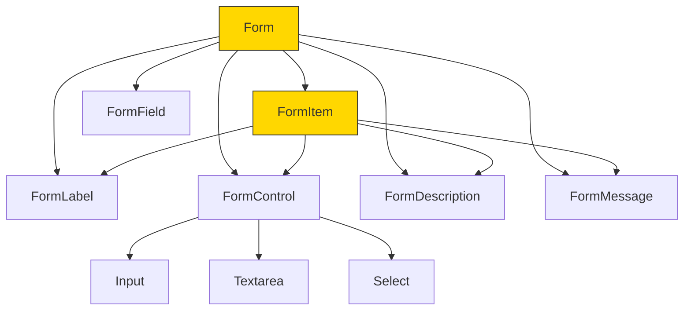

**Diagram sources**
- [form.tsx](file://src/components/ui/form.tsx#L1-L168)
- [input.tsx](file://src/components/ui/input.tsx#L1-L22)
- [textarea.tsx](file://src/components/ui/textarea.tsx#L1-L19)
- [select.tsx](file://src/components/ui/select.tsx#L1-L191)

**Section sources**
- [button.tsx](file://src/components/ui/button.tsx#L1-L63)
- [input.tsx](file://src/components/ui/input.tsx#L1-L22)
- [textarea.tsx](file://src/components/ui/textarea.tsx#L1-L19)
- [switch.tsx](file://src/components/ui/switch.tsx#L1-L32)
- [checkbox.tsx](file://src/components/ui/checkbox.tsx#L1-L33)

## Component Composition
Components are designed to be composed together to create complex UI patterns while maintaining accessibility and consistent styling.

### Form Composition Example
The Form component integrates with Input, Label, and Button components to create accessible forms.

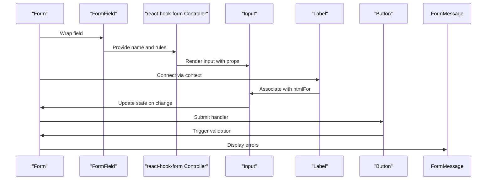

**Diagram sources**
- [form.tsx](file://src/components/ui/form.tsx#L1-L168)
- [input.tsx](file://src/components/ui/input.tsx#L1-L22)
- [label.tsx](file://src/components/ui/label.tsx#L1-L25)
- [button.tsx](file://src/components/ui/button.tsx#L1-L63)

**Section sources**
- [form.tsx](file://src/components/ui/form.tsx#L1-L168)

## Accessibility and Theming
The library prioritizes accessibility and supports dark mode through systematic implementation patterns.

### Accessibility Features
Components implement accessibility through:
- Proper ARIA attributes via Radix UI primitives
- Keyboard navigation support
- Focus management
- Semantic HTML structure
- Screen reader compatibility

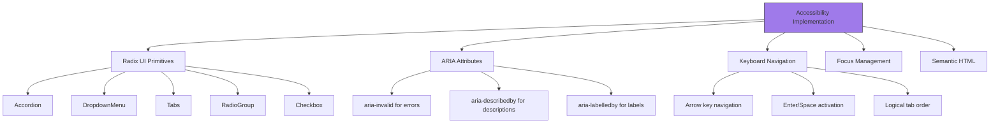

**Diagram sources**
- [accordion.tsx](file://src/components/ui/accordion.tsx#L1-L67)
- [dropdown-menu.tsx](file://src/components/ui/dropdown-menu.tsx#L1-L258)
- [tabs.tsx](file://src/components/ui/tabs.tsx#L1-L67)
- [radio-group.tsx](file://src/components/ui/radio-group.tsx#L1-L46)

### Dark Mode Support
Dark mode is implemented using `next-themes` with CSS variables for consistent theming.

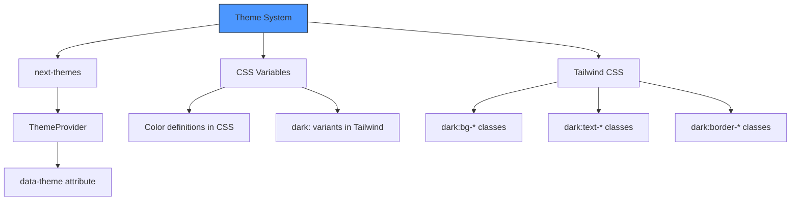

**Section sources**
- [components.json](file://components.json#L1-L23)
- [accordion.tsx](file://src/components/ui/accordion.tsx#L1-L67)
- [button.tsx](file://src/components/ui/button.tsx#L1-L63)

## Performance Considerations
The library implements several performance optimizations to minimize re-renders and improve efficiency.

### Memoization and Stable References
Components use React.memo and stable function references to prevent unnecessary re-renders.

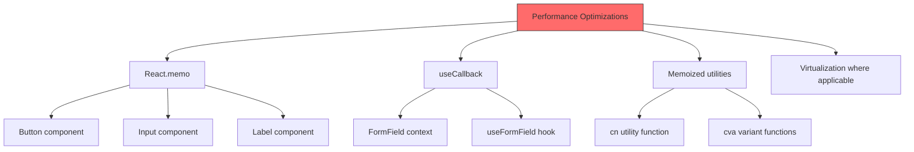

**Section sources**
- [button.tsx](file://src/components/ui/button.tsx#L39-L63)
- [form.tsx](file://src/components/ui/form.tsx#L28-L37)
- [utils.ts](file://src/lib/utils.ts#L1-L7)

## Extending Components
The library provides several patterns for extending components while maintaining type safety and accessibility.

### asChild Pattern
The `asChild` prop allows components to render as different elements while preserving styling and behavior.

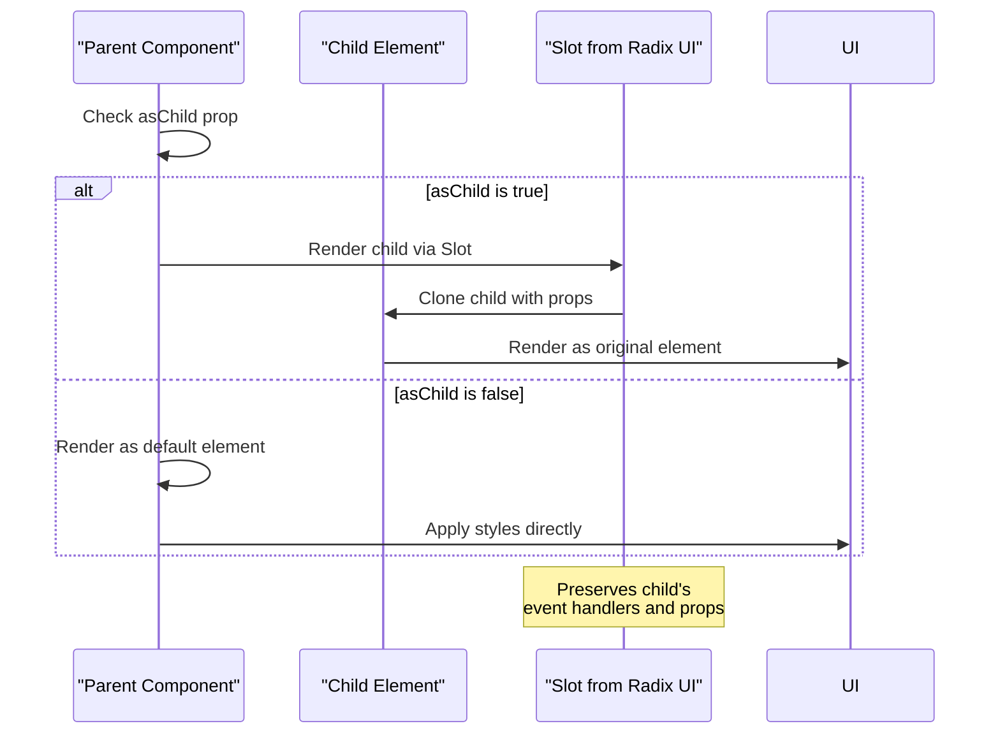

**Diagram sources**
- [button.tsx](file://src/components/ui/button.tsx#L39-L63)

**Section sources**
- [button.tsx](file://src/components/ui/button.tsx#L1-L63)

## Adding New Components
New components can be added following the established patterns and configuration.

### components.json Configuration
The `components.json` file configures the component library settings and aliases.

```mermaid
erDiagram
CONFIG ||--o{ ALIASES : "defines"
CONFIG ||--o{ TAILWIND : "configures"
CONFIG {
string schema
string style
boolean rsc
boolean tsx
}
ALIASES {
string components
string utils
string ui
string lib
string hooks
}
TAILWIND {
string config
string css
string baseColor
boolean cssVariables
string prefix
}
CONFIG }|-- ALIASES : "contains"
CONFIG }|-- TAILWIND : "contains"
```

**Diagram sources**
- [components.json](file://components.json#L1-L23)

**Section sources**
- [components.json](file://components.json#L1-L23)